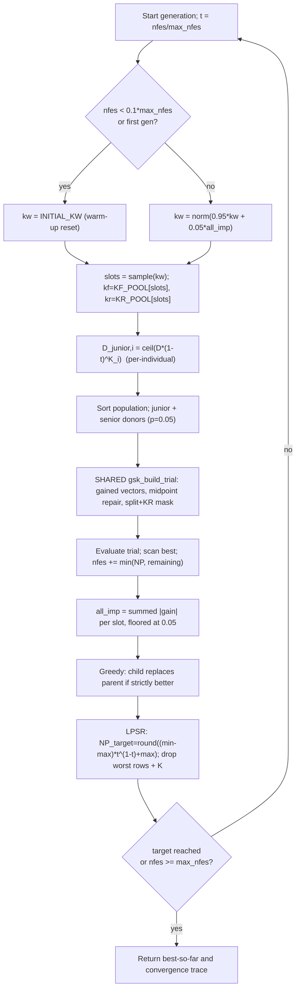

# AGSK — Adaptive Gaining-Sharing Knowledge

> **What this is:** the first self-tuning member of the family — it keeps GSK's
> junior/senior update but learns *which* `kf`/`kr` settings work and shrinks the
> population as the budget burns. **For:** readers who already know
> [GSK](gsk.md) and want to see what "adaptive" buys. **Prerequisites:** the
> gaining-sharing core (junior/senior gained vectors, midpoint repair,
> per-dimension KR mask) from [GSK](gsk.md). **After reading** you can trace one
> generation by hand, including a selection-probability update and a population
> shrink, and map every line of `src/gsk_family/optimizers/agsk.py` to its math.

## Intuition

AGSK reuses GSK's two-phase trial construction unchanged — the same junior and
senior gained vectors, the same midpoint bound repair, and the same
split-then-KR per-dimension mask. See [GSK](gsk.md) for that shared core. The
trial builder is literally the same function (`gsk_build_trial`, called at
`agsk.py:289`).

What AGSK changes is *how the knobs are set and how big the population is*:

- **Adaptive parameter pools.** Instead of one fixed `(kf, kr)` pair, AGSK keeps
  a small discrete menu of `(kf, kr)` settings (four "slots"). Every generation,
  each individual draws a slot from a probability vector `kw`. After evaluation,
  AGSK measures how much fitness each slot bought and nudges `kw` toward the
  settings that paid off. Good settings are sampled more often; bad ones are
  floored, not killed, so they can recover.
- **Per-individual junior schedule via `K`.** Each individual carries its own
  schedule exponent `K` (drawn once at start), so the junior→senior handover
  happens at a different pace for each row, instead of a single global exponent.
- **LPSR — linear population-size reduction.** The population starts at
  `np_init` and shrinks toward `min_pop_size` as `nfes` grows. Each generation
  computes a target size, sorts by fitness, and drops the worst individuals.
  Early breadth gives way to late-stage budget concentrated on fewer, better
  candidates.

## Mathematical formulation

The junior/senior gained vectors, midpoint repair, and the split/KR mask are
identical to [GSK](gsk.md) — only the *inputs* differ (`kf`, `kr`, and the
junior probability are now per-individual, and `p = 0.05`). This section
documents only the three AGSK-specific mechanisms.

**Parameter pools** (`agsk.py:26-28`). Four slots, indexed `0..3`. Slot `s`
supplies one `(kf, kr)` pair:

```text
KF_POOL = [0.1, 1.0, 0.5, 1.0]      # knowledge factor per slot
KR_POOL = [0.2, 0.1, 0.9, 0.9]      # knowledge ratio per slot
slot s ->  kf = KF_POOL[s],  kr = KR_POOL[s]
```

**Slot selection** (`_select_parameter_slots`, `agsk.py:102-113`). One
`rand(NP)` draw per generation; each individual's slot is the first cumulative
bucket of the probability vector `kw` its draw lands in (clamped to 3):

```text
c = cumsum(kw)                       # length-4 cumulative weights, c[3] = 1
slot_i = min( searchsorted(c, u_i, side="left"), 3 ),   u_i ~ U[0,1)
```

**Selection-probability vector `kw`** (`agsk.py:268-272`). For the warm-up
period — the first generation and while `nfes < 0.1 * max_nfes` — `kw` is reset
to the prior `INITIAL_KW = [0.85, 0.05, 0.05, 0.05]` (`agsk.py:28`). After
warm-up it is an exponential moving average toward the latest improvement
credit, then renormalized:

```text
warm-up (nfes < 0.1*max_nfes):  kw = INITIAL_KW
otherwise:                      kw = 0.95*kw + 0.05*all_imp
                                kw = kw / sum(kw)
```

**Improvement credit `all_imp`** (`_improvement_credit`, `agsk.py:116-145`). The
metric is the *summed absolute fitness gain* of the children that strictly
improved, bucketed by the slot that produced them. Let `child_better =
parent > child` and `diff = |parent - child|`. For each slot `s`:

```text
all_imp[s] = sum( diff[i] for i where child_better[i] and slot_i == s )
total      = sum(all_imp)
if total == 0:           all_imp = [0.25, 0.25, 0.25, 0.25]      # no gains this gen
else:
    all_imp = all_imp / total                                   # normalize to 1
    for every slot except the largest:  all_imp[s] = max(all_imp[s], 0.05)
    largest slot = 1 - sum(the other three)                     # keep sum = 1
```

The floor-the-losers / cap-the-winner step (`agsk.py:141-144`) guarantees every
slot keeps at least `0.05` weight (so no setting is permanently starved) while
the sum stays exactly `1`.

**Per-individual junior schedule** (`agsk.py:278-280`, `287`). Each individual
`i` has its own exponent `K_i`. With budget ratio `t = nfes / max_nfes`:

```text
D_junior,i  = ceil( D * (1 - t) ^ K_i )
junior_prob_i = D_junior,i / D
```

`K` is drawn once (`_draw_initial_k`, `agsk.py:87-99`): for each row, with
probability ½ a uniform value in `[0,1)`, otherwise `ceil(20 * U[0,1))` (an
integer in `1..20`). A small `K` keeps an individual junior longer; a large `K`
flips it to senior almost immediately.

**LPSR — linear population-size reduction** (`_target_population_size`,
`agsk.py:148-157`). With `max_pop_size = np_init`, the target size at the current
budget ratio `t = nfes / max_nfes` is:

```text
NP_target(t) = round( (min_pop_size - max_pop_size) * t^(1 - t)  +  max_pop_size )
```

where `round` is half-away-from-zero (`compat_round_int`,
`numeric_compat.py:31-36`). Note the exponent is `1 - t` (not `1`), so the curve
is not strictly linear in `t`; it is steepest near the middle of the run. The
reduction is applied after selection (`_reduce_population_after_generation`,
`agsk.py:160-192`):

```text
if pop_size <= NP_target:          do nothing
reduction = pop_size - NP_target
if pop_size - reduction < min_pop_size:   reduction = pop_size - min_pop_size
survivors = sort(fitness) keep the (pop_size - reduction) best        # drop worst
truncate popold, pop, fitness, and the per-row K vector to survivors
```

`survivors` are returned by `gsk_reduction_survivors` (`reduction.py:12-30`):
stable-argsort by fitness, take the best `pop_size - reduction` indices, then
**re-sort those indices ascending** so the surviving rows keep their original
relative order (the K vector and populations stay row-aligned).

**Selection** is the same strict-greedy replacement as GSK
(`agsk.py:329-332`): `fitness = min(parent, child)` element-wise, and rows where
the child won copy the child into `popold`.

## Pseudocode

```text
NP = np_init;  max_pop = np_init                          # agsk.py:224-225
initialize / accept fair-start population, evaluate, scan best
K = draw_initial_K(NP)                                    # agsk.py:254 (mixed unif / 1..20 int)
kw = None;  all_imp = [0,0,0,0]
for generation = 1, 2, ... until nfes >= max_nfes:        # agsk.py:265
    if kw is None or nfes < 0.1*max_nfes:  kw = INITIAL_KW     # warm-up reset
    else:                                  kw = norm(0.95*kw + 0.05*all_imp)
    slots = select_slots(kw)              # one rand(NP); agsk.py:274
    kf = KF_POOL[slots];  kr = KR_POOL[slots]             # per-individual
    D_junior   = ceil(D * (1 - nfes/max_nfes)^K)          # per-individual; agsk.py:278
    order      = argsort(fitness)                         # best -> worst
    rg1,rg2,rg3 = junior_donors(order)                    # shared with GSK
    r1,r2,r3    = senior_donors(order, p=0.05)            # SENIOR_P; agsk.py:285
    trial = gsk_build_trial(... kf, kr, junior_prob ...)  # SHARED kernel; agsk.py:289
    evaluate trial; nfes += min(NP, max_nfes - nfes); scan best
    all_imp = improvement_credit(fitness, child_fitness, slots)   # agsk.py:327
    greedy replace: parent <- child where f(child) < f(parent)    # agsk.py:329-332
    (popold, pop, fitness, K, NP) = reduce_population(...)         # LPSR; agsk.py:334
    append (nfes, best_so_far) to the convergence trace
    if target_error reached: stop
```

## Parameters

| Option | Symbol | Default | Valid range | Meaning | Code |
|---|---|---|---|---|---|
| `np` | NP₀ | `100` | integer ≥ `min_pop_size` (≥ 11 with defaults) | Fallback initial population if `np_init` is unset. | `agsk.py:209` |
| `np_init` | NP_init | `np` (`100`) | integer ≥ `min_pop_size` | Initial population size; also `max_pop_size` for LPSR. | `agsk.py:210` |
| `min_pop_size` | NP_min | `12` | integer ≥ 11 | LPSR floor — the smallest the population may shrink to. | `agsk.py:211` |
| `seed` | — | required | integer | RNG seed for the run. | `agsk.py:207` |
| `rand_generator` | — | `"twister"` | RNG name | Backend for the RNG context. | `agsk.py:208` |
| `KF_POOL` | kf-pool | `[0.1, 1.0, 0.5, 1.0]` | fixed constant | Per-slot knowledge factors (step scale). | `agsk.py:26` |
| `KR_POOL` | kr-pool | `[0.2, 0.1, 0.9, 0.9]` | fixed constant | Per-slot knowledge ratios (per-dim update prob.). | `agsk.py:27` |
| `INITIAL_KW` | kw₀ | `[0.85, 0.05, 0.05, 0.05]` | fixed constant | Warm-up / reset prior over the four slots. | `agsk.py:28` |
| `SENIOR_P` | p | `0.05` | fixed constant | Senior partition fraction (best/worst block = round(NP·p)). | `agsk.py:29` |

The pools, the warm-up prior, and `p` are module-level constants, not
runner-exposed options. `np_init`, `min_pop_size`, and `np` are read from the
options near the top of `optimize` (`agsk.py:209-211`) and validated by
`_validate_population_options` (`agsk.py:195-202`): `min_pop_size ≥ 11`, and
`np_init ≥ min_pop_size`. The EMA constants `0.95 / 0.05`, the warm-up cutoff
`0.1 * max_nfes`, and the `0.05` slot floor are hard-coded
(`agsk.py:268-272`, `agsk.py:143`).

## Worked example

We illustrate the three AGSK-specific mechanisms with hand-checkable numbers.
The junior/senior/mask arithmetic itself is identical to the
[GSK worked example](gsk.md#worked-example), so it is not repeated here.

**1 — Slot selection.** Use the warm-up prior `kw = [0.85, 0.05, 0.05, 0.05]`,
so `cumsum(kw) = [0.85, 0.90, 0.95, 1.00]`. Four individuals draw
`u = [0.10, 0.88, 0.92, 0.97]`:

```text
u=0.10 -> first bucket >= 0.10 is c[0]=0.85 -> slot 0  -> (kf,kr)=(0.1,0.2)
u=0.88 -> first bucket >= 0.88 is c[1]=0.90 -> slot 1  -> (kf,kr)=(1.0,0.1)
u=0.92 -> first bucket >= 0.92 is c[2]=0.95 -> slot 2  -> (kf,kr)=(0.5,0.9)
u=0.97 -> first bucket >= 0.97 is c[3]=1.00 -> slot 3  -> (kf,kr)=(1.0,0.9)
```

With `kw` heavily weighted on slot 0, most rows take the cautious
`(0.1, 0.2)` setting — exactly the bias the prior encodes.

**2 — Improvement credit and `kw` update.** Suppose this generation, the
strictly-improving children produce summed `|parent - child|` gains of `6.0`
attributable to slot 0 and `2.0` to slot 1, with nothing for slots 2 and 3.
Then `total = 8`, and after `_improvement_credit` (`agsk.py:128-144`):

```text
normalized:        all_imp = [0.75, 0.25, 0.00, 0.00]
imp_order (asc.)         = [2, 3, 1, 0]            # stable argsort of the values
floor every slot but the largest (slot 0):
   slot 2 -> max(0.00, 0.05) = 0.05
   slot 3 -> max(0.00, 0.05) = 0.05
   slot 1 -> max(0.25, 0.05) = 0.25
slot 0 (largest)  = 1 - (0.05 + 0.05 + 0.25) = 0.65
all_imp = [0.65, 0.25, 0.05, 0.05]                # sum = 1.00
```

Now assume warm-up is over and the current `kw = [0.85, 0.05, 0.05, 0.05]`. The
EMA step (`agsk.py:271-272`):

```text
kw = 0.95*[0.85, 0.05, 0.05, 0.05] + 0.05*[0.65, 0.25, 0.05, 0.05]
   = [0.8075, 0.0475, 0.0475, 0.0475] + [0.0325, 0.0125, 0.0025, 0.0025]
   = [0.8400, 0.0600, 0.0500, 0.0500]            # sum = 1.0000, no renormalization needed
```

Slot 1 (the *other* paying slot) gains weight `0.05 -> 0.06`; slot 0 eases from
`0.85 -> 0.84`. The pool is learning, slowly, toward what worked.

**3 — LPSR target size.** Take `np_init = max_pop_size = 100`,
`min_pop_size = 12`, `max_nfes = 10000`. Halfway through the run, `nfes = 5000`,
so `t = 0.5` and `t^(1-t) = 0.5^0.5 = 0.70710678` (`agsk.py:156`):

```text
plan        = (12 - 100) * 0.70710678 = -88 * 0.70710678 = -62.225397
NP_target   = round(-62.225397 + 100) = round(37.774603) = 38
```

If the population is still `100`, `reduction = 100 - 38 = 62`; since
`100 - 62 = 38 ≥ 12`, the floor clause does not fire. `gsk_reduction_survivors`
sorts by fitness, keeps the best `38`, and re-sorts those indices ascending; the
worst `62` rows (and their `K` entries) are dropped. For reference, the same
formula gives `NP_target = 69` at `nfes = 2500` and `13` at `nfes = 9000`,
bottoming out at `min_pop_size = 12` as `t -> 1`.

## Update cycle



## Bounds, budget, and determinism

- **Shared bound repair.** AGSK uses GSK's midpoint repair verbatim (inside
  `gsk_build_trial`): a violating coordinate is pulled to the midpoint of the
  *parent* and the breached bound, never reflected past the parent. See
  [GSK](gsk.md#bounds-budget-and-determinism).
- **Budget.** The loop runs whole generations; the last one is partially counted
  via `n_count = min(NP, max_nfes - nfes)` (`agsk.py:317`), and `nfes` advances
  by `n_count`. As the population shrinks, later generations cost fewer
  evaluations, so AGSK fits more generations into the same budget than fixed-NP
  GSK. The best-so-far is monotone non-increasing.
- **Warm-up window.** While `nfes < 0.1 * max_nfes` the pool is held at
  `INITIAL_KW` every generation (`agsk.py:268-269`); adaptation only begins once
  10% of the budget is spent, so early noise does not move `kw`.
- **Determinism.** All randomness comes from the caller's RNG in a fixed draw
  order per generation: the slot draw `rand(NP)` (`agsk.py:108`), the donor
  draws, then one `(3, NP, D)` block for the mask (`agsk.py:288`). `K` is drawn
  once before the loop (`agsk.py:254`). Reductions are deterministic
  (stable-argsort survivors). See [Seed Policy](../reference/seed_policy.md).

## Complexity

Per generation: `O(NP log NP)` to sort (twice — donors and reduction),
`O(NP·D)` to build and repair trials and to compute `all_imp`, and `O(NP)`
evaluations. Because LPSR drives `NP` down over the run, the *average* `NP` is
well below `np_init`, so the total is bounded by `O(max_nfes · D)` time and
`O(np_init · D)` memory (the initial population is the high-water mark).

## When to use

Reach for AGSK when fixed [GSK](gsk.md) plateaus and you suspect either the
`kf`/`kr` choice or the static population size is the bottleneck: the adaptive
pools self-tune the step/ratio without a sweep, and LPSR concentrates the late
budget on the best survivors. It is the standard adaptive baseline of the
family. If you need APGSK's negative-`KF` pool and stochastic junior rule, see
[APGSK](apgsk.md); for fitness-distance-balanced donor selection,
[FDB-AGSK](fdb-agsk.md); for local search and restarts on top of the adaptive
machinery, [ATMALS-GSK](atmals-gsk.md); and for the family's headline,
high-dimensional method, [DT-GSK](dt-gsk.md) (a dimension-tiered adaptive layer on
the same scaffold). All of them reuse the junior/senior core documented in
[GSK](gsk.md).

## What AGSK changes vs. GSK, at a glance

| Aspect | GSK | AGSK |
|---|---|---|
| `kf`, `kr` | fixed scalars (`0.5`, `0.9`) | per-individual, drawn from a 4-slot pool steered by `kw` |
| junior schedule | one global exponent `k=10` | per-individual exponent `K_i` (mixed uniform / `1..20` int) |
| population size | constant `NP` | LPSR shrink from `np_init` → `min_pop_size` |
| senior fraction `p` | `0.1` | `0.05` (`SENIOR_P`) |
| trial kernel | `gsk_build_trial` | **same** `gsk_build_trial` (unchanged) |
| selection | strict greedy | **same** strict greedy |

The trial-construction math is byte-identical; AGSK only changes *which inputs*
feed it and *how many rows* survive each generation.

## In the 7-algorithm panel

AGSK is one of the six **reference comparators** in the family's headline
comparison (alongside GSK, APGSK, FDB-AGSK, eGSK, and ATMALS-GSK), against which
the proposed [DT-GSK](dt-gsk.md) is benchmarked. In the **7-algorithm
GSK-family panel** built per dimension by `gsk-stats`, AGSK is the standard
*adaptive* baseline: it is the natural "does self-tuning the parameters and
shrinking the population beat fixed GSK?" reference, and APGSK / FDB-AGSK are best
read as deltas on top of it. The panel reports Friedman ranks, Nemenyi
critical-difference diagrams, Holm-corrected Wilcoxon, A12 / Cliff's delta effect
sizes, win/tie/loss, and 7-curve convergence grids under
`results/_run_all/_analysis/<suite>/`. Unlike vanilla `gsk`, AGSK **is** included
in the runner's live `--stats` stream. See
[Statistical Analysis](../research/statistical_analysis.md).

## Source and validation

- Kernel: `src/gsk_family/optimizers/agsk.py`; shared trial builder
  `src/gsk_family/optimizers/_kernels.py` (midpoint bound repair is inlined in the
  compiled kernel); donors
  `src/gsk_family/common/donors.py`;
  LPSR survivors `src/gsk_family/common/reduction.py`
  (`gsk_reduction_survivors`); half-away rounding
  `src/gsk_family/common/numeric_compat.py` (`compat_round_int`). Ported from
  the reference `agsk_optimize.m` with identical pools, defaults, and draw
  order.
- Run results land under `results/_run_all/agsk/<suite>/` (e.g.
  `results/_run_all/agsk/cec2017/`).
- Tested for deterministic replay, fair-start reuse, pool-adaptation and
  population-reduction behaviour, budget crossing, and runner execution on smoke
  cells. See [Validation Report](../research/validation_report.md) and
  [Numerical Examples](../research/numerical_examples.md).
