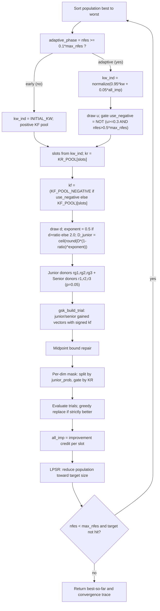

# APGSK — Adaptive-Parameters Gaining-Sharing Knowledge

> **What this is:** AGSK with two extra adaptive twists — a *negative knowledge
> factor* pool that can be switched on probabilistically, and a *stochastic*
> junior-dimension schedule. **For:** readers who already know the
> gaining-sharing core and want to see what "APGSK" adds on top. **Prerequisites:**
> [GSK](gsk.md) (junior/senior core, midpoint repair, KR mask) and
> [AGSK](agsk.md) (adaptive KF/KR pools, improvement-credit weights, LPSR
> population reduction). **After reading** you can evaluate the positive/negative-KF
> gate and the stochastic junior schedule by hand and map every line of
> `src/gsk_family/optimizers/apgsk.py` to its math.

## Intuition

APGSK reuses everything in AGSK and changes two adaptive decisions:

- **Sign-switchable knowledge factor.** AGSK always draws its step scale from a
  *positive* pool `KF_POOL`. APGSK keeps that pool but adds a *negative* pool
  `KF_POOL_NEGATIVE`. Once the run is past its early phase, a gate decides, per
  generation, whether the whole population uses positive or negative `kf`. A
  **negative** knowledge factor flips the sign of the gained step: instead of
  moving *toward* the donor difference it moves *away* from it. Late in a run,
  when the population has clustered, that anti-step is a cheap diversification
  pulse that can escape a basin without a full restart.
- **Stochastic junior schedule.** GSK and AGSK shrink the junior-dimension count
  with a *deterministic* power law. APGSK randomizes the **exponent** each
  generation — sometimes `0.5` (a slow, exploration-leaning decay), sometimes
  `2.0` (a fast, exploitation-leaning decay) — so the junior/senior balance
  jitters around the schedule instead of following one fixed curve.

Both knobs share the rest of the AGSK machinery unchanged: the same four-slot
`KF_POOL`/`KR_POOL`, the same `INITIAL_KW` weights updated from improvement
credit, the same Linear Population Size Reduction (LPSR), and the same junior /
senior gained-sharing kernel with midpoint repair — the shared `gsk_build_trial`
(`_kernels.py`), invoked at `apgsk.py:184`.

## Mathematical formulation

The junior/senior gained vectors, midpoint repair, and the per-dimension KR mask
are **identical to GSK** — see [GSK § Mathematical formulation](gsk.md#mathematical-formulation).
The adaptive slot selection, improvement-credit weight update, and LPSR are
**identical to AGSK** — see [AGSK](agsk.md). Only the two APGSK-specific pieces
are derived here.

**Negative knowledge-factor pools** (`apgsk.py:38-39`). Both pools are indexed by
the AGSK slot `s ∈ {0,1,2,3}` chosen for each individual:

```text
KF_POOL          = [ 0.10,  1.00,  0.50,  1.00 ]   # positive (same as AGSK)
KF_POOL_NEGATIVE = [-0.15, -0.05, -0.05, -0.15 ]   # negative (APGSK only)
```

**Positive-vs-negative gate** (`_apgsk_kf_values`, `apgsk.py:42-58`). The pool is
chosen *once per generation* for the whole population. Outside the adaptive phase
the positive pool is always used; inside it a single uniform draw
`u = adaptive_pool_draw ∈ [0,1)` (`apgsk.py:148`) and the budget ratio decide
(`apgsk.py:53-57`):

```text
adaptive_phase is true  iff  nfes >= 0.1 * max_nfes        # apgsk.py:138

if not adaptive_phase:
    use_negative = false                                   # always positive

else:
    use_negative = NOT ( u >= 0.3  AND  nfes > 0.5*max_nfes )
                 = ( u < 0.3 )  OR  ( nfes <= 0.5*max_nfes )   # De Morgan

kf_pool = KF_POOL_NEGATIVE  if use_negative  else  KF_POOL
kf[i]   = kf_pool[ slot[i] ]
```

Read the gate as two regimes:

- **First half of the adaptive phase** (`0.1*max_nfes <= nfes <= 0.5*max_nfes`):
  the right conjunct `nfes > 0.5*max_nfes` is false, so `use_negative` is always
  `true` — the negative pool fires every generation regardless of `u`.
- **Second half** (`nfes > 0.5*max_nfes`): the gate reduces to `u < 0.3`, so the
  negative pool fires on roughly 30 % of generations and the positive pool on the
  other 70 %. This is the late-stage anti-step pulse: most generations keep
  converging with positive `kf`, but ~30 % inject a negative-`kf` diversification
  burst.

Because the negative magnitudes are small (`|kf| ≤ 0.15`), the anti-step is a
gentle nudge away from the donor difference, not a large jump.

**Effect of a negative `kf` on the gained vector.** Substituting a negative `kf`
into the GSK junior update (`_kernels.py:128-131`) simply negates the bracketed
donor term. For the *other* branch (`worse = f(x_i) > f(x_rg3)` is false):

```text
g_j = x_i + kf * ( x_rg1 - x_rg2 + x_i - x_rg3 )
kf > 0:  step points along  ( x_rg1 - x_rg2 + x_i - x_rg3 )   (toward donors)
kf < 0:  step points against that vector                      (away from donors)
```

The senior update behaves the same way; midpoint repair (`_kernels.py:132-135,
140-143`) still pulls any out-of-bounds coordinate back to the parent–bound
midpoint, so a negative step can never leave `[lb, ub]`.

**Stochastic junior-dimension schedule** (`_stochastic_junior_dimension`,
`apgsk.py:61-66`). One uniform draw `d = rng.random() ∈ [0,1)` (`apgsk.py:165`)
per generation randomizes the exponent; `ratio = nfes / max_nfes`:

```text
ratio    = nfes / max_nfes
exponent = 0.5  if d > ratio   else  2.0                       # apgsk.py:64
D_junior = ceil( round_half_away( D * (1 - ratio)^exponent ) ) # apgsk.py:65-66
junior_prob = D_junior / D                                     # apgsk.py:174
```

`round_half_away` is `compat_round_int` (`numeric_compat.py:31-36`,
half-away-from-zero); the outer `ceil` of an already-integer value leaves it
unchanged but matches the reference expression. Contrast with the **deterministic**
schedules:

```text
GSK   (gsk.py:149-150):  D_junior = ceil( D * (1 - g/G_max)^k ),   k = 10  (fixed)
AGSK  (agsk.py:288-290): D_junior = ceil( D * (1 - nfes/max_nfes)^k_i )    (per-row k_i, fixed for the run)
APGSK (apgsk.py:61-66):  exponent flips between 0.5 and 2.0 each generation by a coin vs. ratio
```

Two things follow. First, the exponent is a **scalar** for the whole population
each generation (GSK/AGSK use a fixed `k`; AGSK's is even per-individual), so
APGSK's junior count is the same for every individual in a generation but
*varies generation to generation*. Second, the gate `d > ratio` makes the slow
exponent `0.5` more likely **early** (small `ratio`) and the fast exponent `2.0`
more likely **late** (large `ratio`) — a soft bias toward exploration early and
exploitation late, layered on top of the `(1 - ratio)` decay.

> **RNG note.** APGSK still draws AGSK's initial per-individual `k` vector
> (`apgsk.py:121`, `_draw_initial_k`) purely to keep the random stream
> bit-identical to AGSK, but the stochastic schedule above **never uses it**
> (`apgsk.py:119-120`). The draw order per generation is: slots →
> `adaptive_pool_draw` (adaptive phase only) → junior-schedule `d` → the junior
> `rg3` draw and the three senior block draws (`apgsk.py:171-172`) → the
> `(3, NP, D)` mask block.

## Pseudocode

```text
np_init, min_pop_size = options                                  # apgsk.py:74-75
max_pop_size = np_init
initialize / accept fair-start population, evaluate, record best
k_vec = draw_initial_k(NP)        # RNG-fidelity only, unused      # apgsk.py:121
kw_ind = None;  all_imp = zeros(4)
for generation = 1, 2, ... until nfes >= max_nfes:               # apgsk.py:135
    if kw_ind is None or nfes < 0.1*max_nfes:                    # apgsk.py:138
        kw_ind = INITIAL_KW;            adaptive_phase = False
    else:
        kw_ind = normalize(0.95*kw_ind + 0.05*all_imp); adaptive_phase = True
    slots = select_parameter_slots(kw_ind)                       # apgsk.py:146 (AGSK)
    kr    = KR_POOL[slots]
    u     = rng.random()  if adaptive_phase else None            # apgsk.py:148
    kf, used_negative = apgsk_kf_values(slots, adaptive_phase, u, nfes, max_nfes)  # gate
    D_junior = stochastic_junior_dimension(D, nfes, max_nfes, rng.random())        # apgsk.py:161
    order   = argsort(fitness)                                    # best -> worst
    rg1,rg2,rg3 = junior_donors(order)                           # apgsk.py:171
    r1,r2,r3    = senior_donors(order, SENIOR_P=0.05)            # apgsk.py:172
    junior_prob = D_junior / D
    trial = gsk_build_trial(..., kf_junior=kf, kf_senior=kf, kr=kr, junior_prob=...)  # apgsk.py:184
    evaluate trial; nfes += n_count
    all_imp = improvement_credit(fitness, children_fitness, slots)   # AGSK
    greedy replace: parent <- child where f(child) < f(parent)   # apgsk.py:224-226
    LPSR: reduce population toward target size                    # apgsk.py:228 (AGSK)
    append (nfes, best_so_far) to the convergence trace
    if best - optimum < target_error: stop                       # apgsk.py:241-244
```

## Parameters

APGSK exposes only the AGSK population options; the pools and gate constants are
fixed in code (not user options) and listed below the table.

| Option | Symbol | Default | Valid range | Meaning | Code |
|---|---|---|---|---|---|
| `np` | NP | `100` | integer ≥ `min_pop_size` (≥ 11 with defaults) | Fallback initial population size when `np_init` is absent. | `apgsk.py:73` |
| `np_init` | NP_init | `np` (`100`) | integer ≥ `min_pop_size` | Initial population size before LPSR. | `apgsk.py:74` |
| `min_pop_size` | NP_min | `12` | integer ≥ 11 | Floor for LPSR (validated `≥ 11`, `agsk.py:207-208`). | `apgsk.py:75` |
| `seed` | — | required | integer | RNG seed (passed to `RandomContext`). | `apgsk.py:71` |
| `rand_generator` | — | `"twister"` | RNG name | Backend for `RandomContext`. | `apgsk.py:72` |

Fixed constants (not options):

| Constant | Value | Valid range | Meaning | Code |
|---|---|---|---|---|
| `KF_POOL` | `[0.1, 1.0, 0.5, 1.0]` | positive reals | Positive knowledge-factor pool (shared with AGSK). | `apgsk.py:38` |
| `KF_POOL_NEGATIVE` | `[-0.15, -0.05, -0.05, -0.15]` | negative reals | Negative knowledge-factor pool (APGSK only). | `apgsk.py:39` |
| `KR_POOL` | `[0.2, 0.1, 0.9, 0.9]` | each in [0,1] | Knowledge-ratio pool (imported from AGSK). | `apgsk.py:22-34`, `agsk.py:27` |
| `INITIAL_KW` | `[0.85, 0.05, 0.05, 0.05]` | sums to 1 | Initial slot-selection weights (imported from AGSK). | `agsk.py:28` |
| `SENIOR_P` | `0.05` | (0, 0.5) | Senior best/worst block fraction (imported from AGSK). | `agsk.py:29` |
| adaptive-phase threshold | `0.1 * max_nfes` | — | `nfes` at which weights start adapting and the gate turns on. | `apgsk.py:138` |
| negative-gate draw cutoff | `0.3` | (0,1) | `u < 0.3` keeps the negative pool in the second half. | `apgsk.py:56` |
| negative-gate stage cutoff | `0.5 * max_nfes` | — | Boundary between the always-negative and probabilistic halves. | `apgsk.py:56` |
| junior-schedule exponents | `0.5` / `2.0` | — | Slow vs. fast junior-decay exponents chosen by `d > ratio`. | `apgsk.py:64` |

## Worked example

Two hand-checkable decisions in one generation. Take a run with
`max_nfes = 100000`, `D = 10`.

**(A) Negative-KF gate — first-half generation.** Suppose `nfes = 30000`
(`ratio = 0.3`, so `nfes >= 0.1*max_nfes` → adaptive phase is on) and the gate
draw is `u = 0.82`. Evaluate `apgsk.py:56`:

```text
right conjunct: nfes > 0.5*max_nfes  ->  30000 > 50000  = False
use_negative = not ( 0.82 >= 0.3  AND  False ) = not ( False ) = True
=> kf_pool = KF_POOL_NEGATIVE   (negative, regardless of u)
```

Say individual `i` was assigned slot `s = 0`, so `kf[i] = KF_POOL_NEGATIVE[0] =
-0.15`. Take a 1-D slice with parent `x_i = 2.0`, donors `x_rg1 = 5.0`,
`x_rg2 = 1.0`, `x_rg3 = 4.0`, and the *other* junior branch
(`f(x_i) > f(x_rg3)` is false):

```text
bracket = x_rg1 - x_rg2 + x_i - x_rg3 = 5 - 1 + 2 - 4 = 2.0
g_j = x_i + kf*bracket = 2.0 + (-0.15)*(2.0) = 2.0 - 0.30 = 1.70
```

The same bracket with a positive `kf` would have pushed `g_j` *up* to
`2.0 + 0.15*2.0 = 2.30`; the negative factor instead pulls it *down* to `1.70` —
an anti-step away from the donor pull, the diversification nudge.

**(B) Negative-KF gate — second-half generation.** Now `nfes = 70000`
(`ratio = 0.7`). The right conjunct `70000 > 50000` is `True`, so the gate is
exactly `u < 0.3`:

```text
u = 0.55  ->  use_negative = not ( 0.55 >= 0.3 AND True ) = not True  = False  -> POSITIVE pool
u = 0.10  ->  use_negative = not ( 0.10 >= 0.3 AND True ) = not False = True   -> NEGATIVE pool
```

So past the halfway mark only ~30 % of generations (`u < 0.3`) take the
negative pulse; the rest converge with the positive pool.

**(C) Stochastic junior schedule.** Same generation as (A), `ratio = 0.3`,
`D = 10`, schedule draw `d`:

```text
d = 0.80 > ratio=0.3  ->  exponent = 0.5
  value    = round_half_away( 10 * (1-0.3)^0.5 ) = round( 10 * 0.836660 ) = round(8.3666) = 8
  D_junior = ceil(8) = 8     ->  junior_prob = 8/10 = 0.8   (exploration-leaning)

d = 0.20 <= ratio=0.3 ->  exponent = 2.0
  value    = round_half_away( 10 * (1-0.3)^2 )   = round( 10 * 0.49 )     = round(4.9)   = 5
  D_junior = ceil(5) = 5     ->  junior_prob = 5/10 = 0.5   (exploitation-leaning)
```

The two draws yield different junior/senior splits (`0.8` vs `0.5`) in the *same*
generation state — that is the stochastic jitter a deterministic schedule cannot
produce. With `junior_prob = 0.8`, dimension `j` from (A) is treated as junior
when its `rand_split[i,j] <= 0.8`, and the negative `g_j = 1.70` reaches the
trial only if the KR gate `rand_kr_junior[i,j] <= kr[i]` also passes; otherwise
the parent `2.0` is kept (`_kernels.py:144-149`).

## Update cycle



## Bounds, budget, and determinism

- **Bound repair** is the shared GSK midpoint rule (`_kernels.py:132-135,
  140-143`): a violating coordinate is pulled to the midpoint of the parent and
  the breached bound. This holds for *negative*-`kf` steps too, so anti-steps
  never leave `[lb, ub]`.
- **Budget.** The loop runs whole generations until `nfes >= max_nfes`; the final
  generation is partially counted via `n_count = min(pop_size, max_nfes - nfes)`
  (`apgsk.py:212`). With LPSR active the population shrinks toward `min_pop_size`,
  so later generations spend fewer evaluations each. Best-so-far is monotone
  non-increasing.
- **Determinism.** The trial kernel is pure arithmetic; all randomness is drawn by
  the caller in a fixed order — slots, then the adaptive-pool draw `u` (only in
  the adaptive phase), then the junior-schedule draw `d`, then the junior `rg3`
  draw and the three senior block draws (`apgsk.py:171-172`), then one `(3, NP, D)`
  mask block (`apgsk.py:146-175`). The unused `k_vec` draw (`apgsk.py:120`) is
  kept to preserve byte-for-byte stream parity with AGSK. Serial and parallel runs
  produce identical results. See [Seed Policy](../reference/seed_policy.md).
- **Diagnostics.** `params` records `kf_pool`, `kf_pool_negative`, and the per-run
  counts `negative_kf_generations` / `positive_kf_generations` (`apgsk.py:156-159,
  280-281`) so you can audit how often the negative pulse fired.

## Complexity

Same order as GSK/AGSK. Per generation: `O(NP log NP)` to sort, `O(NP·D)` to build
and repair trials, `O(NP)` evaluations; the gate and stochastic-exponent draws are
`O(1)` scalars. Over a run the total is `O(max_nfes · D)` time and `O(NP·D)`
memory; LPSR only lowers `NP` over time, so it never increases this bound.

## When to use

Reach for APGSK when an AGSK run stalls in late-stage exploitation and you want a
built-in escape mechanism cheaper than a full restart: the negative-`kf` pulse
periodically diversifies after the halfway mark, and the stochastic junior
schedule keeps the exploration/exploitation balance from locking onto a single
curve. If you do not need the sign-switch or the schedule jitter, prefer plain
[AGSK](agsk.md) (deterministic, one fewer source of variance) or baseline
[GSK](gsk.md). Other siblings: [FDB-AGSK](fdb-agsk.md),
[ATMALS-GSK](atmals-gsk.md), and the family's headline, high-dimensional method
[DT-GSK](dt-gsk.md).

## In the 7-algorithm panel

APGSK is one of the six **reference comparators** in the family's headline
comparison (with GSK, AGSK, FDB-AGSK, eGSK, and ATMALS-GSK), against which the
proposed [DT-GSK](dt-gsk.md) is benchmarked. In the **7-algorithm GSK-family
panel** built per dimension by `gsk-stats`, APGSK reads as a two-change delta on
[AGSK](agsk.md): the negative-`kf` diversification pulse and the stochastic junior
schedule. Reading APGSK and AGSK side by side on the per-function mean tables and
convergence grids isolates exactly what those two twists buy on each suite. The
panel emits Friedman ranks, Nemenyi critical-difference diagrams, Holm-corrected
pairwise Wilcoxon, Vargha-Delaney A12 / Cliff's delta effect sizes, win/tie/loss,
and 7-curve convergence grids under `results/_run_all/_analysis/<suite>/`; APGSK
is included in the runner's live `--stats` stream. The per-run diagnostics
`negative_kf_generations` / `positive_kf_generations` (see below) let you confirm
the negative pulse actually fired as often as the gate predicts. See
[Statistical Analysis](../research/statistical_analysis.md).

## Source and validation

- Kernel: `src/gsk_family/optimizers/apgsk.py`. It imports the adaptive
  machinery (`INITIAL_KW`, `KR_POOL`, `SENIOR_P`, slot selection, improvement
  credit, LPSR, option parsing) from `src/gsk_family/optimizers/agsk.py`; the
  shared trial builder is `src/gsk_family/optimizers/_kernels.py`; donors are in
  `src/gsk_family/common/donors.py`; population reduction in
  `src/gsk_family/common/reduction.py`; half-away rounding in
  `src/gsk_family/common/numeric_compat.py`. Ported from the reference
  implementation's APGSK driver (`apgsk_optimize.m`) with identical pools, gate,
  schedule, and draw order.
- Canonical results land under `results/_run_all/apgsk/<suite>/`.
- Tests cover the positive/negative KF gate, the stochastic junior schedule,
  shared adaptive slot selection, improvement credit, population reduction, target
  stopping, fair starts, deterministic replay, and runner integration. See
  [Validation Report](../research/validation_report.md) and
  [Numerical Examples](../research/numerical_examples.md).
