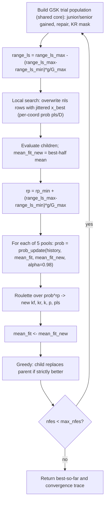

# ATMALS-GSK — Adaptive Tuning, Memory, Adaptive Local Search

> **What this is:** the most heavily self-tuning member of the family — it keeps
> the gaining-sharing core of [GSK](gsk.md) but drives **five** parameters from
> success-weighted memory and bolts an **adaptive local search** onto the best
> vector each generation. **For:** readers who already know the junior/senior
> core and want the ATMALS additions. **Prerequisites:** [GSK](gsk.md) (core,
> midpoint repair, KR mask) and [AGSK](agsk.md) (the idea of parameter pools).
> **After reading** you can trace one memory-roulette selection and one
> local-search step by hand and map each to `atmals_gsk.py` /
> `atmals_helpers.py`.

## Intuition

ATMALS-GSK ("Adaptive Tuning + Memory + Adaptive Local Search") reuses the
exact GSK trial builder — junior/senior gained vectors, midpoint bound repair,
the split-by-`junior_prob` then gate-by-`kr` mask — without changing a line of
it (`atmals_gsk.py:137-156` calls the shared `gsk_build_trial`). Three things
are new:

- **Five adaptive pools, not four.** GSK's `kf`, `kr`, `k`, and the senior
  fraction `p` each become a *grid* of candidate values, and a fifth pool `pls`
  is added to steer the local search. Every generation picks one value from
  each grid (`atmals_gsk.py:208-212`, `:324-328`).
- **Memory-based roulette.** A per-pool weight vector accumulates over the whole
  run. Slots that were chosen on improving generations gain weight; slots chosen
  on worsening generations lose it. The vector is raised to a growing power `rp`
  before each spin, so as the run matures the wheel concentrates on the slots
  that have paid off (`atmals_helpers.py:22-79`, `atmals_gsk.py:317,324-328`).
- **Adaptive local search.** After the GSK trials are built, a few rows are
  overwritten with perturbations of the **current best** vector. The
  perturbation *probability per coordinate* is set by `pls/D`, and the
  *amplitude* `range_ls` shrinks across the run, so the search starts coarse and
  ends fine (`atmals_gsk.py:71-108,293-305`).

The signal that drives all of this is the **mean of the best half** of the
population's error each generation — a smoother, less greedy progress measure
than the single best (`atmals_gsk.py:50-68`).

## Mathematical formulation

The gaining-sharing core is identical to [GSK](gsk.md); the donor blocks are
drawn by ATMALS-local helpers that match the reference exactly (a CEC2017 split
at `p=0.1` in `atmals_helpers.py:159-174`, or a fixed 10 % / 90 % split for
CEC2011 in `:177-192`). Only the additions are derived here.

**Progress signal (best-half mean)** (`atmals_gsk.py:50-68`). With the
population's per-individual error `e` (for CEC2017 that is `|f - f*|`; for
CEC2011, or an unknown optimum, the raw fitness):

```text
e_sorted = sort(e) ascending
m        = mean( e_sorted[0 : max(1, floor(NP/2))] )
```

`mean_fit` is `m` before a generation; `mean_fit_new` is `m` recomputed from the
children.

**Per-pool weight update** (`atmals_gaussmf` + `_atmals_reward_row`,
`atmals_helpers.py:14-49`, ported from the reference `ProbUpdate.m`). Let a pool hold values `v` (length `L`); let the slot chosen
last generation be at 1-based position `c` (its value matched in `v`). A
Gaussian membership over the *pool values* peaks at the position index `c`:

```text
sigma = 0.05 * ( max(v) - min(v) )
yy    = exp( -( v - c )^2 / (2*sigma^2) )            # gaussmf(v, sigma, c)
denom = max( |mean_fit|, eps )
improved:  row =  yy        * exp( -(mean_fit_new - mean_fit)/denom )
worsened:  row = (1 - yy)*0.1* exp( -(mean_fit_new - mean_fit)/denom )
tie:       row =  0
```

The reference update appends the new `row` onto the pool's history, then
collapses the history with a geometric forgetting factor `alpha = 0.98`. The
optimizer stores the equivalent compact weighted sum in
`AtmalsProbabilityMemory`, because old rows keep the same weight forever and only
one new weighted row is added per generation. The *oldest* logical row is
weighted `alpha^1` (the largest weight) and the *newest* logical row
`alpha^(row_count)` (the smallest), so newer rows count less and older rows more
as the history accumulates and decays:

```text
prob = sum over history rows r (oldest first, index = 1..row_count) of  alpha^(index) * row_r
```

With `alpha = 0.98` the weight halves about every 34 rows (`0.98^34 ≈ 0.5`), so
a contribution's influence is roughly halved every ~34 generations.

(Because `c` is the *index* 1..L while `v` holds the actual grid values, the
Gaussian is centred far outside the value range; with `sigma` so small, `yy`
underflows toward 0 for most grids — a faithful quirk of the reference. The
worsened branch's `(1 - yy)*0.1` term is therefore what keeps weight alive. The
update is reproduced verbatim so results match the reference.)

**Memory roulette with sharpening** (`atmals_helpers.py:131-156`,
`atmals_gsk.py:317,324-328`). The selection weight is `prob` raised to a power
`rp` that grows with the run:

```text
rp = rp_min + (range_ls_max - range_ls_min) * (g / G_max)     # ~3.0 -> ~3.2
w  = prob ^ rp
p_sel = w / sum(w)
draw threshold u ~ U(0,1)
slot = searchsorted(cumsum(p_sel), u, side="left")   # clamped to L-1
value = pool[slot]
```

(`rp_min = 3.0`, `range_ls_max = 0.2`, `range_ls_min = 1e-10` at
`atmals_gsk.py:228-230`; so `rp` rises only from 3.0 to ~3.2 over the run.
A `rp_max:5.0` appears in the result `params` block but is not used by the loop —
`atmals_gsk.py:392`.)

**Adaptive local search** (`atmals_gsk.py:71-108,293-305`). The amplitude decays
linearly each generation:

```text
range_ls = range_ls_max - (range_ls_max - range_ls_min) * (g / G_max)   # 0.2 -> ~0
nls      = round(0.05 * NP)                                             # rows touched
```

`nls` rows of the freshly built trial population are replaced by a perturbed copy
of the current best vector `x_best`. For each touched row and each coordinate
`col`:

```text
with probability pls/D:
    x[row,col] = x_best[col] + (2*U(0,1) - 1) * range_ls * (ub_col - lb_col)
    clip to [lb_col, ub_col]      # CEC2017: hard clip; CEC2011: clip to bound -/+ eps
otherwise:
    x[row,col] = x_best[col]      # coordinate copied from the best vector
```

So a touched row is "best vector, with a sparse coarse-to-fine jitter." The
larger `pls` is, the more coordinates get jittered.

**Selection** is the same strictly-greedy replacement as GSK
(`atmals_gsk.py:341-344`): a child replaces its parent only where
`f(child) < f(parent)`. ATMALS-GSK does **not** reduce the population
(unlike [AGSK](agsk.md)'s LPSR); `NP` is constant.

## Pseudocode

```text
G_max = (cec2011 ? max_nfes/NP : fix(max_nfes/NP))          # atmals_gsk.py:219
kf,kr,k,p,pls = 0.5, 0.9, 10.0, 0.1, 1.0                    # initial picks :221-226
prob_* = ones(len(pool))   for each of the 5 pools          # :232-236
initialize population, evaluate, mean_fit = best_half_mean  # :238-257
record best-so-far; nfes += NP                              # :262-268
for g = 1, 2, ... until nfes >= max_nfes:                   # :271
    trial = GSK_generation(pop, fit, kf, kr, k, p, g)       # shared core :280
    range_ls = range_ls_max - (range_ls_max-range_ls_min)*g/G_max   # :293
    trial = local_search(trial, x_best, nls, pls, range_ls) # :296
    child_fit = evaluate(trial); nfes += n_count            # :307
    mean_fit_new = best_half_mean(child_fit)                # :315
    rp = rp_min + (range_ls_max-range_ls_min)*g/G_max       # :317
    for each pool (kf, kr, k, p, pls):                      # :318-328
        prob = prob_update(history, pool, chosen, mean_fit, mean_fit_new, alpha)
        chosen = pool[ roulette(prob^rp) ]                  # :324-328
    mean_fit = mean_fit_new
    greedy replace: parent <- child where f(child) < f(parent)   # :341-344
    append (nfes, best_so_far) to the convergence trace     # :346
```

## Parameters

| Option | Symbol | Default | Valid range | Meaning | Code |
|---|---|---|---|---|---|
| `np` | NP | `100` | integer ≥ 12 | Fixed population size (no reduction); guard rejects `NP < 12`. | `atmals_gsk.py:202-204` |
| `protocol` | — | `"cec2017"` | `"cec2017"` \| `"cec2011"` | Selects donor split, `G_max` rounding, error metric, and bound-clip eps. | `atmals_gsk.py:201`, `:42-47` |
| `kf_pool` | kf grid | `arange(0.2, 0.8, 0.1)` → 7 values | non-empty float vector | Knowledge-factor candidates (step scale). Controls `kf`. | `atmals_gsk.py:208` |
| `kr_pool` | kr grid | `arange(0.85, 1.0, 0.01)` → 16 values | non-empty float vector | Knowledge-ratio candidates (per-dim update prob). Controls `kr`. | `atmals_gsk.py:209` |
| `k_pool` | k grid | `arange(8, 30, 1)` → 23 values | non-empty float vector | Junior-schedule exponent candidates (handover sharpness). Controls `k_rate`. | `atmals_gsk.py:210` |
| `p_pool` | p grid | `arange(0.05, 0.15, 0.01)` → 11 values | non-empty float vector | Senior partition-fraction candidates. `p_value` is roulette-selected and tracked/adapted in the parameter memory (`atmals_gsk.py:321,327`), but the CEC2017 senior split is **hardcoded to 0.1** (`atmals_gsk.py:132`), so in this port `p` is recorded but does **not** resize the senior best/worst blocks. | `atmals_gsk.py:211` |
| `pls_pool` | pls grid | `arange(1.0, 2.0, 0.1)` → 11 values | non-empty float vector | Local-search density candidates; per-coordinate jitter prob is `pls/D`. | `atmals_gsk.py:212` |
| `seed` | — | required | integer | RNG seed; fixes the whole draw order. | `atmals_gsk.py:199` |

Internal constants (not options, fixed in the loop): initial picks
`kf=0.5, kr=0.9, k=10.0, p=0.1, pls=1.0` (`atmals_gsk.py:221-226`);
`alpha=0.98` (`:225`); `nls = round(0.05·NP)` (`:227`); `rp_min=3.0` (`:228`);
`range_ls_max=0.2`, `range_ls_min=1e-10` (`:229-230`). There is **no**
`use_local_search` flag — the local search always runs (with `nls=0` it is a
no-op, `atmals_gsk.py:84`). There is **no** explicit `probability_memory`
option; the memory lives in five compact `AtmalsProbabilityMemory` states seeded
with the all-ones first logical row so the first spin is uniform. Results record
`probability_memory="compact_weighted_sum"` and `probability_memory_rows`.

> Defaults use a half-open upper bound in code (`arange(0.2, 0.8000001, 0.1)`):
> the tiny `…0001` epsilon makes the endpoint inclusive, so `kf_pool` really
> does end at `0.8`, `kr_pool` at `1.0`, `k_pool` at `30`, `p_pool` at `0.15`,
> and `pls_pool` at `2.0`.

## Worked example

Two hand-checkable pieces: one memory-roulette selection, and one local-search
coordinate.

**1) Memory roulette with sharpening** (`atmals_helpers.py:131-156`). Take a small
3-slot pool with accumulated weights `prob = [0.2, 0.5, 0.3]` and an early-run
`rp = 3.0` (`atmals_gsk.py:317`, `:324`). The selection weight is `prob^rp`:

```text
prob^3   = [0.2^3, 0.5^3, 0.3^3] = [0.008, 0.125, 0.027]
sum      = 0.160
p_sel    = [0.0500, 0.78125, 0.16875]
cumsum   = [0.0500, 0.83125, 1.0]
```

The cubing has sharpened a 0.50 lead into a 0.78 share. Now spin:

```text
u = 0.10 -> searchsorted(cumsum, 0.10) = slot 1   (0.05 < 0.10 <= 0.83125)
u = 0.50 -> slot 1
u = 0.90 -> slot 2   (0.83125 < 0.90)
```

So the historically-best slot 1 is chosen for two of these three draws — and the
gap widens as `rp` grows later in the run.

**2) One local-search coordinate** (`atmals_gsk.py:95-107`). Suppose
`D = 30`, `pls = 1.5` (so per-coord prob `pls/D = 0.05`), bounds
`lb=-100, ub=100`, current best `x_best[col] = 12.0`, and this is a mid-run
generation with `range_ls = 0.1` (`atmals_gsk.py:293`). The row is first set to
`x_best`, then for one coordinate the RNG draws `r1 = 0.03` (`< 0.05`, so jitter
fires) and `r2 = 0.7`:

```text
delta = (2*r2 - 1) * range_ls * (ub - lb)
      = (2*0.7 - 1) * 0.1 * (100 - (-100))
      = 0.4 * 0.1 * 200 = 8.0
x[row,col] = x_best[col] + delta = 12.0 + 8.0 = 20.0   (inside [-100,100])
```

A coordinate where the gate draw is `>= 0.05` keeps `x_best[col] = 12.0`
unchanged. Early in the run `range_ls = 0.2` would have doubled `delta` to 16.0;
late in the run `range_ls → 0` collapses the jitter to nearly zero, fine-tuning
the best vector.

**3) One weight-update step (structure)** (`atmals_helpers.py:41-49`). If the
children improved (`mean_fit_new < mean_fit`), the chosen slot's row is
`yy * exp(-(Δ)/|mean_fit|)` with `Δ < 0`, so the exponential is `> 1` and that
slot gains weight; a worsening generation routes weight to the *non-chosen* slots
via `(1 - yy)*0.1`. All rows are then folded with a geometric series that weights
**newer rows less** — the oldest row by `0.98^1` (the largest weight) down to the
newest by `0.98^(row_count)` — matching the derivation above, so a row's
influence halves about every 34 rows.

## Update cycle



## Bounds, budget, and determinism

- **Bound repair** in the GSK core is the same midpoint pull toward the parent
  as [GSK](gsk.md). The **local search** clips independently: CEC2017 hard-clips
  to `[lb, ub]`; CEC2011 clips to `lb+eps` / `ub-eps`
  (`atmals_gsk.py:104-107`).
- **Budget.** `G_max = fix(max_nfes/NP)` for CEC2017 (CEC2011 keeps the exact
  ratio) (`atmals_gsk.py:219`); the last generation is partially counted via
  `n_count = min(NP, max_nfes - nfes)` (`atmals_gsk.py:331`). Best-so-far is
  monotone non-increasing.
- **Determinism.** Every random draw goes through the caller's `RandomContext`
  in a fixed order: the GSK `(3, NP, D)` block (`atmals_gsk.py:136`), the local
  search's `permutation` + per-cell `random()` draws (`atmals_gsk.py:90,98,100`),
  then the five roulette spins (`atmals_gsk.py:324-328`). Same seed → identical
  result, serial or parallel. See [Seed Policy](../reference/seed_policy.md).
- **CEC2011, D=1** takes a senior-only fallback generation
  (`atmals_gsk.py:159-194`) that skips the junior path; the rest of the loop is
  unchanged.

## Complexity

Per generation: `O(NP log NP)` to sort, `O(NP*D)` to build trials, plus
`O(nls*D)` for the local search (`nls = round(0.05*NP)`), and `O(L)` per pool for
the five compact memory updates and roulettes (`L <= 23`). The pool work is
dominated by `O(NP*D)`. Over `G_max ~= max_nfes/NP` generations:
`O(max_nfes*D)` time. Memory is `O(NP*D)` for the population plus `O(L)` per
adaptive pool; it no longer grows with the number of generations.

## When to use

ATMALS-GSK is the choice when you want maximum self-tuning and a built-in
local-refinement stage, and you are willing to spend a little overhead on the
memory bookkeeping. It keeps `NP` fixed, so on budgets where population
reduction helps, compare against [AGSK](agsk.md) (LPSR) or
[APGSK](apgsk.md)/[FDB-AGSK](fdb-agsk.md). For the un-tuned baseline that every
variant extends, see [GSK](gsk.md); for the family's headline, high-dimensional
method, see [DT-GSK](dt-gsk.md), which adds dimension-aware
interaction-structure memory to the same scaffold.

## In the 7-algorithm panel

ATMALS-GSK is one of the six **reference comparators** in the family's headline
comparison (with GSK, AGSK, APGSK, FDB-AGSK, and eGSK), against which the proposed
[DT-GSK](dt-gsk.md) is benchmarked. In the **7-algorithm GSK-family panel**
built per dimension by `gsk-stats`, ATMALS-GSK is the most heavily self-tuning of
the *reference* comparators — five memory-roulette pools plus an adaptive local
search — so it is typically among the tougher baselines for the proposed method
to beat (the strongest *comparator* is [EGSK](egsk.md); the proposed DT-GSK
holds the family's best descriptive mean rank on the primary CEC2017 suite) and
a useful upper reference
for "how far does self-tuning alone get you without interaction-structure
memory?". Unlike the AGSK family, ATMALS-GSK keeps `NP`
fixed (no LPSR), which can matter on budgets where population reduction helps. The
panel reports Friedman ranks, Nemenyi critical-difference diagrams, Holm-corrected
Wilcoxon, A12 / Cliff's delta effect sizes, win/tie/loss, and 7-curve convergence
grids under `results/_run_all/_analysis/<suite>/`; ATMALS-GSK is included in the
runner's live `--stats` stream. See
[Statistical Analysis](../research/statistical_analysis.md).

## Source and validation

- Kernel: `src/gsk_family/optimizers/atmals_gsk.py`; ATMALS helpers
  (`prob_update`, `roulette_select`, senior donors, Gaussian membership)
  `src/gsk_family/optimizers/atmals_helpers.py`; shared trial builder
  `src/gsk_family/optimizers/_kernels.py`; rounding/truncation
  `src/gsk_family/common/numeric_compat.py`. Ported from the reference ATMALS
  driver and its `ProbUpdate.m` with identical pool grids, draw order, and the
  index-vs-value Gaussian quirk preserved.
- Canonical results land in `results/_run_all/atmals-gsk/cec2017/`. Run for
  example:

  ```bash
  python -m gsk_family.cli.run \
    --optimizer atmals-gsk \
    --suite cec2017 \
    --dimension 30 \
    --function 1 \
    --runs 1 \
    --seed 20240620 \
    --max-evaluations 300000 \
    --output-root results/_run_all
  ```

- Tested for deterministic replay, fair-start reuse, pool selection,
  memory-weighted roulette, local-search application, budget crossing, and
  runner execution. See [Validation Report](../research/validation_report.md)
  and [Numerical Examples](../research/numerical_examples.md).
