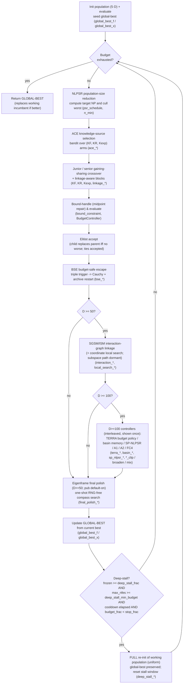

# DT-GSK — Dimension-Tiered Gaining-Sharing Knowledge

> **What this is:** the family's **headline / proposed method** — it keeps the
> GSK gaining-sharing scaffold and wraps it in a **dimension-aware** stack of
> adaptive configuration selection, population reduction, escape, linkage-aware crossover,
> an **interaction-structure memory** that records the co-movement of strictly improving accepted moves
> at zero extra evaluation cost, and a deterministic final polish (its shipped
> eigenframe basis is a controlled negative result — coordinate axes beat it at
> D = 50 in the paper's revision experiment E1). **For:**
> readers who already know the junior/senior core and want to understand every
> subsystem DT-GSK adds and how the "pub" profile turns them on by dimension.
> **Prerequisites:** [GSK](gsk.md) (junior/senior gained vectors, midpoint
> repair, KR mask) and [AGSK](agsk.md) (the idea of adaptive parameter pools and
> population reduction). **After reading** you can name the eight core subsystems
> (plus the `D>=100` controller bundle), read off what each dimension tier
> (`D<20`, `20–49`, `50–99`, `>=100`) adds, and map each behaviour to
> `dt_gsk.py`, `_dt_profiles.py`, and `_dt_subsystems/`.

DT-GSK ("Dimension-Tiered Gaining-Sharing Knowledge Optimization",
optimizer id `dt-gsk`) is this project family's own proposed method by Mostafa
Masoud; the other family members ([GSK](gsk.md), [AGSK](agsk.md),
[APGSK](apgsk.md), [FDB-AGSK](fdb-agsk.md), [ATMALS-GSK](atmals-gsk.md),
[EGSK](egsk.md)) are the baselines and variants it is compared against. It conforms to the **same uniform
contract** as every other optimizer — `optimize(problem, options) ->
OptimizerResult` — so it is a drop-in for the runner and CLI:

```python
from gsk_family.optimizers.dt_gsk import optimize
from gsk_family.types import OptimizerOptions

result = optimize(problem, OptimizerOptions(seed=20240620, rand_generator="threefry"))
```

No tuning is required: the dimension-aware **`pub`** profile is selected
automatically from `problem.dim`. Advanced users may override individual
`DTGSKConfig` fields via `options.values` (see [Parameters](#parameters-and-the-pub-profile)).

## Intuition

DT-GSK starts from the same picture as [GSK](gsk.md): a population improves by
*gaining* knowledge from better peers and *sharing* it across dimensions, with a
junior→senior schedule handing exploration over to exploitation. Plain GSK fixes
its knobs and its population size; DT-GSK instead treats the whole run as a
problem of *spending a fixed evaluation budget well across very different problem
sizes*. Three ideas drive everything:

- **Adapt the operator, not just the parameter.** A multi-armed bandit (ACE)
  learns which `(KF, KR, Kexp)` operator settings are paying off and concentrates
  draws on them, while weak entries get pruned (ARGP) on acceptance-rate evidence.
- **Spend the budget where it counts.** The population shrinks nonlinearly
  (NLPSR) so early breadth gives way to late-stage concentration; a budget-safe
  escape (BSE) rescues the run from stagnation without blowing the budget; a
  **deep-stall full restart (multi-start)** abandons and re-initialises the whole
  working population when the incumbent freezes for a quarter of the budget — with
  a preserved global-best so it can never lose ground; and a deterministic
  eigenframe polish refines the incumbent in the final slice of budget.
- **Reuse the run's own strictly improving accepted moves for free.** At the upper tiers (`D>=50`) the
  interaction-structure memory (SGSM/ISM) records which coordinates move
  *together* on accepted steps and reuses that co-movement to steer the linkage
  block crossover — all at **zero extra evaluation cost**, since it only observes
  moves the run already made. This is a non-learning success-graph statistic, not a
  recovery of the objective's true variable interactions: the component's isolated
  effect is examined directly, and its limits reported, in the Supplementary
  Materials (Section S6).

Because what helps at `D=10` (aggressive escape, dense linkage mixing) differs
from what helps at `D=300` (population floors, frozen-streak broadening, basin
memory), every one of these subsystems is gated and tuned **by dimension tier**.

## Contributions

The subsystems below map onto the three contributions the project claims:

- **C1 — A deterministic final polish.** A one-shot deterministic compass search on
  the eigenbasis of the signed interaction graph — coordinate axes when the graph
  carries no signal — run in the final budget slice at the `D>=50` tiers. The
  contribution is the deterministic endgame itself, **not the basis it searches
  along**: a three-arm isolation at fixed enablement finds the polish beating no
  refinement at both active dimensions (22/2/5 at `D=50`, 23/1/5 at `D=100`), while
  the *learned* eigenframe is **beaten by the plain coordinate axes** at `D=50`
  (Holm 1.4e-4, 25 of 29 functions) and, under the canonical 1e-8 tie rule, at
  `D=100` as well (Holm 0.0489)
  (Supplementary Materials, Section S9.1). C1 is therefore claimed **basis-neutrally**.
- **C2 — Dimension-tiered adaptive scaffold.** The `pub` profile itself: ACE/ARGP
  operator selection, the NLPSR population schedule, and BSE + the diversity archive
  + the deep-stall restart, each gated and tuned by dimension tier. The claim is
  narrowed to the dimensions where tiering was **demonstrated** against a
  high-dimension transplant — `D=10` and `D=50` — with the `20–49` tier disclosed as
  **mis-specified**: at `D=30` the parameter set the profile resolves at `D=10` beats
  the set it ships, on 20 of 29 functions (Holm 5.5e-3; Supplementary Materials,
  Section S9.3).
- **C3 — Controlled family evaluation.** The seven-algorithm GSK-family panel run
  under one frozen protocol (see [the panel section](#in-the-7-algorithm-panel)).

The **interaction-structure memory (ISM/SGSM) is a specified *negative result*, not
a contribution.** Its direct-isolation overlay finds **no significant standalone
benefit** at its active tiers once the family-wise error is Holm-corrected, and the
three-arm basis isolation added in revision sharpens that to **harm**: in the basis
C1's polish searches along, the learned eigenframe is **beaten by the plain
coordinate axes** at `D=50` (Holm 1.4e-4, 25 of 29 functions) and is not separated
from them at `D=100` — while the polish itself beats no refinement at both active
dimensions, so what failed is the learned geometry, not the endgame. The method's
standing is therefore attributed to the *complete dimension-tiered system*, never to
ISM. Its role is to supply linkage evidence (to the block crossover) and an
eigenbasis (to C1's polish); both cost **zero extra evaluations**, though enabling
the memory costs +57.3% wall-clock on CEC2017 at `D=50`, +36.3% at `D=100`, and
+30.3% on CEC2013 at `D=50`. See the Supplementary Materials (Sections S6 and S9.1)
for the two isolation designs and their results.

## Main components

The eight core subsystems — plus the `D>=100` controller bundle (the ninth row) —
and how each one works:

| Subsystem | Role |
|---|---|
| **ACE** — Adaptive Configuration Engine | A multi-armed bandit over a 5-arm (+DE) pool of `(KF, KR, Kexp)` operator settings. EMA credit-tracking concentrates draws on arms with the higher realised improvement (the credit is the positive fitness delta, `max(parent-child, 0)`); at `D>=20` it keeps a top/bottom acceptance memory. |
| **NLPSR** — Nonlinear Population-Size Reduction | Shrinks `NP` from `NP_init` toward a tier floor `N_min` along a nonlinear schedule, so breadth early gives way to concentrated budget late. |
| **ARGP** — Acceptance-Rate Gated Pruning | Watches operator-pool acceptance over a window and prunes entries whose acceptance falls below a tier threshold, after a warm-up fraction. |
| **Linkage-aware block crossover** | Recombines in arbitrary (non-contiguous) coordinate blocks --- chunks of a random coordinate permutation (block size 5 or 10 by dimension) for a dimension-dependent fraction of the population (`linkage_block_mix_prob` = 0.70 at `D<20` and `D>=50`, 0.40 at mid dim), preserving variable groupings instead of treating every coordinate independently. |
| **BSE** — Budget-Safe Escape | A triple-trigger stagnation detector (acceptance / diversity / signal floors) that fires a Cauchy rescue and an archive-seeded restart, capped so it can never overshoot the budget. |
| **Deep-stall full restart (multi-start)** — DEFAULT-ON | A standard mechanism (not experimental). When the incumbent has been frozen for `>= deep_stall_frac` of the budget, the **entire working population is re-initialised uniformly** while a separate **global-best** preserves the best-ever — so a restart can never lose ground and escapes basins BSE cannot (BSE always keeps the trapped elite). RNG is drawn only when it fires; no extra NFEs. |
| **SGSM / ISM** — Interaction-Structure Memory | At `D>=50`, a confidence-gated success-graph that records the co-movement of *accepted* moves at zero extra evaluation cost and steers the linkage block crossover. (It also *can* steer a top-`k`-block subspace local search, but that path is **not enabled** in the frozen `pub` profile — a charged coordinate local search runs instead; see the [main loop](#main-loop-per-generation-pipeline), step 8.) |
| **Eigenframe final polish** | At `D>=50`, a one-shot RNG-free deterministic compass search on the SGSM eigenbasis, run in the final budget slice (~96% of budget). |
| **D>=100 controllers** | Upper-tier protection: A1 late-accept clip, A2 frozen-streak broaden, FC4 linkage random-mix, basin memory, and an SP-NLPSR subspace floor. |

**How each works**

- **ACE** keeps a small pool of operator settings (the bandit arms), each an
  `(KF, KR, Kexp)` triple; an optional DE-style arm can enter the pool. Each
  generation it samples an arm per individual, then updates an exponential
  moving average of each arm's credit from the summed fitness improvement of its trials (improvement magnitude, not an acceptance count)
  (`ace_learning_rate=0.10`, floor `ace_min_prob=0.05`), so the wheel drifts
  toward arms that win. At `D>=20` the credit is split into top/bottom
  acceptance memory rather than a single pool.
- **NLPSR** computes a target population size
  `NP = NP_init + (N_min − NP_init) · x^(1−x)`, where `x = evals / max_evals`.
  The exponent `x^(1−x)` makes the curve concave, holding breadth longer than a
  straight line before collapsing toward `N_min` near the end; the worst
  individuals are dropped to hit each target.
- **ARGP** maintains an acceptance window (`argp_window=30`) and, after a warm-up
  (`argp_warmup_frac=0.15`), **freezes** operator entries whose windowed acceptance
  sits below the tier threshold (`0.02` at low/mid dim, `0.010` at `D>=50`) and
  redistributes their probability mass to the survivors (they are frozen behind a
  probability floor, not deleted, so a recovering arm can return), keeping draws
  concentrated on productive operators.
- **Linkage-aware block crossover** replaces the per-coordinate KR mask, for a
  fraction of the population, with a *block* mask over arbitrary (non-contiguous) coordinate
  groups (`linkage_block_size_by_dim`: 5 below `D=50`, 10 at `D>=50`), refreshed
  periodically. The mix probability is tier-dependent
  (`linkage_block_mix_prob` ≈ 0.70 at `D<20`, 0.40 mid, 0.70 at `D>=50`).
- **BSE** tracks a stagnation signal over a window
  (`bse_signal_window`), an acceptance floor (`bse_acceptance_floor`), and a
  diversity floor (`bse_diversity_floor_frac`). At low dim a single stagnation
  trigger is used; at `D>=20` the **triple** trigger (`bse_trigger_mode="triple"`)
  requires several conditions. On firing it injects a Cauchy rescue
  (`bse_cauchy_*`) and reseeds part of the population from the external archive,
  bounded by `bse_max_restarts` so it is budget-safe.
- **Deep-stall full restart (multi-start)** is a **standard, default-on**
  mechanism (`deep_stall_restart_enabled=True`), distinct from BSE. At the **end of
  every generation** DT-GSK first updates a separate **global-best** (`global_best_f`,
  `global_best_x`) that shadows the best-ever solution, then tests a
  budget-proportional **stall predicate**. It fires a full restart when **all** of
  the following hold:
    1. the incumbent has been frozen for at least `deep_stall_frac` of the budget
       (`(nfes_used − nfes_at_best) / max_nfes >= deep_stall_frac`, default `0.25`);
    2. the total budget is large enough — `max_nfes >= deep_stall_min_budget`
       (default `20000`); this keeps tiny budgets (e.g. the 3000-NFE byte-stability
       KAT) inert, so default-on is byte-safe and every real CEC run (`>= 10000·D`)
       clears it;
    3. the **cooldown** has elapsed — at least `deep_stall_cooldown_frac` of the
       budget since the last deep-stall restart (default `0.15`);
    4. the run is not yet in its closing phase — `budget_frac < deep_stall_stop_frac`
       (default `0.9`).
  When it fires, the **entire working population is re-initialised uniformly** in
  the box (`lower + U·span`, drawn from the `bse` substream) and re-evaluated; the
  stall window and stagnation detector reset from "now". The **global-best
  invariant** is the key guarantee: because the best-ever lives outside the working
  population, a full re-init can **never lose ground**, and `optimize()` returns
  the global-best (it replaces the working incumbent whenever the global-best is
  better). This lets the multi-start escape a basin BSE **cannot** — BSE
  structurally preserves the trapped elite, which in a deep trap *is* the bad
  attractor, whereas the full re-init removes it. It costs **no extra NFEs** beyond
  the re-evaluation it performs, and **RNG is drawn only when it fires**, so
  non-stalling runs (especially at the upper tiers, which stay productive via SGSM/TERRA) are
  **byte-identical** to runs with the mechanism off. It fixes the catastrophic
  CEC2017 **F30 D10 run-27 basin trap** (best-f `~817578 → ~591`), with a disclosed
  **D30 trade-off**: it can prematurely restart a handful of slow-converging
  multimodal functions.
- **SGSM/ISM** accumulates a decaying interaction graph
  (`interaction_graph_decay=0.95`) over which coordinate pairs move together on
  accepted steps, refreshed every few generations after a warm-up. It is gated by
  confidence thresholds (`interaction_confidence_min`, with an adaptive variant)
  and minimum-evidence guards (`interaction_min_updates`,
  `interaction_min_refreshes`) so it only acts once the graph is trustworthy.
  When confident, it supplies linkage blocks to the block crossover. The graph
  can *also* feed a top-`k`-block subspace to the local search, but that path is
  **dormant** in the frozen `pub` profile (`local_search_method="coordinate"`,
  `local_search_auto_subspace=False`); the charged coordinate local search runs
  instead. It costs **no extra evaluations** because it only observes moves the
  run already accepted.
- **Eigenframe final polish** (`final_polish_*`) starts at ~96% of budget and
  runs a deterministic compass/pattern search along the eigenvectors of the SGSM
  interaction matrix, refining the incumbent without consuming the RNG — a clean,
  reproducible end-of-run squeeze.
- **D>=100 controllers** add: **A1** late-accept clip (tightens acceptance when a
  long log-drop streak stalls), **A2** frozen-streak broaden (widens the operator
  when acceptance freezes), **FC4** link random-mix (injects randomness into
  linkage on negative lift), **basin memory** (remembers visited basins), and the
  **SP-NLPSR** subspace floor that keeps a minimum number of subspace samples
  alive.

The GSK survivor selection accepts a child when it is **no worse** (`<=`;
equal-fitness ties accepted) --- the one relaxation of base GSK's strictly-greedy
rule; DT-GSK's machinery otherwise decides *how trials are built and how the
budget is spent*, not how replacement works.

## Main loop (per-generation pipeline)

DT-GSK initialises a `5·D` population from its own `init` substream, evaluates
it, and seeds the **global-best** shadow that the deep-stall restart preserves.
It then runs the loop below until the evaluation budget is exhausted, and returns
the **global-best**. The flowchart depicts the **principal** order in `_dt_core.py`
(`dt_gsk_optimize`); the dimension-gated steps (`D>=50`, `D>=100`) are skipped
when the active `pub` tier does not enable them. The `D>=100` controllers are drawn
as one node for readability, but are in fact **interleaved** across the generation:
SP-NLPSR clamps the reduction target (step 2), FC4 acts inside the linkage crossover
(step 4), and the TERRA budget policy gates the escape (step 7) and local-search
(step 8) stages.



Step-by-step (each step cross-referenced to its config field):

1. **Init.** Sample `NP_init = np_init_mult·D = 5·D` rows from the `init`
   substream, evaluate, and set `global_best_f`/`global_best_x` (`np_init_mult`).
2. **NLPSR reduction.** Compute the target `NP` from the budget fraction and cull
   the worst individuals toward `n_min` (`psr_schedule`, `psr_alpha`, `n_min`).
3. **ACE selection.** Sample a knowledge-source arm — an `(KF, KR, Kexp)` triple
   (plus optional DE arm) — per individual from the bandit memory (`ace_pool`,
   `ace_init_probs`, `ace_learning_rate`, `ace_min_prob`, `ace_memory_mode`,
   `ace_de_entry`).
4. **Junior/senior crossover.** Build the junior and senior gained vectors and
   mix them through the KR mask, using linkage-aware contiguous blocks for part of
   the population (`KF`, `KR`, `Kexp`, `p_senior`, `linkage_block_size_by_dim`,
   `linkage_block_mix_prob`).
5. **Bound-handle & evaluate.** Repair out-of-bounds components by the L-SHADE
   midpoint rule and evaluate through the `BudgetController` cap (`bounds`,
   `max_nfes`).
6. **Elitist accept.** A child replaces its parent when it is **no worse**
   (`<=`; equal-fitness ties are accepted, matching the frozen code and
   Eq. (9) --- this is the one relaxation of the base GSK greedy selection).
7. **BSE escape.** On the triple stagnation trigger, fire the Cauchy rescue and
   archive-seeded partial restart, capped by `bse_max_restarts` (`bse_trigger_mode`,
   `bse_signal_window`, `bse_acceptance_floor`, `bse_diversity_floor_frac`,
   `bse_cauchy_*`, `bse_restart_frac`, `bse_max_restarts`, `bse_stop_frac`).
8. **(D>=50) SGSM/ISM + local search.** Update the decaying interaction graph from
   **strictly improving** accepted moves (ties do not update the graph; DE-arm
   moves have update weight 0, local-search displacements weight 0.25) and, when
   confident, steer the linkage block crossover. The
   frozen `pub` profile runs a **charged coordinate local search** here; the
   graph-steered top-`k`-block subspace variant is implemented but not enabled
   (`interaction_graph_enabled`, `interaction_confidence_min`,
   `interaction_use_for_linkage`, `local_search_method="coordinate"`,
   `local_search_*`).
9. **(D>=100) upper-tier controllers.** TERRA budget policy, basin memory, SP-NLPSR
   subspace floor, A1 late-accept clip, A2 frozen-streak broaden, FC4 linkage
   random-mix (`terra_enabled`, `budget_policy_enabled`, `basin_memory_enabled`,
   `sp_nlpsr_enabled`, `late_accept_clip_enabled`, `frozen_broaden_enabled`,
   `link_random_mix_enabled`). These are **interleaved** across the generation,
   not a single stage: SP-NLPSR clamps the step-2 reduction target, FC4 acts
   inside the step-4 linkage crossover, and the TERRA budget policy gates the
   step-7 escape and step-8 local search.
10. **(D>=50) Eigenframe final polish.** Once, from `final_polish_start_frac` of
    the budget, refine the incumbent by a deterministic RNG-free compass search on
    the SGSM eigenbasis (`final_polish_enabled`, `final_polish_start_frac`,
    `final_polish_step_frac`).
11. **Update global-best.** If the current best beats `global_best_f`, record it
    and reset the stall marker (`nfes_at_best`).
12. **Deep-stall test (decision).** If the incumbent has been frozen for
    `>= deep_stall_frac` of the budget **and** `max_nfes >= deep_stall_min_budget`
    **and** the cooldown has elapsed **and** `budget_frac < deep_stall_stop_frac`,
    then **re-initialise the entire working population uniformly** and reset the
    stall window; otherwise continue. The preserved global-best means this can
    never lose ground (`deep_stall_restart_enabled`, `deep_stall_frac`,
    `deep_stall_min_budget`, `deep_stall_cooldown_frac`, `deep_stall_stop_frac`).
13. **Loop / return.** Repeat until the budget is exhausted, then return the
    **global-best** (the core's return path substitutes it for the working
    incumbent whenever it is better, before the adapter wraps the result).

## Worked example

DT-GSK's distinctive budget mechanism is **NLPSR** — the nonlinear
population-size reduction that holds breadth early and collapses toward the tier
floor late. It is a clean closed form, so the target `NP` at any point in the run
is hand-checkable. Take a `D=50` run, where the `pub` profile sets
`NP_init = np_init_mult · D = 5 · 50 = 250` (the `np_init_mult` default,
`_dt_core.py:152`) and the tier floor `n_min = 25` (`_dt_profiles.py:97`).

**Formula** (`nlpsr` schedule; `x = nfes_used / max_nfes`):

```text
NP(x) = NP_init + (n_min - NP_init) · x^(1-x)          # rounded half-up
      = 250     + (25      - 250)    · x^(1-x)
      = 250     - 225 · x^(1-x)
```

**Step through the budget** (`x^(1-x)` is 0 at `x=0` and 1 at `x=1`):

| x = nfes/max | x^(1-x) | 250 − 225·x^(1-x) | NP (round half-up) |
|---:|---:|---:|---:|
| 0.00 | 0.0000 | 250.000 | 250 |
| 0.10 | 0.1259 | 221.674 | 222 |
| 0.25 | 0.3536 | 170.450 | 170 |
| 0.50 | 0.7071 |  90.901 |  91 |
| 0.75 | 0.9306 |  40.614 |  41 |
| 1.00 | 1.0000 |  25.000 |  25 |

The worst individuals are dropped each generation to hit the current target. The
`x^(1-x)` exponent is what makes the schedule *nonlinear*: at the halfway point
`x=0.5` the population is already down to 91, below the linear-`LPSR` value of
`250 + (25 − 250)·0.5 = 137.5` for the same endpoints — so DT-GSK sheds breadth
faster than a straight line through the first half of the run (the reduction is
steepest mid-run, since the effective exponent is `1-x`, not `1`), then eases as
it approaches the floor over the final quarter.

Code: `_psr_target_size()` in `src/gsk_family/optimizers/_dt_core.py:801`
(numba hot path `_psr_target_nb` in `_dt_subsystems/_numba_accel.py:909`,
`nl = frac**(1.0-frac)` at line 933).
Why it matters: NLPSR is how DT-GSK "spends the budget where it counts" — the
same `x^(1-x)` shape AGSK uses for [LPSR](../research/numerical_examples.md#lpsr-population-schedule-adaptive-variants),
but starting from a dimension-scaled `5·D` population and bottoming out at a
tier-specific floor rather than a fixed minimum.

## Dimension tiers

The `pub` profile (built in `_dt_profiles.py:build_pub_config`) layers a common
block of settings (`_PUB_COMMON`) with tier-specific overrides selected by
`problem.dim`. What each tier adds:

| Tier | Adds / changes |
|---|---|
| **`D<20`** | ACE single-pool memory (`ace_memory_mode="single"`), no DE arm entry, NLPSR; aggressive escape — extra restarts (`bse_max_restarts=4`, `bse_restart_frac=0.30`) and Cauchy rescue enabled; dense linkage mixing (`linkage_block_mix_prob=0.70`, block size 5); late coordinate local search (`local_search_start_frac=0.80`). |
| **`20–49`** | ACE top/bottom memory (`ace_memory_mode="top_bottom"`), DE arm enabled (`ace_de_entry=True`), triple-trigger BSE with Cauchy, lighter linkage mixing (`0.40`); a best-status override across the whole tier (`_D30_BEST_STATUS_OVERRIDES`: `bse_restart_frac=0.30`, `p_senior=0.15`). **This tier is mis-specified:** at `D=30` the set the profile resolves at `D=10` beats the set shipped here, on 20 of 29 CEC2017 functions (Holm 5.5e-3; Supplementary Materials, Section S9.3). |
| **`50–99`** | Population floor `n_min=25`; **SGSM/ISM** turned on (`interaction_graph_enabled`, `interaction_graph_min_dim=50`) with adaptive confidence, steering the linkage block crossover (the graph-steered subspace local search stays dormant — `local_search_method="coordinate"`); block size 10; **eigenframe final polish** enabled (`final_polish_start_frac=0.96`); a senior split (`p_senior_split_enabled`) and promoted local-search budget. |
| **`>=100`** | Everything in the `>=50` tier **plus** the upper-tier controllers (`_PUB_D_GE_100_EXTRA`): TERRA budget policy, basin memory, SP-NLPSR subspace floor, coordinate local search with cooldowns, A1 late-accept clip (`late_accept_clip_enabled`), A2 frozen-streak broaden (`frozen_broaden_enabled`), FC4 linkage random-mix (`link_random_mix_enabled`), and a reduced restart cap (`bse_max_restarts=2`). |

The exact resolved config for any dimension is whatever
`build_pub_config(dim, …)` returns; the tables above summarise the override
blocks in `_dt_profiles.py` (`_PUB_D_LT_20`, `_PUB_D_20_TO_49`, `_PUB_D_GE_50`
+ `_SGSM_D_GE_50_EXTRA` + the adaptive/promoted blocks, and
`_PUB_D_GE_100_EXTRA`).

**Worked example — what switches on at `D=10` vs `D=100`.** Resolving
`build_pub_config` at the two extremes makes the gating concrete (each cell is the
value `_dt_profiles.py` merges onto the `DTGSKConfig` defaults):

| Subsystem | `D=10` (tier `D<20`) | `D=100` (tier `>=100`) |
|---|---|---|
| ACE operator bandit | on — single-pool memory, **no DE arm** | on — top/bottom memory, **no DE arm** |
| NLPSR reduction | on (`nlpsr`) | on (`nlpsr`) **+ SP-NLPSR** subspace floor |
| ARGP pruning | on — threshold `0.02` | on — threshold `0.010` |
| Linkage block crossover | on — block size **5**, mix `0.70` | on — block size **10**, mix `0.70` |
| BSE escape | on — single `stagnation` trigger, Cauchy, **4** restarts | on — `triple` trigger, Cauchy, **2** restarts |
| Deep-stall restart | on (default) | on (default) |
| Coordinate local search | on — from **80%** of budget | on — from **70%**, with period/cooldown |
| SGSM/ISM memory | **off** (`interaction_graph_min_dim=50`) | **on** — adaptive confidence |
| Eigenframe final polish | **off** | **on** — from **96%** of budget |
| `D>=100` controllers (TERRA / basin / A1 / A2 / FC4) | **off** | **on** |

Two non-obvious points fall out of the merge order. First, the DE-style ACE arm is
a **mid-dimension-only** feature: `ace_de_entry` is `True` only in the `20–49` and
`50–99` tiers and `False` at both `D=10` and `D=100`. Second, everything "off" at
`D=10` is off because the corresponding `DTGSKConfig` default is `False`
(`interaction_graph_enabled`, `final_polish_enabled`, and every `D>=100` controller)
and the `D<20` block never switches it on; everything "on" at `D=100` is turned on
by the inherited `D>=50` blocks (`_SGSM_D_GE_50_EXTRA`, `_D_GE_50_PROMOTED`) plus
`_PUB_D_GE_100_EXTRA`.

## RNG and self-initialization

DT-GSK draws all randomness through a dedicated substream RNG layer
(`_dt_rng.py`) with **13 named, append-only substreams**, child-seeded from one
run seed:

```text
init, core, ace, kexp, div, bse, arch, link, de, control, flow, basin, trust
```

The order is **load-bearing**: each substream's child seed is assigned by
position, so the contract is prefix-locked and new substreams may only be
appended at the end. Stream 0 (`init`) receives the run seed *verbatim* — so the
**`init` substream equals `threefry(seed)`**, the same stream the family's
fair-start mechanism uses. Toggling any subsystem therefore cannot disturb the
draw order of the others.

DT-GSK **always** uses the `threefry` generator with the unified shared seed
`get_cec_seed` under **every** seed policy (it is listed in
`seed_policy.UNIFIED_ONLY_OPTIMIZERS`), so it sits on the exact same shared
seed/generator footing as the rest of the GSK family. See
[Seed Policy](../reference/seed_policy.md).

**Self-init (a documented fair-start exception).** DT-GSK's initial population
is `np_init_mult · D = 5·D` rows (the NLPSR starting size). It draws this
population *itself*, from its own unified `threefry(seed)` stream (the `init`
substream), and **intentionally ignores the runner's fair-start `X0`**. This is
intrinsic to the algorithm — it preserves DT-GSK's tuned, byte-identical
initialization — and it is **not** a different seed: the self-init stream is the
same `threefry(seed)` the fair-start uses. The result records
`notes="self-init (fair-start exception)"` (`dt_gsk.py:327`), and the run stays
fully deterministic for a given seed.

## Budget and determinism

- **Budget.** Evaluations are counted *through* `problem.evaluate` by an internal
  `BudgetController`, which is the single evaluation cap; the run stops at
  `problem.max_nfes` (default `10000·D`). `result.nfes_used` is reported as
  `OptimizerResult.nfes`, and the convergence trace records best-so-far at each
  callback (`dt_gsk.py:259-272`). Best-so-far is monotone non-increasing.
- **Bounds.** Both **uniform scalar** `(lo, hi)` bounds and **per-dimension**
  heterogeneous bounds are supported: `_resolve_bounds` collapses uniform bounds to
  a scalar pair and returns per-coordinate `(lb, ub)` arrays for heterogeneous ones
  (as used by the CEC2011 real-world problems, where each variable has its own
  range); only empty bounds raise (`_resolve_bounds`, `dt_gsk.py:75-90`).
- **Determinism.** Same seed → identical result. Every draw flows through the 13
  substreams in a fixed order, and DT-GSK never reseeds mid-run. At `D>=50`,
  byte-stable determinism relies on **single-threaded numba/BLAS** (thread
  pinning), because the SGSM linear-algebra paths must reduce in a fixed order.

## Byte-for-byte parity with the source project

DT-GSK was migrated from its originating development tree (the
`03-DT-GSK-v2.1` workspace, predating this repository) and reproduces
it **byte-for-byte**. The `_dt_profiles.py` `pub` builder is a faithful port of
the source's `profiles.py` `pub` profile together with the
`dt_gsk_`-prefix-strip mapping the source's `experiment._build_dt_gsk_config`
applied, so the migrated optimizer produces the source's per-dimension
`DTGSKConfig` — and therefore its trajectory — bit-for-bit. The
`_dt_subsystems/` core and subsystems are vendored byte-for-byte.

Parity was validated on the sphere function and CEC2017 across `D=10/30/50/100`
(all exact). Byte-stability is locked by
`tests/regression/test_dt_gsk_byte_stable.py`, and the profile builder is locked
against an oracle generated from the source by `tests/unit/test_dt_profiles.py`.

## Parameters and the `pub` profile

DT-GSK has **no required tuning values**. The dimension-aware `pub` profile is
applied automatically by `problem.dim`; the run-level fields are resolved from
the problem and options and cannot be overridden via `values`:

| Field | Source | Meaning |
|---|---|---|
| `profile` | always `"pub"` | The single shipped, paper-facing profile (`dt_gsk.py:318`). |
| `dim`, `seed`, `max_nfes`, `bounds`, `rand_generator` | problem / options | **Reserved** run-level fields; not overridable via `values` (`_RESERVED_FIELDS`, `dt_gsk.py:40`). |
| `np_init_mult` | profile | Initial population multiplier; `NP_init = np_init_mult · D` (= `5·D`). |
| `n_min` | profile (tier) | NLPSR population floor (e.g. `25` at `D>=50`). |
| `KF`, `KR`, `Kexp` | profile / ACE | Operator settings; the ACE bandit adapts these during the run. |
| `deep_stall_restart_enabled` | profile (default `True`) | Default-on **deep-stall full restart (multi-start)**; re-inits the working population on a deep stall while preserving the global-best. |
| `deep_stall_frac` | profile (default `0.25`) | Frozen-incumbent fraction of the budget that arms the deep-stall restart. |
| `deep_stall_min_budget` | profile (default `20000`) | Minimum `max_nfes` for the deep-stall restart to be active (keeps tiny budgets byte-identical). |
| `deep_stall_cooldown_frac` | profile (default `0.15`) | Minimum budget fraction between consecutive deep-stall restarts. |
| `deep_stall_stop_frac` | profile (default `0.9`) | Budget fraction past which deep-stall restarts no longer fire. |
| `restarts_done` | result | Number of BSE restarts that fired (`dt_gsk.py:324`). |

**Advanced overrides.** Any `DTGSKConfig` field (other than the reserved
run-level ones) may be overridden per run via `options.values`; the adapter
applies them with `dataclasses.replace` after building the profile
(`dt_gsk.py:248-254`). For example, to disable the final polish at high
dimension:

```python
result = optimize(
    problem,
    OptimizerOptions(seed=20240620, values={"final_polish_enabled": False}),
)
```

Unknown keys are ignored; reserved keys (`dim`, `seed`, `max_nfes`, `bounds`,
`rand_generator`) are never taken from `values`.

## When to use

DT-GSK is the **default first choice** of the family and the method this project
proposes. On CEC2017 (51 runs, 29 functions, F2 excluded) it attains the **best
descriptive family-rank aggregate** — first mean rank at D10/D50/D100 and second
at D30 behind the strong eGSK baseline — but Holm-corrected pairwise tests
separate it from eGSK **only at D10**, and the paper's matched-population
control shows the D50/D100 first places rest in part on the NP = 5D population
rule. On the real-world CEC2011 suite it places second in the family, with a
Holm-significant loss to eGSK. It is designed
to scale across dimensions — the eigenframe polish and `D>=100` controllers target
the upper dimension tiers — while its aggressive escape, dense linkage mixing, and
the default-on deep-stall multi-start keep it strong at low dimension. The standing
is a property of the **complete dimension-tiered system**, and two isolations
say why it is not attributed to any single subsystem. A direct component
isolation finds no detectable standalone benefit from the interaction-structure
memory at its active tiers (Supplementary Materials, Section S6). A three-arm
isolation of the refinement basis, added in revision, sharpens that to harm: in
the memory's terminal exploitation channel — the basis the deterministic final
polish searches along — the learned eigenframe is **beaten by the plain
coordinate axes** at D50 (Holm 1.4e-4, 25 of 29 functions) and is not separated
from them at D100 (Section S9.1). The polish itself survives, beating no
refinement at both active dimensions, so it is claimed basis-neutrally and the
memory is reported as a specified negative result rather than as a contribution.
Reach for DT-GSK when you want the strongest out-of-the-box result and do not
want to tune by hand. (Ranks are in the manuscript and its Supplementary
Materials; `FINAL_RELEASE_REPORT.md` is a historical CEC2017-only record from
before submission and is not current.)

For the baselines and variants it is compared against:

- [GSK](gsk.md) — the un-tuned reference core every member extends.
- [AGSK](agsk.md) — adaptive KF/KR pools + linear population reduction.
- [APGSK](apgsk.md) — AGSK plus a negative-KF pool and stochastic junior schedule.
- [FDB-AGSK](fdb-agsk.md) — AGSK with fitness-distance-balance donor selection.
- [ATMALS-GSK](atmals-gsk.md) — five-pool memory tuning plus adaptive local search.
- [EGSK](egsk.md) — dual adaptive knowledge factors plus a late interior-point
  polish; the strongest baseline in the panel.

## In the 7-algorithm panel

DT-GSK is the **proposed method** at the centre of the family's headline
comparison — not a comparator. The statistical suite (`gsk-stats`) builds, per
dimension, the **7-algorithm GSK-family panel**: DT-GSK plus the **six reference
comparators** (`gsk`, `agsk`, `apgsk`, `fdb-agsk`, `egsk`, `atmals-gsk`). Note
`egsk` contributes its committed comparator data to the panel from the committed
`scipy`-SLSQP **port** CSVs (the comparator of record); this is the same runnable
port shipped here, whose only deviation from the MATLAB reference is scipy-SLSQP
in place of `fmincon`.
Panel data for every algorithm — DT-GSK included — is loaded
**reference-first** from the committed panel
`benchmarks/cec_reference_results/<suite>/<optimizer>/` (the full 7-optimizer
panel is committed for CEC2017, CEC2011, and CEC2013); a locally reproduced run
under `results/_run_all/` is only a fallback for cells the reference tree does
not carry. Across the panel DT-GSK appears as the row the analysis is built to
defend: Friedman ranks + Nemenyi critical-difference diagrams, Holm-corrected
pairwise Wilcoxon, Vargha-Delaney A12 / Cliff's delta effect sizes, win/tie/loss
tallies, BCa bootstrap intervals, LaTeX tables, and 7-curve convergence grids, all
written under `results/_run_all/_analysis/<suite>/`. DT-GSK is the **default
target** of the runner's live `--stats` stream. The panel bears out the
dimension-tier story above: on CEC2017 DT-GSK holds the best descriptive mean
rank at D10/D50/D100 and is second at D30 behind the strong eGSK baseline —
descriptive ranks, not significance claims: Holm-corrected tests separate it
from eGSK only at D10, and the D50/D100 first places rest in part on the
population rule (paper experiment E2). The deterministic final polish earns its
place (it beats no refinement at both active dimensions), its learned
eigenframe basis does not (coordinate axes beat it at D = 50, E1) — while the
SGSM/ISM memory is a **supporting** mechanism
that a direct isolation shows **no significant standalone benefit** from
(Holm-corrected; see Section S6), so its separation is never attributed to ISM. See
[Statistical Analysis](../research/statistical_analysis.md) for the panel
construction and the single-source-of-truth policy
(`src/gsk_family/analysis/project_policy.py`) that fixes the runnable/reference
split.

Beyond the family panel, a **scaffold ablation** isolates what each DT-GSK
mechanism contributes: `scripts/run_ablation.py` disables exactly one
`optimizer_options` flag per cell — ACE (`ace_enabled`), NLPSR (`psr_enabled`),
BSE (`bse_enabled`), linkage crossover (`linkage_blockwise_enabled`), the endgame
coordinate local search (`local_search_enabled`), elite archive
(`arch_enabled`) — plus the full-scaffold baseline, with SGSM
(`interaction_graph_enabled`) held off in every cell;
`papers/scripts/generate_ablation_matrix.py` then rolls the cells up into a
mean-Friedman-rank matrix with full-vs-cell Wilcoxon/Holm tests. The SGSM
overlay itself is ablated separately on a dedicated overlay design — the four cells
`full` / `no_sgsm` / `no_adaptive` / `no_finalpolish`, run across CEC2013 and
CEC2017 at the SGSM-active `D>=50` tiers
(`benchmarks/cec_reference_results/_ablation/overlay/`).

The standalone CEC2017 review pack
(`python papers/scripts/generate_review_pack.py` →
`papers/DT-GSK-CEC2017-review.pdf`) renders the same 7-algorithm convergence
grids (GSK, AGSK, APGSK, FDB-AGSK, eGSK, ATMALS-GSK, DT-GSK) from the per-cell
`CheckpointErrors_<alg>_F<k>_D<dim>.csv` files; any missing curve is logged to
`papers/DT-GSK-CEC2017-review_missing.log` and never fabricated.

## Source and validation

- **Code map.**
  - `src/gsk_family/optimizers/dt_gsk.py` — the `optimize()` adapter (contract
    bridge, bounds check, profile build, result assembly).
  - `src/gsk_family/optimizers/_dt_profiles.py` — the dimension-tier `pub`
    config builder (`build_pub_config`, `pub_overrides`).
  - `src/gsk_family/optimizers/_dt_rng.py` — the 13-substream RNG layer.
  - `src/gsk_family/optimizers/_dt_core.py` — the core driver
    (`dt_gsk_optimize`, `DTGSKConfig`, `DTGSKResult`).
  - `src/gsk_family/optimizers/_dt_subsystems/` — the DT-GSK core and
    subsystems, vendored byte-for-byte. Notable modules:
    - `interaction_graph.py` — the SGSM/ISM interaction-structure memory (the
      decaying coordinate-pair graph and the learned linkage it exposes).
    - `basin_memory.py` — the `D>=100` basin memory of visited regions.
    - `budget.py` / `budget_policy.py` — the `BudgetController` evaluation cap and
      the TERRA budget policy that gates the final-polish / upper-tier behaviour.
    - `bound_constraint.py` — the uniform-scalar bound handling.
    - `gained_shared_junior.py` / `gained_shared_senior.py` — the
      gaining-sharing junior/senior gained-vector kernels.
    - `_numba_accel.py` — the numba-accelerated hot paths (single-threaded at
      `D>=50` for byte-stable reduction order).
    - `_dt_provenance.py` — provenance/version stamping used by the parity tests.
- **Validation.** Byte-stability is locked by
  `tests/regression/test_dt_gsk_byte_stable.py`; the profile builder is locked
  against a source oracle by `tests/unit/test_dt_profiles.py`. See the
  [Validation Report](../research/validation_report.md).
- **Sample run.** Canonical results land in `results/_run_all/dt-gsk/cec2017/`.
  Run for example:

  ```bash
  python -m gsk_family.cli.run \
    --optimizer dt-gsk \
    --suite cec2017 \
    --dimension 30 \
    --function 1 \
    --runs 1 \
    --seed 20240620 \
    --max-evaluations 300000 \
    --output-root results/_run_all
  ```
