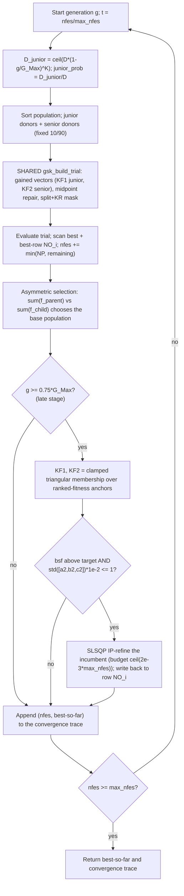

# EGSK — Enhanced Gaining-Sharing Knowledge

> **What this is:** a strong published GSK variant (Jawad, Roshdy & Mohamed,
> [doi:10.1016/j.rico.2025.100542](https://doi.org/10.1016/j.rico.2025.100542)) that keeps GSK's
> junior/senior update but adds **two independently-adapted knowledge factors**, a **fixed 10/90
> senior partition**, and a **late-stage interior-point local polish**. **For:** readers who know
> [GSK](gsk.md) and want the strongest non-proposed baseline in the panel. **Prerequisites:** the
> gaining-sharing core (junior/senior gained vectors, midpoint repair, split-then-KR mask) from
> [GSK](gsk.md). **After reading** you can trace one EGSK generation by hand and map every line of
> `src/gsk_family/optimizers/egsk.py` to its math.

## Intuition

EGSK reuses GSK's two-phase trial construction **unchanged** — the same junior and senior gained
vectors, midpoint bound repair, and split-then-KR per-dimension mask (the literal `gsk_build_trial`
kernel, `egsk.py` main loop). What EGSK adds is *three* enhancements over base GSK:

- **Dual adaptive knowledge factors `KF1` (junior) and `KF2` (senior).** Base GSK uses one fixed
  `kf`; EGSK carries two, held at `0.5` for most of the run, then — in the **last 25% of the budget**
  (`g ≥ 0.75·G_Max`) — recomputed **per individual** from a *triangular membership function* over
  ranked-fitness anchors. The factors become large in the "interesting" fitness band and zero
  outside it, sharpening the late-stage step.
- **Fixed 10/90 senior partition.** The senior donors are drawn from a best-10% / middle-80% /
  worst-10% split (`round(NP·0.1)`, `round(NP·0.9)`), regardless of any `p` parameter — equal to the
  shared senior helper with `p = 0.1`.
- **Interior-point local refinement.** When the search stalls late (a low-spread anchor condition),
  EGSK polishes the incumbent with a bounded gradient-based local search. The reference uses MATLAB
  `fmincon` (SQP); this port substitutes `scipy.optimize.minimize(method="SLSQP")` — the closest open
  equivalent, called with box bounds, `maxiter=max(1, budget)`, and `ftol=1e-12` (`egsk.py:204`),
  every objective call charged to `nfes` — and validates by **statistical equivalence** (see
  *Source and validation*).

A fourth, smaller transcribed quirk is an **asymmetric population-level selection** (it compares the
parent-vs-child fitness *sums* to choose the base population), preserved exactly from the reference.

## Mathematical formulation

The junior/senior gained vectors, midpoint repair, and the split/KR mask are identical to
[GSK](gsk.md). This section documents only the EGSK-specific mechanics. Constants
(`egsk.py:53-60`): `NP = 100`, `KR = 1`, `K = 10` (scalar), `KF1₀ = KF2₀ = 0.5`, senior `p = 0.1`,
late-stage trigger `0.75`, IP budget fraction `2e-3`.

**Junior schedule (scalar).** Unlike AGSK's per-row exponent, EGSK uses one scalar count per
generation (`egsk.py` main loop), with `G_Max = ⌊max_nfes / NP⌋`:

```text
D_junior  = ceil( D * (1 - g/G_Max) ^ K )          # K = 10, scalar
junior_prob = D_junior / D                          # broadcast over the population
```

**Dual knowledge factors — late stage only** (`g ≥ 0.75·G_Max`). With the post-selection fitness
vector `x` and donor index vectors `Rg1,Rg2,Rg3` (junior) and `R1,R2,R3` (senior), the triangular
membership `tri(x; a, b, c)` is:

```text
tri(x; a,b,c) = (x - a)/(b - a)   if a <= x <= b
              = (c - x)/(c - b)   if b <= x <= c
              = 0                  otherwise
KF1_i = clamp( tri( x_i ; f[Rg1_i], f[Rg3_i], f[Rg2_i] ) )      # per-individual anchors
KF2_i = clamp( tri( x_i ; f[min R1], f[min R2], f[min R3] ) )   # SCALAR anchors (min over the index vectors)
clamp(y): set y to 0 wherever y >= 1, y <= 0, or y is non-finite (degenerate 0/0 anchors -> no move)
```

The `min(R1)` over the *index* vector (not the fitness) is a faithfully-preserved reference quirk
(`egsk.py` late-stage block). Before the late stage both factors stay `0.5`, so EGSK is plain GSK
with `kf = 0.5` for the first 75% of the budget.

**Asymmetric selection** (`egsk.py` selection block, transcribed from the reference):

```text
if sum(f_parent) < sum(f_child):  base = parent;  copy child where f_child < f_parent   # ties keep parent
else:                             base = child;   restore parent where f_parent < f_child # ties keep child
f = elementwise_min(f_parent, f_child)
```

**Interior-point refinement** (`_egsk_ip_refine`, `egsk.py`). In the late stage, if the best-so-far is
still above target (`bsf > optimum + val_2_reach`, always true when the optimum is unknown) **and**
`std([a2,b2,c2])·1e-2 ≤ 1`, run a bounded local search seeded at the incumbent:

```text
budget = min( ceil(2e-3 · max_nfes),  max_nfes - nfes )      # MaxFunEvals, capped by remaining budget
SLSQP minimize objective on [lb, ub] from bsf_solution; count every call into nfes
on improvement: replace the incumbent (and its population row NO_i) with the refined point
```

The IP-refine draws **no random numbers**, so the GSK random stream is untouched.

## Pseudocode

```text
NP = 100;  G_Max = floor(max_nfes / NP)                       # egsk.py constants
initialize / accept fair-start population, evaluate, scan best + best-row NO_i
KF1 = KF2 = 0.5 * ones(NP);  KR = 1;  K = 10
for generation g = 1, 2, ... until nfes >= max_nfes:
    D_junior   = ceil(D * (1 - g/G_Max)^K);  junior_prob = D_junior/D    # scalar
    order      = argsort(fitness)                            # best -> worst
    rg1,rg2,rg3 = junior_donors(order)                       # SHARED with GSK
    r1,r2,r3    = senior_donors(order, p=0.1)                # fixed 10/90 == egsk-local
    trial = gsk_build_trial(... kf_junior=KF1, kf_senior=KF2, junior_prob, kr=1 ...)   # SHARED kernel
    evaluate trial; nfes += min(NP, remaining); scan best + NO_i
    asymmetric selection (sum-of-fitness base choice)        # egsk-specific
    if g >= 0.75*G_Max:                                      # late stage
        KF1 = clamp(tri over per-individual anchors)
        KF2 = clamp(tri over scalar anchors a2,b2,c2)
        if (optimum unknown or bsf > optimum + 1e-8) and std([a2,b2,c2])*1e-2 <= 1:
            bsf, nfes = SLSQP_refine(bsf, budget=ceil(2e-3*max_nfes))   # fmincon -> SLSQP
            write bsf back to population row NO_i
    append (nfes, best_so_far) to the convergence trace
# the reference never stops early; termination is always max_evaluations
```

## Parameters

| Option | Symbol | Default | Meaning | Code |
|---|---|---|---|---|
| `np` | NP | `100` | Population size (fixed; EGSK does no reduction). | `egsk.py` opts |
| `seed` | — | required | RNG seed for the run. | `egsk.py` opts |
| `rand_generator` | — | `"twister"` | RNG backend (use `threefry` for the canonical protocol). | `egsk.py` opts |
| `kf1`, `kf2` | KF1₀, KF2₀ | `0.5` | Initial junior/senior knowledge factors. | `egsk.py` opts |
| `kr` | KR | `1.0` | Knowledge ratio (per-dim update prob.; `1` = no KR gating). | `egsk.py:55` |
| `k` | K | `10` | Junior-schedule exponent (scalar). | `egsk.py:56` |
| `senior_p` | p | `0.1` | Fixed senior partition fraction (10/90). | `egsk.py:54` |
| — | — | `0.75` | Late-stage trigger fraction of `G_Max`. | `egsk.py:58` |
| — | — | `2e-3` | IP-refine budget fraction of `max_nfes`. | `egsk.py:59` |

`senior_p`, the late-stage trigger, and the IP budget are constants; `np`, `kf1/kf2`, `kr`, `k` are
read from options at the top of `optimize`.

## Worked example

The one genuinely non-obvious EGSK mechanic is the **late-stage knowledge factor**, so it is worth
tracing one by hand (`egsk.py:314-318`). Before `g >= 0.75·G_Max` both factors are the constant `0.5`
(plain GSK); after the trigger each `KF1_i` is a *clamped triangular membership* of the individual's
own fitness against its three junior-donor fitnesses.

**One `KF1_i`** (`egsk.py:314`). Take individual `i` in the late stage with fitness `x_i = 30`, whose
junior donors have fitnesses `a = f[Rg1_i] = 10`, `b = f[Rg3_i] = 40`, `c = f[Rg2_i] = 90` (the anchor
order is `(a, b, c) = (Rg1, Rg3, Rg2)`, exactly as the call passes them):

```text
a <= x <= b   (10 <= 30 <= 40)  -> left branch
KF1_i = (x - a)/(b - a) = (30 - 10)/(40 - 10) = 20/30 = 0.667
0 < 0.667 < 1 and finite        -> clamp keeps it   ->  KF1_i = 0.667
```

So this row's junior gained vector is scaled by `0.667` instead of `0.5`.

**The degenerate case that the clamp catches.** If two anchors coincide — say the donors tie so
`b = a = 40` — the left branch is `(x - a)/0`, i.e. `±inf` (or `0/0 = NaN` when `x = a`). `_clamp_kf`
(`egsk.py:132-146`) maps any non-finite (and any `>= 1` or `<= 0`) membership to `0`, so `KF1_i = 0`:
that individual makes **no junior move** and keeps its parent. This is why equal-fitness anchors
silently disable the enhancement rather than corrupting the step.

`KF2_i` is computed the same way but over **scalar** anchors `a2 = f[min R1]`, `b2 = f[min R2]`,
`c2 = f[min R3]` (`egsk.py:315-318`) — `min` taken over the donor **index** vectors, the preserved
reference quirk — so a single triangle is shared by every individual that generation.

## Update cycle



## Bounds, budget, and determinism

- **Shared bound repair.** EGSK uses GSK's midpoint repair verbatim inside `gsk_build_trial`.
- **Budget.** Whole generations; the last is partially counted via `min(NP, max_nfes - nfes)`. The
  IP-refine adds up to `ceil(2e-3·max_nfes)` evaluations, capped by the remaining budget, all counted
  into `nfes` (matching the reference's `funcCount` accounting). The reference never stops early →
  termination is always `max_evaluations`.
- **Determinism.** All randomness is the caller's RNG in a fixed per-generation order — junior
  donors, senior donors, then one `(3, NP, D)` mask block — identical to the rest of the family, so
  the **GSK population search reproduces the reference Threefry stream bit-for-bit**. The IP-refine is
  a deterministic local solver and draws no RNG.

## Complexity

Per generation: `O(NP log NP)` to sort, `O(NP·D)` to build/repair trials, `O(NP)` evaluations, plus —
only in the late stage when triggered — up to `ceil(2e-3·max_nfes)` extra evaluations for the IP
polish. Total bounded by `O(max_nfes · D)` time and `O(NP · D)` memory.

## What EGSK changes vs. GSK, at a glance

| Aspect | GSK | EGSK |
|---|---|---|
| knowledge factor | one fixed `kf = 0.5` | **two** factors `KF1`, `KF2`, late-stage triangular-membership adaptation |
| senior fraction `p` | `0.1` | `0.1` (fixed 10/90, hardcoded) |
| junior schedule | global exponent `k = 10` | **same** scalar `k = 10` |
| local search | none | **late-stage interior-point polish** (SLSQP, fmincon in the reference) |
| selection | strict greedy | **asymmetric** sum-of-fitness base choice |
| trial kernel | `gsk_build_trial` | **same** `gsk_build_trial` |

## In the 7-algorithm panel

EGSK is one of the six **reference comparators** in the family's headline comparison (with GSK, AGSK,
APGSK, FDB-AGSK, and ATMALS-GSK), against which the proposed [DT-GSK](dt-gsk.md) is benchmarked. It
is the **strongest baseline**: it ranks marginally above DT-GSK at **D30** (CEC2017) and on
**CEC2011**, while DT-GSK leads overall and at D10/D50/D100. EGSK is now a **runnable** optimizer (not
just reference CSVs), so the comparison is fully reproducible; the committed comparator numbers are the
Python `scipy`-SLSQP port run, validated as statistically equivalent to the published MATLAB `fmincon` reference.
The panel (`gsk-stats`) reports Friedman ranks, Nemenyi CD diagrams, Holm-corrected Wilcoxon, effect
sizes, and win/tie/loss under `results/_run_all/_analysis/<suite>/`. See
[Statistical Analysis](../research/statistical_analysis.md).

## Source and validation

- Kernel: `src/gsk_family/optimizers/egsk.py`; shared trial builder `_kernels.py`; donors
  `common/donors.py`; repair `common/bounds.py`. Ported from the reference `egsk_optimize.m`,
  `egsk_gained_shared_senior.m`, `egsk_ip_refine.m` with identical operators, defaults, and draw order
  for the GSK core.
- **Validation strategy:** the GSK population search is byte-faithful (Threefry, identical seed
  schedule); the IP-refine substitutes `scipy` SLSQP for MATLAB `fmincon` (no byte-identical Python
  equivalent), so agreement with the reference is **statistical** — validated by a *true paired*
  per-run test (the reference ships per-run errors with seeds matching the Threefry schedule, so the
  port runs at the same seed and only the SLSQP-vs-`fmincon` polish can differ). Across a D10+D30
  bounded sweep (20 cells × 15 paired runs) the port is **never materially worse than the reference**:
  14/20 cells show no detectable difference, the exact cells stay exact, and the few flagged cells are
  either negligible (`≤1e-6`) or slightly in the port's favour. Full table, method, and the reproducible
  command: [EGSK Validation Appendix](../research/egsk_validation_appendix.md). The
  porting analysis behind the `fmincon` -> SLSQP decision is the
  [EGSK port spec](../development/egsk_port_spec.md). See also
  the harness `scripts/validate_egsk_vs_reference.py` and `tests/unit/test_egsk.py`.
- Run results land under `results/_run_all/egsk/<suite>/`.
