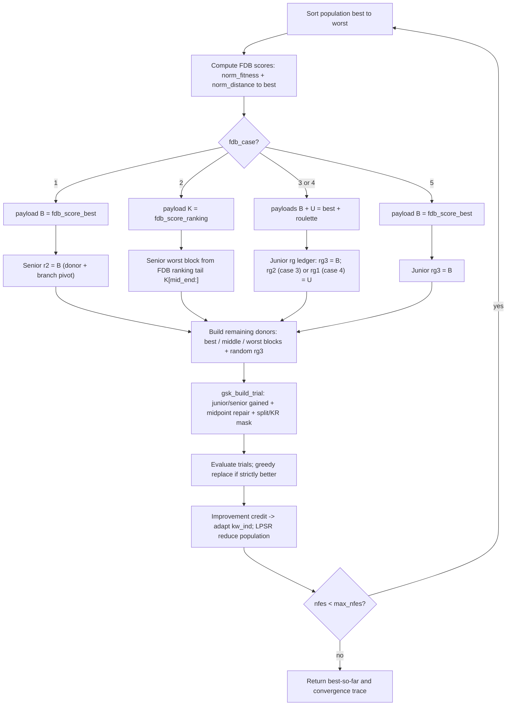

# FDB-AGSK — Fitness-Distance-Balance AGSK

> **What this is:** [AGSK](agsk.md) with one change — some random donor picks are
> replaced by **fitness-distance-balance (FDB)** selected individuals. **For:**
> readers who already know the gaining-sharing core and want the FDB donor twist.
> **Prerequisites:** [GSK](gsk.md) (junior/senior core, midpoint repair, KR mask)
> and [AGSK](agsk.md) (adaptive `kf`/`kr` pools, LPSR population reduction).
> **After reading** you can compute an FDB score by hand and say exactly which
> donor each of the five `fdb_case` values replaces.

## Intuition

FDB-AGSK keeps the entire AGSK machine intact: the same junior/senior gained
vectors, the same midpoint bound repair, the same per-dimension split + KR mask,
the same adaptive `(kf, kr)` pools, and the same linear population-size reduction.
Only the **donor indices** change.

Plain AGSK fills its donor slots from rank neighbours (junior) and from
best/middle/worst blocks (senior), choosing within each block **uniformly at
random**. FDB-AGSK argues that purely random donors waste guidance: a good donor
should be both **fit** (low objective value) and **diverse** (far from the
current best, so it pulls the search somewhere new). The **fitness-distance
balance** score rewards exactly that combination — it is large for individuals
that are simultaneously near the top of the ranking and far from the best point
in space. FDB-AGSK computes that score each generation and splices the chosen
individual(s) into specific donor slots. The `fdb_case` option (1–5) picks
*which* slots get overwritten and *which* flavour of FDB pick goes there.

Everything else — the schedules, the credit accounting, the reduction — is
inherited unchanged, so this guide spends its budget on the FDB score and the
five injection cases.

## Mathematical formulation

### The FDB score

Let the population be `x_0 … x_{NP-1}` with fitness `f_0 … f_{NP-1}`. Let
`b = argmin f` be the **best** individual and `x_b` its position. The score
combines a *normalized fitness* term and a *normalized distance-to-best* term
(`fdb_scores.py:33-41`):

```text
d_i      = sum_j | x_b,j - x_i,j |                         # L1 distance to best  (fdb_scores.py:33)

norm_fit_i  = 1 - ( f_i - min_f ) / ( max_f - min_f )      # fdb_scores.py:39
norm_dist_i = ( d_i - min_d ) / ( max_d - min_d )          # fdb_scores.py:40

FDB_i = norm_fit_i + norm_dist_i                           # fdb_scores.py:41
```

where `min_f, max_f` are the min/max fitness, and `min_d, max_d` the min/max of
the distance vector `d`. Two consequences fall straight out of the algebra:

- **Fitness is inverted** (the `1 - …`), so the *best* individual gets
  `norm_fit = 1` and the *worst* gets `0`. Higher FDB = better.
- The best individual `x_b` has `d_b = min_d` (it is closest to itself), so its
  `norm_dist = 0`. Its score is therefore exactly `1.0`, and any individual that
  is reasonably fit **and** reasonably far from `x_b` can beat it. That tension
  is the whole point: FDB never just returns the fitness-best.

**Degeneracy guards** (`fdb_scores.py:28-31, 47-48, 63-65`). If the fitness is
flat (`min_f == max_f`) the scores are all zero and the selectors fall back to a
uniform `randi` draw (a 1-based inclusive integer, converted to 0-based).
`fdb_score_roulette` additionally falls back when the fitness sum or `sum(x_b)` is
non-finite (`fdb_scores.py:29`, `np.sum(fit)` — the fitness sum, computed before
the FDB scores).

### The three selectors

The score feeds three selection routines (`fdb_scores.py:44-71`):

```text
fdb_score_best(pop, f)      -> argmax_i FDB_i                       # single index   (:49)
fdb_score_ranking(pop, f)   -> argsort(FDB) descending             # full ordering  (:58)
fdb_score_roulette(pop, f)  -> roulette-wheel pick, P_i ∝ FDB_i     # single index   (:67-71)
```

`fdb_score_best` returns the single highest-FDB individual. `fdb_score_ranking`
returns *all* indices sorted best-FDB→worst (an array, used to re-rank the senior
worst block). `fdb_score_roulette` draws one index with probability proportional
to its FDB score (`threshold = rand()·sum(FDB)`, then `searchsorted` on the
cumulative sum, `fdb_scores.py:67-71`).

### Which donor slots get the FDB pick

The shared kernel builds each gained vector from three donor indices
(`_kernels.py:128-139`). Junior donors `(rg1, rg2, rg3)`: `rg1`/`rg2` are the
better/worse **rank neighbours**, `rg3` is the third term in the gained vector.
Senior donors `(r1, r2, r3)`: `r1` from the **best** block, `r2` from the
**middle** block (and also the worse/other pivot, `_kernels.py:64`), `r3` from
the **worst** block. The senior partition uses `SENIOR_P = 0.05`
(`agsk.py:29`; **note** this is half of GSK's `p = 0.1`), with block boundaries
`top_end = round(NP·0.05)`, `mid_end = round(NP·0.95)` (`fdb_agsk.py:149-150`).

Each `fdb_case` replaces a different subset of those six indices. The payloads
come from `_fdb_indices` (`fdb_agsk.py:186-197`): `B = fdb_score_best`,
`K = fdb_score_ranking`, `U = fdb_score_roulette`. The junior overrides live in
`_fdb_junior_r1r2r3` (`fdb_agsk.py:95-112`), the senior overrides in
`_fdb_senior_r1r2r3` (`fdb_agsk.py:159-170`):

```text
case  payload(s)              junior donors                         senior donors
                              (rg1,  rg2,  rg3)                     (r1,    r2,   r3)
----  --------------------    ---------------------------------     -----------------------------
 1    B (scalar)              neigh, neigh, RANDOM                  best,   = B,  worst
 2    K (full ranking)        neigh, neigh, RANDOM                  best,   mid,  worst from K[mid_end:]
 3    B and U                 neigh, = U,   = B                     best,   mid,  worst
 4    B and U                 = U,   neigh, = B                     best,   mid,  worst
 5    B (scalar)              neigh, neigh, = B                     best,   mid,  worst
```

Reading the table case by case (each "RANDOM" is the usual collision-free uniform
junior `rg3` draw, `fdb_agsk.py:96`):

- **Case 1** (`fdb_agsk.py:159-163`). Junior is untouched (standard random
  `rg3`). **Senior `r2` is forced to the FDB-best index `B`.** Because `r2` is
  also the senior worse/other pivot (`_kernels.py:64`), case 1 changes both the
  donor *and* the branch comparison `f_i > f_B`.
- **Case 2** (`fdb_agsk.py:164-167`). Junior untouched. Senior `r1`/`r2` are
  normal best/middle picks, but **`r3` is sampled from the FDB ranking's tail
  `K[mid_end:]`** — i.e. the worst block is re-defined by FDB score instead of by
  raw fitness.
- **Case 3** (`fdb_agsk.py:97-101`). **Junior `rg2 = U` (roulette FDB) and
  `rg3 = B` (best FDB)**; senior is fully standard. Two of the three junior
  donors become FDB picks.
- **Case 4** (`fdb_agsk.py:102-106`). **Junior `rg1 = U` (roulette FDB) and
  `rg3 = B` (best FDB)**; senior standard. Like case 3 but the roulette pick
  replaces the *better* neighbour `rg1` instead of the worse neighbour `rg2`.
- **Case 5** (`fdb_agsk.py:107-110`). **Junior `rg3 = B` (best FDB)** only;
  senior standard. The lightest touch — a single FDB injection into the junior
  third term.

After any junior override, `rg3` (and in cases 3/4 the forced indices) still pass
through the same collision-free repair loop that rejects `rg3 ∈ {rg1, rg2, i}`
(`fdb_agsk.py:114-121`).

## Pseudocode

```text
pop_size = np_init;  max_pop = np_init                       # fdb_agsk.py:220-221
initialize / accept fair-start population, evaluate, record best
k_vec = draw_initial_k(pop_size)                             # AGSK schedule (agsk.py:87)
while nfes < max_nfes:                                       # fdb_agsk.py:259
    kw_ind = INITIAL_KW  (first 10% of budget)  else  0.95*kw_ind + 0.05*all_imp, renormalize
    slots  = select_parameter_slots(kw_ind);  kf,kr = KF_POOL[slots], KR_POOL[slots]
    junior_dims = ceil(D * (1 - nfes/max_nfes)^k_vec)        # per-individual schedule
    fdb_index, rfdb_index = fdb_indices(fdb_case, pop, fitness)   # B / K / U  (fdb_agsk.py:277)
    order = argsort(fitness)                                 # best -> worst
    rg1,rg2,rg3 = fdb_junior_r1r2r3(order, fdb_case, fdb_index, rfdb_index)   # case overrides
    r1,r2,r3    = fdb_senior_r1r2r3(order, fdb_case, fdb_index)               # case overrides
    trial = gsk_build_trial(...)            # junior/senior gained + repair + split/KR mask
    evaluate trial; nfes += n_count
    all_imp = improvement_credit(fitness, children_fitness, slots)
    greedy replace: parent <- child where f(child) < f(parent)
    LPSR: reduce pop_size toward target(nfes), drop worst rows   # agsk.py:160
    append (nfes, best_so_far) to the convergence trace
```

The only lines that differ from [AGSK](agsk.md) are the `_fdb_indices` call and
the two `_fdb_*_r1r2r3` donor builders. Everything else — the shared
`gsk_build_trial` kernel, the improvement-credit update, the greedy selection, and
the LPSR reduction — is identical to AGSK; the AGSK helpers and the kernel are
imported directly (`fdb_agsk.py:17-31`).

## Parameters

| Option | Symbol | Default | Valid range | Meaning | Code |
|---|---|---|---|---|---|
| `np` | NP | `100` | integer ≥ `min_pop_size` | Fallback initial population size when `np_init` is absent. | `fdb_agsk.py:204` |
| `np_init` | NP₀ | `np` | integer ≥ `min_pop_size` | Initial population size before LPSR reduction. | `fdb_agsk.py:205` |
| `min_pop_size` | NP_min | `12` | integer ≥ 11 | Floor the population reduces to (must be ≥ 11 so the senior blocks stay non-empty). | `fdb_agsk.py:206` |
| `fdb_case` | — | `1` | integer in `{1,2,3,4,5}` | Donor-injection case (see table below). | `fdb_agsk.py:207`, validated `fdb_agsk.py:41-46` |

`fdb_case` value meanings (overrides applied each generation):

| `fdb_case` | FDB payload | What it overrides |
|---|---|---|
| `1` | `fdb_score_best` (scalar) | Senior `r2` ← FDB-best (also the senior branch pivot). |
| `2` | `fdb_score_ranking` (array) | Senior worst block re-sampled from the FDB-ranking tail `K[mid_end:]`. |
| `3` | `fdb_score_best` + `fdb_score_roulette` | Junior `rg2` ← FDB-roulette, `rg3` ← FDB-best. |
| `4` | `fdb_score_best` + `fdb_score_roulette` | Junior `rg1` ← FDB-roulette, `rg3` ← FDB-best. |
| `5` | `fdb_score_best` (scalar) | Junior `rg3` ← FDB-best. |

Shared AGSK constants (fixed, not options): `KF_POOL = [0.1, 1.0, 0.5, 1.0]`,
`KR_POOL = [0.2, 0.1, 0.9, 0.9]`, `INITIAL_KW = [0.85, 0.05, 0.05, 0.05]`,
`SENIOR_P = 0.05` (`agsk.py:26-29`). See [AGSK](agsk.md) for how the pools adapt.

## Worked example

Compute one FDB score table by hand for a tiny population, then read off the
donor for each case. Setup `NP = 4`, `D = 2`:

```text
i0: x = [ 1.0,  2.0]   f = 5
i1: x = [ 2.0,  0.0]   f = 8
i2: x = [-1.0, -1.0]   f = 3    <- best (min fitness)
i3: x = [ 4.0,  3.0]   f = 20   <- worst
```

**Step 1 — distances to the best (`x_b = i2 = [-1,-1]`), L1.**

```text
d_0 = |−1−1| + |−1−2| = 2 + 3 = 5
d_1 = |−1−2| + |−1−0| = 3 + 1 = 4
d_2 = 0                          (best vs itself)
d_3 = |−1−4| + |−1−3| = 5 + 4 = 9
min_d = 0,  max_d = 9
```

**Step 2 — normalize.** `min_f = 3`, `max_f = 20` so `max_f − min_f = 17`;
`max_d − min_d = 9`.

```text
       norm_fit = 1 − (f−3)/17        norm_dist = (d−0)/9        FDB = sum
i0:    1 − 2/17  = 0.8824             5/9 = 0.5556              1.4379
i1:    1 − 5/17  = 0.7059             4/9 = 0.4444              1.1503
i2:    1 − 0/17  = 1.0000             0/9 = 0.0000              1.0000
i3:    1 − 17/17 = 0.0000            9/9 = 1.0000              1.0000
```

**Step 3 — read off the selectors.**

```text
fdb_score_best     = argmax FDB                 = i0   (1.4379)
fdb_score_ranking  = argsort desc               = [i0, i1, i2, i3]
fdb_score_roulette = pick with P_i ∝ FDB_i      = i0 with prob 1.4379/4.5882 ≈ 0.313, etc.
```

The instructive part: the fitness-best is **i2**, the farthest is **i3**, but FDB
chooses **i0** — a fit *and* spread-out point. It refuses both the greedy
fitness pick and the pure-diversity pick. With `fdb_case = 5`, every junior
gained vector that generation uses `rg3 = i0` as its third donor; with
`fdb_case = 1`, every senior gained vector uses `r2 = i0` as both its middle
donor and its branch pivot.

(For a senior-block worked example, note `SENIOR_P = 0.05` needs `NP ≥ 11` for a
valid senior partition — `round(NP·0.05) ≥ 1` gives a non-empty top block at
`NP ≥ 10`, but the worst block stays non-empty only at `NP ≥ 11`, which is why the
family floors `min_pop_size` at 11 — so the four-row population above only
exercises the junior cases by hand; the senior cases follow the identical score
table at `NP ≥ 11`.)

## Update cycle



## Bounds, budget, and determinism

- **Bounds and repair** are unchanged from [GSK](gsk.md): each gained coordinate
  that violates a bound is pulled to the midpoint between the *parent* value and
  the breached bound (`_kernels.py:132-135, 140-143`).
- **Budget.** `nfes` advances by `n_count = min(pop_size, max_nfes − nfes)` per
  generation (`fdb_agsk.py:319`); the population shrinks under LPSR toward a
  target size each generation (`agsk.py:148-157`). Unlike [AGSK](agsk.md),
  FDB-AGSK has **no target-error early stop** — the loop always runs to
  `max_nfes` and reports `termination="max_evaluations"` (`fdb_agsk.py:362`).
- **Determinism.** All randomness flows from the caller's `RandomContext` in a
  fixed order: the FDB selectors draw first (only on their fallback paths, or for
  roulette), then junior `rg3`, then the senior block samples, then one
  `(3, NP, D)` mask block (`fdb_agsk.py:277-290`). Serial and parallel runs match
  bit-for-bit. See [Seed Policy](../reference/seed_policy.md).

## Complexity

Per generation, on top of AGSK's `O(NP log NP)` sort and `O(NP·D)` trial build,
the FDB score adds `O(NP·D)` for the distance vector and `O(NP)` (or
`O(NP log NP)` for `fdb_score_ranking`) for selection — so the asymptotics are
unchanged: `O(max_nfes·D)` time, `O(NP·D)` memory over the run.

## When to use

Reach for FDB-AGSK when plain [AGSK](agsk.md) stalls because its random donors
keep re-using nearby points and you want donor *diversity* steered by a principled
fitness-distance trade-off. Start with `fdb_case = 1` (the default, lightest
senior injection); cases 3–4 are more aggressive (two junior donors replaced) and
worth trying when exploration is the bottleneck. If you do not need FDB donor
steering, the plain [AGSK](agsk.md), [APGSK](apgsk.md), or [GSK](gsk.md) baselines
are simpler. For comparison this optimizer sits alongside
[ATMALS-GSK](atmals-gsk.md) in the family; for the family's headline,
high-dimensional method, see [DT-GSK](dt-gsk.md) (a dimension-tiered adaptive
layer on the same gaining-sharing scaffold).

Example run (writes under `results/_run_all/fdb-agsk/cec2017/`):

```bash
python -m gsk_family.cli.run \
  --optimizer fdb-agsk \
  --suite cec2017 \
  --dimension 30 \
  --function 1 \
  --runs 1 \
  --seed 20240620 \
  --max-evaluations 300000 \
  --output-root results/_run_all
```

## In the 7-algorithm panel

FDB-AGSK is one of the six **reference comparators** in the family's headline
comparison (with GSK, AGSK, APGSK, eGSK, and ATMALS-GSK), against which the
proposed [DT-GSK](dt-gsk.md) is benchmarked. In the **7-algorithm GSK-family
panel** built per dimension by `gsk-stats`, FDB-AGSK is the "smarter donors on the
AGSK machine" entry: identical adaptive pools and LPSR, with only the donor
indices steered by the fitness-distance-balance score. Comparing it to plain
[AGSK](agsk.md) on the panel's per-function tables and convergence grids isolates
the contribution of FDB donor selection alone. The panel reports Friedman ranks,
Nemenyi critical-difference diagrams, Holm-corrected Wilcoxon, A12 / Cliff's delta
effect sizes, win/tie/loss, and 7-curve convergence grids under
`results/_run_all/_analysis/<suite>/`; FDB-AGSK is included in the runner's live
`--stats` stream. Because FDB-AGSK has **no target-error early stop** (it always
runs to `max_nfes`, `fdb_agsk.py:362`), every run contributes a full-budget
convergence curve to the grids. See
[Statistical Analysis](../research/statistical_analysis.md).

## Source and validation

- Kernel: `src/gsk_family/optimizers/fdb_agsk.py`; FDB scores
  `src/gsk_family/optimizers/fdb_scores.py`; shared trial builder
  `src/gsk_family/optimizers/_kernels.py`; adaptive pools / LPSR reused from
  `src/gsk_family/optimizers/agsk.py`. Ported from the reference
  `fdb_agsk_optimize.m` plus `fdb_score_best.m`, `fdb_score_ranking.m`, and
  `fdb_score_roulette.m`, with identical defaults and draw order.
- Tests cover all three FDB score modes, the degeneracy fallbacks, all five
  injection cases, deterministic replay, fair-start reuse, budget handling, and
  runner execution on smoke cells (`tests/unit/test_fdb_scores.py`,
  `tests/smoke/test_fdb_agsk_smoke.py`). See
  [Validation Report](../research/validation_report.md) and
  [Numerical Examples](../research/numerical_examples.md).
