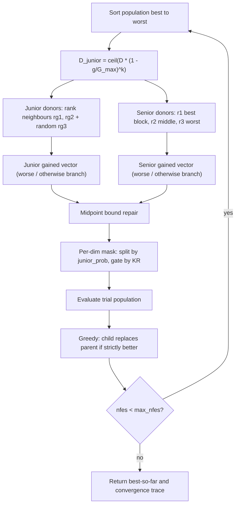

# GSK — Gaining-Sharing Knowledge

> **What this is:** the reference algorithm of the family and the base every
> other optimizer extends. **For:** anyone who wants to understand the core
> gaining-sharing update before reading a variant. **Prerequisites:** basic
> population-based optimization. **After reading** you can trace one generation
> by hand and map every line of `src/gsk_family/optimizers/gsk.py` to its math.

## Intuition

GSK models how people acquire and share knowledge in two phases:

- **Junior phase (exploration).** Early on, an individual learns from the two
  neighbours next to it in the fitness ranking and from one random peer. This
  spreads search widely.
- **Senior phase (exploitation).** Later, an individual learns from the
  **elite** and the **worst** of the population, mediated by a **middle**
  performer. This refines around good regions.

Each *dimension* of an individual is assigned to one phase per generation. A
schedule moves dimensions from junior to senior as the run progresses, so the
search transitions smoothly from exploration to exploitation.

## Mathematical formulation

Let `x_i` be individual `i`, with the population sorted best→worst. `kf` is the
knowledge factor (step scale), `kr` the knowledge ratio (per-dimension update
probability), `p` the senior partition fraction.

**Junior gained vector** (`_kernels.py:128-131`). Donors `rg1`, `rg2` are the
better and worse neighbours of `x_i` in the ranking; `rg3` is a random,
collision-free peer (`donors.py:24-67`). With `worse = f(x_i) > f(x_rg3)`:

```text
worse:      g_j = x_i + kf * ( x_rg1 - x_rg2 + x_rg3 - x_i )
otherwise:  g_j = x_i + kf * ( x_rg1 - x_rg2 + x_i - x_rg3 )
```

**Senior gained vector** (`_kernels.py:136-139`). The sorted population is split
into a best block (top `round(NP*p)`), a middle block, and a worst block (bottom
`round(NP*p)`); `r1`, `r2`, `r3` are random picks from those blocks
(`donors.py:70-105`). With `worse = f(x_i) > f(x_r2)`:

```text
worse:      g_s = x_i + kf * ( x_r1 - x_i + x_r2 - x_r3 )
otherwise:  g_s = x_i + kf * ( x_r1 - x_r2 + x_i - x_r3 )
```

**Midpoint bound repair** (inline in the trial kernel, `_kernels.py:132-135,140-143`). Per
coordinate `j`, using the *parent* value `x_i,j`:

```text
g < lb_j:  g = (x_i,j + lb_j) / 2
g > ub_j:  g = (x_i,j + ub_j) / 2
```

**Junior dimension schedule** (`gsk.py:149-150`). At generation `g` of `G_max`:

```text
D_junior = ceil( D * (1 - g / G_max) ^ k )
junior_prob = D_junior / D
```

`(1 - g/G_max)` shrinks from 1 to 0, and the exponent `k = 10` makes the
junior→senior handover sharp: early generations are almost all junior, late
generations almost all senior.

**Per-dimension mask** (`_kernels.py:144-149`). Two independent random draws per
coordinate decide what reaches the trial vector; otherwise the parent value is
kept:

```text
rand_split <= junior_prob  -> junior dim: take g_j only if rand_kr_junior <= kr
otherwise                  -> senior dim: take g_s only if rand_kr_senior <= kr
```

**Selection** is strictly greedy (`gsk.py:217-219`): the child replaces the
parent only if `f(child) < f(parent)`.

## Pseudocode

```text
G_max = fix(max_nfes / NP)                      # gsk.py:110
initialize / accept fair-start population, evaluate, record best
for g = 1, 2, ... until nfes >= max_nfes:       # gsk.py:147
    D_junior   = ceil(D * (1 - g/G_max)^k)      # gsk.py:149-150
    order      = argsort(fitness)               # best -> worst
    rg1,rg2,rg3 = junior_donors(order)          # rank neighbours + random
    r1,r2,r3    = senior_donors(order, p)        # best / middle / worst blocks
    for each individual i, dimension j:
        g_j = junior_update(...);  repair(g_j)
        g_s = senior_update(...);  repair(g_s)
        trial[i,j] = masked choice of g_j / g_s / parent   # split + KR gates
    evaluate trial; nfes += NP
    greedy replace: parent <- child where f(child) < f(parent)
    append (nfes, best_so_far) to the convergence trace
```

## Parameters

| Option | Symbol | Default | Valid range | Meaning | Code |
|---|---|---|---|---|---|
| `np` | NP | `100` | integer ≥ 4 (≥ 6 at the default `p=0.1` so the senior blocks are non-empty; NP=4,5 raise an error) | Population size (junior donors need NP≥4; senior needs non-empty blocks). | `gsk.py:92` |
| `kf` | kf | `0.5` | > 0 (typ. (0,1]) | Knowledge factor — step scale of the gained vectors. | `gsk.py:93` |
| `kr` | kr | `0.9` | [0, 1] | Knowledge ratio — per-dimension probability an update is applied. | `gsk.py:94` |
| `k` | k | `10.0` | > 0 | Junior-schedule exponent — larger = sharper junior→senior handover. | `gsk.py:95` |
| `p` | p | `0.1` | (0, 0.5) | Senior partition fraction (best/worst block sizes = round(NP·p)). | `gsk.py:96` |

## Worked example

One individual through one generation. Setup (hand-checkable):

```text
D = 2,  NP = 6,  lb = [-5,-5],  ub = [5,5],  kf = 0.5,  kr = 0.9,  p = 0.1
population, already sorted best -> worst (fitness on the right):
  rank 0 (best):  x0 = [ 1.0,  2.0]   f = 5
  rank 1:         x1 = [-1.0,  0.5]   f = 8
  rank 2:         x2 = [ 3.0, -1.0]   f = 10   <- update this individual (i = 2)
  rank 3:         x3 = [-2.0,  3.0]   f = 14
  rank 4:         x4 = [ 4.0,  4.0]   f = 20
  rank 5 (worst): x5 = [-3.0, -4.0]   f = 25
```

**Junior update.** Neighbours of rank 2: `rg1 = x1` (better), `rg2 = x3`
(worse). Say the RNG draws the random peer `rg3 = x5`. Since
`f(x2)=10 > f(x5)=25` is **false**, use the *otherwise* branch:

```text
g_j = x2 + 0.5 * ( x1 - x3 + x2 - x5 )
    = [3,-1] + 0.5 * ( [1,-2.5] + [6, 3] )
    = [3,-1] + 0.5 * [7, 0.5]  =  [6.5, -0.75]
dim 0: 6.5 > ub=5  ->  repair (x2,0 + 5)/2 = (3+5)/2 = 4.0
g_j = [4.0, -0.75]
```

**Senior update.** With NP=6, p=0.1: best block = {x0}, middle = {x1..x4},
worst = {x5}. Say the RNG draws `r1 = x0`, `r2 = x4`, `r3 = x5`. Since
`f(x2)=10 > f(x4)=20` is **false**, use the *otherwise* branch:

```text
g_s = x2 + 0.5 * ( x0 - x4 + x2 - x5 )
    = [3,-1] + 0.5 * ( [-3,-2] + [6, 3] )
    = [3,-1] + 0.5 * [3, 1]  =  [4.5, -0.5]   (both in bounds)
```

**Mask.** Suppose this generation has `D_junior = 1`, so `junior_prob = 0.5`,
and the draws are `rand_split = [0.3, 0.8]`, `rand_kr_junior[0] = 0.2`,
`rand_kr_senior[1] = 0.95`:

```text
dim 0: 0.3 <= 0.5 -> junior; 0.2 <= 0.9 -> take g_j[0] = 4.0
dim 1: 0.8 >  0.5 -> senior; 0.95 > 0.9 -> keep parent x2,1 = -1.0
trial = [4.0, -1.0]
```

The child is evaluated; it replaces `x2` only if its fitness beats 10.

## Update cycle



## Bounds, budget, and determinism

- **Bound repair** never reflects past the parent; it pulls a violating
  coordinate to the midpoint between the parent and the breached bound, so
  trials stay inside `[lb, ub]` and near their parent.
- **Budget.** `G_max = fix(max_nfes / NP)` and the loop runs whole generations,
  so the final generation may be partially counted (`n_count = min(NP,
  max_nfes - nfes)`, `gsk.py:207`). The best-so-far is monotone non-increasing.
- **Determinism.** The trial kernel is pure arithmetic; all randomness comes
  from the caller's RNG in a fixed draw order (`gsk.py:165` draws one
  `(3, NP, D)` block), so serial and parallel runs produce identical results.
  See [Seed Policy](../reference/seed_policy.md).

## Complexity

Per generation: `O(NP log NP)` to sort, `O(NP·D)` to build and repair trials,
`O(NP)` evaluations. Over a run of `G_max ≈ max_nfes/NP` generations the total is
`O(max_nfes · D)` time and `O(NP·D)` memory.

## When to use

GSK is the baseline: a strong, low-parameter starting point and the control in
every comparison. If a run needs population reduction or self-tuned `kf`/`kr`,
reach for a variant — [AGSK](agsk.md) (adaptive pools + LPSR),
[APGSK](apgsk.md), [FDB-AGSK](fdb-agsk.md), or [ATMALS-GSK](atmals-gsk.md) — all
of which reuse the junior/senior core above. For high-dimensional problems and
the family's headline method, see [DT-GSK](dt-gsk.md), which keeps this same
gaining-sharing scaffold and adds a dimension-tiered adaptive layer (adaptive
operator control, a population-size schedule, restarts, and an eigenframe final
polish).

## In the 7-algorithm panel

GSK is one of the six **reference comparators** in the family's headline
comparison — the others are AGSK, APGSK, FDB-AGSK, eGSK, and ATMALS-GSK — against
which the proposed [DT-GSK](dt-gsk.md) is benchmarked. Together they form the
**7-algorithm GSK-family panel** built per dimension by the statistical suite
(`gsk-stats`). For each suite/dimension the panel produces Friedman ranks +
Nemenyi critical-difference diagrams, pairwise Wilcoxon with Holm correction,
Vargha-Delaney A12 / Cliff's delta effect sizes, win/tie/loss tallies, and
7-curve convergence grids; outputs land under
`results/_run_all/_analysis/<suite>/`. As the un-tuned baseline, GSK is the
control: it typically sits low on the family rank chart and is the reference every
"did the variant actually help?" question is measured against. Full panel construction and the statistical machinery are
documented in [Statistical Analysis](../research/statistical_analysis.md).

A note on coverage: vanilla `gsk` is intentionally **skipped by the runner's
live `--stats` stream**, so per-dimension Wilcoxon
/ Friedman output streamed during a run does not include the GSK row even though
the offline `gsk-stats` panel does. (The `cec2011` suite *is* included in the live
stream — it emits a single per-suite rollup panel now that its reference rollups
are committed.) This is a deliberate fairness choice — the
live stream focuses on the adaptive comparators — not a gap in the data.

## Parameter interactions and tuning notes

- **`kf` × `kr`.** `kf` scales the gained step and `kr` is the per-coordinate
  probability that step reaches the trial. Raising `kf` without lowering `kr`
  makes large moves on many dimensions at once (aggressive, can overshoot);
  lowering `kr` keeps most coordinates at the parent value so each child differs
  in only a few dimensions (cautious). The defaults `kf=0.5, kr=0.9` favour broad
  but moderate updates.
- **`k` (schedule exponent).** With the default `k=10`, `D_junior =
  ceil(D·(1-g/G_max)^10)` keeps nearly every dimension junior until late in the
  run, then flips sharply to senior. Smaller `k` softens the handover (more senior
  dimensions earlier → earlier exploitation); larger `k` delays it. This is the
  one knob the adaptive variants replace with a learned or randomized schedule
  (per-individual `K` in [AGSK](agsk.md), a coin-flipped exponent in
  [APGSK](apgsk.md), a roulette grid in [ATMALS-GSK](atmals-gsk.md)).
- **`p` and `NP` together.** The senior partition needs all three blocks
  non-empty: `top_end = round(NP·p) ≥ 1` **and** `mid_end = round(NP·(1-p)) < NP`
  (half-away rounding). At the default `p=0.1`, `NP=4` gives `top_end =
  round(0.4) = 0` and `NP=5` gives `mid_end = round(4.5) = 5 = NP` (an empty
  worst block) — both trip the empty-block guard (`common/donors.py:86-90`), so
  `NP ≥ 6` is the smallest valid size. The adaptive variants use the smaller
  `p=0.05`, which needs `NP ≥ 11` for the same reason — hence their
  `min_pop_size ≥ 11` floor.

## Source and validation

- Kernel: `src/gsk_family/optimizers/gsk.py`; shared trial builder
  `src/gsk_family/optimizers/_kernels.py` (midpoint bound repair is inlined in the
  compiled kernel); donors `src/gsk_family/common/donors.py`. The standalone
  reference port of the repair rule is `gsk_bound_repair` in
  `src/gsk_family/common/bounds.py`. Ported from the reference `gsk_optimize.m`
  with identical defaults and draw order.
- Tested for deterministic replay, fair-start reuse, convergence shape, budget
  crossing, and runner execution on smoke cells. See
  [Validation Report](../research/validation_report.md) and
  [Numerical Examples](../research/numerical_examples.md).
