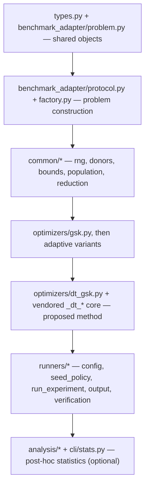

# Code Reading Guide

> **Orientation.** This page is a guided tour of the source tree: read it once,
> in order, and you will understand how a YAML request becomes a reproducible
> experiment. It is for a new contributor getting oriented before making
> changes. Each step builds on the one before, so resist jumping ahead. After
> finishing you will know where the shared types, benchmark adapter, helpers,
> optimizers, and runner live, and why the layers depend on each other the way
> they do. Pair this with the [Developer Guide](developer_guide.md) for setup and
> testing, the [module dependencies](../reference/module_dependencies.md) for the
> formal dependency rules, and the [glossary](../reference/glossary.md) for terms.

## Reading Order At A Glance

The diagram below is the whole tour in one picture: read top to bottom, and each
box depends only on the boxes above it.



Each step depends only on the ones above it (see
[Module Dependencies](../reference/module_dependencies.md)). The analysis layer
at the bottom is optional for a first pass — read it only when you need to
understand how results become statistics and figures.

## Start With Public Types

Begin here: these two files define the data objects every other layer passes
around, so the rest of the code is easier once you know them.

```text
src/gsk_family/types.py
src/gsk_family/benchmark_adapter/problem.py
```

These files define the objects that optimizers and runners exchange — chiefly
`OptimizerOptions`, `OptimizerResult`, and `BenchmarkProblem`.

## Read The Benchmark Adapter

Next, see how a benchmark problem is built and validated. Then read:

```text
src/gsk_family/benchmark_adapter/protocol.py
src/gsk_family/benchmark_adapter/factory.py
```

This layer replaces the reference benchmark bridge with a Python problem
factory and shape validation, so optimizers receive a uniform problem object.

## Read The Shared Compatibility Helpers

These small modules preserve reference-faithful numeric behavior; optimizers
lean on them so each kernel stays short. Read:

```text
src/gsk_family/common/numeric_compat.py
src/gsk_family/common/rng.py
src/gsk_family/common/donors.py
src/gsk_family/common/bounds.py
src/gsk_family/common/population.py
src/gsk_family/common/reduction.py
```

These helpers preserve reference-oriented rounding, sorting, indexing, bounds, and
population behavior. A note on the RNG layer worth understanding early:
`common/rng.py` is a façade that selects a reference-matching stream by label —
`threefry` (the default counter-based Threefry-4x64-20, in
`common/threefry_rng.py`) or `twister`/`seed` (MT19937 and mcg16807, in
`common/reference_rng.py`). Each label reproduces the corresponding upstream
stream bit-for-bit, which is what makes exact Python-replay and parity claims
possible. The seed each run uses is chosen by `runners/seed_policy.py` (read it
in the runner step below).

## Read One Optimizer

Learn the base algorithm first, then read the variants as deltas against it.
Start with `optimizers/gsk.py`, then compare adaptive variants:

```text
agsk.py
apgsk.py
fdb_agsk.py
atmals_gsk.py
egsk.py
```

The variants share the same result contract (`OptimizerResult`) while changing
donor selection, parameter adaptation, local search, FDB selection, or — for
`egsk` — knowledge-factor adaptation plus a late-stage SLSQP polish. Reading
them as deltas against `gsk.py` is faster than reading each in full: each one
keeps the same `optimize(problem, options)` signature and only swaps the parts
named above.

## Read The Proposed Method (dt-gsk)

`dt-gsk` — this project's **proposed** Dimension-Tiered Gaining-Sharing Knowledge — is the
most layered optimizer, so read it last. Treat the adapter as project-owned glue
and the rest as a **byte-identical** vendored core (do not expect it to follow
local style; it intentionally mirrors the source project):

```text
optimizers/dt_gsk.py          adapter: optimize(problem, options), picks the "pub" profile by problem.dim
optimizers/_dt_profiles.py    build_pub_config(...) — per-dimension config builder
optimizers/_dt_rng.py         named-substream RNG over the unified threefry stream
optimizers/_dt_core.py        vendored driver (byte-identical)
optimizers/_dt_subsystems/    vendored subsystems (byte-identical)
```

Two things to keep in mind while reading. First, only the two **byte-identical**
upstream copies — `_dt_core.py` and everything under `_dt_subsystems/` — are
exempt from the docstring gate; the adapter `dt_gsk.py` and the project-authored
`_dt_profiles.py` / `_dt_rng.py` layers are fully docstringed and *are* checked
by `tests/unit/test_docstrings.py`. All five, however, are behavior-frozen (the
whole set is hash-locked in `algorithm_freeze_manifest.json`) and guarded by
`tests/regression/test_dt_gsk_byte_stable.py` and `tests/unit/test_dt_profiles.py`.
Second, `dt-gsk` self-initializes a `np_init_mult * D` population (a documented
fair-start exception; `np_init_mult` defaults to `5`) and always uses the
unified `threefry` + `get_cec_seed` schedule via `UNIFIED_ONLY_OPTIMIZERS` in
`seed_policy.py`.

## Read Runner And Output

Finish with the top layer that ties everything together — turning a request into
artifacts on disk. Finally read:

```text
src/gsk_family/runners/config.py
src/gsk_family/runners/seed_policy.py
src/gsk_family/runners/run_experiment.py
src/gsk_family/runners/output.py
src/gsk_family/runners/verification.py
```

This path shows how CLI/YAML requests become repeatable experiment artifacts.
`config.py` parses and validates the request; `seed_policy.py` derives each
run's seed (and forces `threefry` + the shared schedule for `dt-gsk`);
`run_experiment.py` is the driver that maps `OPTIMIZER_FUNCTIONS[name]` over the
`(suite, dim, func, run)` grid and, behind the opt-in `--stats` flag, streams the
per-dimension Wilcoxon + Friedman panel; `output.py` writes the per-cell
artifacts under `results/_run_all/<optimizer>/<suite>/`; and `verification.py`
checks them. For the parallel/worker behavior that wraps this driver, see the
[Developer Guide](developer_guide.md#parallel-and-worker-model).

## Optional: Analysis And Statistics Layer

Once the runner makes sense, read the analysis layer to see how results become
statistics, figures, and LaTeX. The `gsk-stats` CLI (`cli/stats.py`) is the
thin front end; the engine lives under `src/gsk_family/analysis/`:

```text
src/gsk_family/analysis/result_loader.py     load results (committed reference panel first, results/_run_all fallback)
src/gsk_family/analysis/statistical_tests.py Friedman ranks + pairwise Wilcoxon (vendored)
src/gsk_family/analysis/family_report.py     end-to-end report orchestration
src/gsk_family/analysis/figures.py           Nemenyi CD diagrams + rank charts
src/gsk_family/analysis/latex_tables.py       LaTeX table fragments
src/gsk_family/analysis/project_policy.py    the 7-algorithm GSK-family panel
```

`project_policy.py` defines the reference-comparator panel; note that `egsk`
appears there as committed comparator data, so the panel reports its cells from
that reference data even though `egsk` is now runnable via `--optimizer egsk`. Like the vendored dt-gsk core, `analysis/statistics.py`
and `analysis/statistical_tests.py` are byte-identical vendored modules and are
exempt from the docstring gate.
