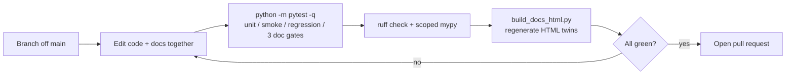

# Contributor Guide

> **Orientation.** This page is the checklist for *submitting* a change: branch,
> edit, update docs, run the gate, open a pull request. It is for anyone landing
> a contribution, large or small. After reading it you will know the exact
> commands the project expects to pass before review, and which changes require
> a documentation update. For the mechanics of the code itself, see the
> [Developer Guide](developer_guide.md); to add a whole new optimizer, suite, or
> command, see the [Extension Guide](extension_guide.md). Unfamiliar terms are
> defined in the [glossary](../reference/glossary.md).

The overriding rule: contributions must preserve reference-compatible behavior
and the reference evidence trail. "Reference" here means the upstream
implementation this package ports; "evidence trail" means the imported reference
results the Python output is checked against.

## Contribution Workflow

The end-to-end path from idea to pull request. Steps are ordered — do not push
before the local gate (step 3) is green.

1. Work on a branch. Keep commits small and focused, each with a clear message
   that explains the change.
2. Update documentation alongside the code it describes. For example, an
   algorithm change updates its `docs/algorithms/*.md` guide.
3. Run the local gate before pushing — the test suite, the ruff correctness
   lint, and the scoped mypy type check (the same three commands CI runs):

   ```powershell
   python -m pytest -q
   python -m ruff check src tests scripts
   python -m mypy src/gsk_family/cli src/gsk_family/runners src/gsk_family/common `
     --ignore-missing-imports --follow-imports=skip
   ```

   After any docs or docstring change, also regenerate the HTML twins under
   `docs/html/` and commit them:

   ```powershell
   python scripts/build_docs_html.py
   ```

4. Open a pull request once the gate is green.

The path from idea to merge, and where each gate sits:



### What the local gate enforces

`python -m pytest` is not just unit tests — it also runs three documentation
gates that frequently catch contribution mistakes. Knowing them up front saves a
red CI run:

- **Docstring coverage** (`tests/unit/test_docstrings.py`): every module, class,
  function, and method under `src/gsk_family` needs a docstring. The vendored
  `dt-gsk` core and the vendored analysis modules are exempt; everything else
  is not.
- **Doc-list resolution** (`tests/smoke/test_documentation_commands.py`,
  `test_documented_docs_exist`): a fixed list of documentation paths must exist
  on disk. **Do not rename, move, or delete a listed doc.** If you genuinely
  must add a new doc, add its path to that list in the same PR — but prefer
  editing an existing file.
- **Link resolution** (`tests/smoke/test_documentation_commands.py`,
  `test_generated_html_local_links_resolve`): every local link in the generated
  `docs/html/` site must resolve. Verify any relative Markdown link you add
  points at a real file, then rebuild the HTML.

These mirror the gates described in the
[Developer Guide](developer_guide.md#documentation-requirements). The ruff
configuration lives in `pyproject.toml`: `[tool.ruff]` sets
`target-version = "py310"` and `line-length = 120`, and the nested
`[tool.ruff.lint]` table sets `select = ["E9", "F"]`. The scoped mypy gate
(`[tool.mypy]`) type-checks only `src/gsk_family/cli`, `src/gsk_family/runners`,
and `src/gsk_family/common` under `--follow-imports=skip`, so it is fast and
must stay green on those three packages.

### PR checklist

Before you click "open pull request", confirm:

- [ ] Branch is up to date; commits are small, focused, and clearly messaged.
- [ ] `python -m pytest -q` is green (including the three doc gates).
- [ ] `python -m ruff check src tests scripts` is clean.
- [ ] The scoped `python -m mypy src/gsk_family/cli src/gsk_family/runners src/gsk_family/common --ignore-missing-imports --follow-imports=skip` gate is clean.
- [ ] Docs updated in the same PR (see [Documentation Expectations](#documentation-expectations)).
- [ ] HTML twins regenerated and committed if any `.md` or docstring changed.
- [ ] Imported reference evidence under `benchmarks/cec_reference_results/` was
      not edited (see [Evidence Policy](#evidence-policy)).
- [ ] If you touched anything under `optimizers/_dt_core.py` or `optimizers/_dt_subsystems/`,
      the byte-stability regression still passes (see [Vendored dt-gsk](#vendored-dt-gsk-byte-identity)).

## Before Changing Code

A short orientation pass so your change fits existing behavior and provenance.

1. Read the relevant algorithm or architecture document (the
   [algorithm guides](../algorithms/gsk.md) and
   [architecture](../reference/architecture.md)).
2. Check [`docs/LICENSES.md`](../LICENSES.md) for source provenance.
3. Run the focused tests for the area you plan to change (see the
   [Developer Guide testing tiers](developer_guide.md#testing)).

## Before Submitting Changes

This is the minimum verification beyond the workflow gate above. Run the full
suite:

```powershell
python -m pytest
```

For runner or benchmark changes, also run at least one CLI smoke command. The
bundled `configs/smoke.yml` runs one optimizer on one function at a tiny budget,
so it finishes in seconds:

```powershell
gsk-run --config configs/smoke.yml --root .
```

For a change that should exercise every runnable optimizer, use the bundled
multi-optimizer smoke configs (`configs/all_optimizers_smoke.yml`,
`configs/all_optimizers_cec2017_reduced.yml`). A single direct invocation is
also useful when you want full control over one cell:

```powershell
gsk-run --optimizer dt-gsk --suite cec2017 --dimension 10 --function 1 `
  --runs 1 --max-evaluations 2000 --seed-policy unified `
  --rand-generator threefry --output-root results --overwrite
```

If your change can affect the live statistics panel, add `--stats` (opt-in,
default OFF) to a run on an advanced optimizer. The panel is skipped only for
vanilla `gsk`; fixed-dimension suites emit a per-dimension panel and
native-dimension `cec2011` emits a single per-suite rollup panel.

## Documentation Expectations

Docs live next to the behavior they describe. Update documentation in the same
pull request when you change:

| You changed... | Update at least... |
| --- | --- |
| optimizer behavior | the matching `docs/algorithms/<name>.md` |
| benchmark protocol metadata | `docs/reference/benchmark_protocol.md` |
| config fields | `docs/getting-started/configuration.md` |
| output files / artifact schema | `docs/reference/result_schema.md` |
| seed policy | `docs/reference/seed_policy.md` |
| validation thresholds / parity decisions | `docs/research/validation_report.md` |
| CLI commands or flags | `docs/getting-started/runbook.md` |

After any of these doc or docstring edits, regenerate the HTML twins with
`python scripts/build_docs_html.py` and commit them so the link-resolution gate
stays green.

## Vendored dt-gsk byte-identity

`dt-gsk` is this project's proposed method, and its core was migrated
**byte-identically** from the source DT-GSK v2.1 project. Those modules must not be
edited for behavior, reformatted, or "cleaned up" to satisfy a linter -- they are
intentionally exempt from the docstring gate because they are upstream copies. If
upstream changes, re-vendor wholesale and regenerate the goldens; never hand-edit.

**The locked file list, the tests that guard it, the dimension tiers, and the golden
parameters are all in the [DT-GSK Core Reference](dt_gsk_core_reference.md).** Read it
before touching anything under `optimizers/_dt_*`.

Two things that catch people out, and are spelled out there:

- the byte-stable golden runs at **D <= 30**, *below* the tier where the interaction
  graph and the final polish activate -- so it cannot see a defect in either;
- a behavior change at **D >= 50** invalidates the evidence produced by the old binary
  and forces a regeneration campaign
  ([Evidence Re-run Runbook](evidence_rerun_runbook.md)).

## Evidence Policy

The separation between imported and generated data is what makes parity claims
trustworthy. Imported reference tables are source evidence: treat them as
read-only and never edit them to make a Python run pass — the read-only root is
`benchmarks/cec_reference_results/`. Generated Python evidence belongs under
`results/` (typically `results/_run_all/<optimizer>/<suite>/`) or another
explicit generated-output root, so the two never mix. The same rule covers the
papers review pack: missing convergence curves are logged to
`papers/DT-GSK-CEC2017-review_missing.log` and are **never** fabricated to fill
a grid. See [Reproducibility](../research/reproducibility.md) for how this
evidence is used and [Maintenance Guide](maintenance_guide.md#reference-evidence)
for how new external evidence is recorded.

