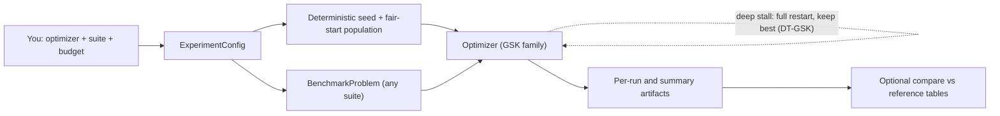
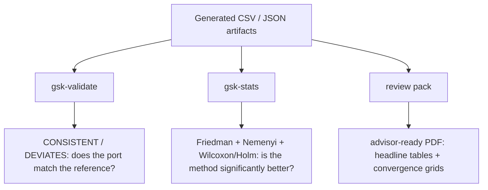

# Explainer

> **What this page is.** A plain-language introduction to what this project is,
> what the GSK family of optimizers actually does, and why the code is shaped
> the way it is.
> **Who it is for.** Newcomers who want the big picture before touching any
> command.
> **After reading**, you will understand the core idea behind GSK, the role of
> each major moving part (problems, seeds, optimizers, artifacts), and why the
> project keeps generated results separate from reference results.
> **Prerequisites:** none. **Next:** run something with the
> [Tutorial](tutorial.md), then keep the [Glossary](../reference/glossary.md)
> open for unfamiliar terms.

## The one-paragraph version

This project is a Python implementation of the **Gaining-Sharing-Knowledge
(GSK)** family of optimization algorithms, together with a set of standard
benchmark problems used to measure them. It is a faithful port of an upstream
reference implementation. You pick an optimizer and a benchmark, the runner
executes it under controlled, reproducible conditions, and it writes the results
to disk as plain CSV and JSON files. You can then compare those results against
imported reference tables to check that the port behaves correctly.

## What is an optimizer, and what is GSK?

**An optimizer searches for the inputs that make a function as small as
possible.** Think of the function as a landscape with hills and valleys; the
optimizer is looking for the lowest point. The benchmark functions here are
deliberately hard — many valleys, traps, and ridges — so they stress-test how
well an algorithm searches.

**GSK is a population-based optimizer.** Instead of moving a single guess
around, it keeps a *population* of candidate solutions and improves them
generation by generation, loosely imitating how people gain and share knowledge:

- **Gaining** — an individual improves by learning from others that are doing
  better or worse than it.
- **Sharing** — improvements spread through the population over time.

GSK splits each candidate's variables into two groups whose sizes shift as the
search progresses:

- A **junior phase** early on, where an individual learns from its
  fitness-rank neighbours and a random peer. This favours broad **exploration**.
- A **senior phase** later on, where an individual learns from the best and
  worst blocks of the population through a middle performer. This favours
  focused **exploitation**.

Two parameters control the update: the **knowledge factor** `kf` (how big a step
to take along a "gained" direction) and the **knowledge ratio** `kr` (the
per-variable probability that the gained value actually replaces the old one).
The variants in this project (AGSK, APGSK, FDB-AGSK, ATMALS-GSK) keep the
same skeleton but adapt these choices in different ways. DT-GSK
(Dimension-Tiered Gaining-Sharing Knowledge) is this
project's own proposed method: it keeps the gaining-sharing scaffold and adds a
dimension-aware "pub" profile with adaptive control, nonlinear population
reduction, an interaction-structure memory for high-dimensional problems, and a
deep-stall full-restart (multi-start) safeguard that re-seeds the working
population when the search freezes while keeping the best-so-far. On CEC2017
(51 runs, 29 scored functions, F2 excluded) it is the **#1-ranked algorithm in
the GSK family** — #1 at D10, D50, and D100, and #1 overall by **both mean and
median** Friedman rank; at D30 it is led only by the strong `egsk` baseline,
the runner-up overall. That standing is a property of the complete
dimension-tiered system, not of any single subsystem — a direct component
isolation found no detectable standalone benefit from the interaction-structure
memory at its active tiers (see the Supplementary Materials, Section S6).
See the per-optimizer guides — [GSK](../algorithms/gsk.md),
[AGSK](../algorithms/agsk.md), [APGSK](../algorithms/apgsk.md),
[FDB-AGSK](../algorithms/fdb-agsk.md),
[ATMALS-GSK](../algorithms/atmals-gsk.md), [EGSK](../algorithms/egsk.md),
[DT-GSK](../algorithms/dt-gsk.md) — and
the [Glossary](../reference/glossary.md) for `kf`, `kr`, junior/senior, and
LPSR.

There are **seven runnable optimizers** in total (the five comparators above,
the proposed `dt-gsk`, and `egsk`). `egsk` is a faithful MATLAB port whose only
deviation is the interior-point refinement (SLSQP in place of MATLAB `fmincon`),
validated as statistically equivalent to the MATLAB `fmincon` reference; its
statistical-panel and advisor-review-pack cells come from the committed
`scipy`-SLSQP port run (the comparator of record).

## What the project does, step by step

For each optimizer and benchmark problem, the runner performs a fixed sequence.
The plain-language version first, then the same steps as a diagram.

1. **Builds a bounded benchmark problem** — a function plus its variable bounds,
   evaluation budget, and known optimum (if any).
2. **Creates deterministic seeds** and, when fair starts are requested, a shared
   initial population (explained below).
3. **Runs the optimizer** until it spends its configured evaluation budget
   (counted in [number of function evaluations, NFEs](../reference/glossary.md)).
4. **Records the best-so-far value** at checkpoints, producing a convergence
   trace.
5. **Writes per-run and summary artifacts** to disk (CSV and JSON).
6. **Optionally compares** the generated summaries against imported reference
   tables.

## How it fits together

The data flow from your request to the artifacts on disk:

Each box maps to a real part of the code: the `ExperimentConfig` you build from
a YAML file or CLI flags, the seed schedule, the `BenchmarkProblem` adapter, the
optimizer kernel, and the writers that produce the output tree. The optimizer
self-loop is its generation loop; the dashed self-loop is DT-GSK's default-on
deep-stall full restart, which re-seeds the working population when the search
freezes for a large fraction of the budget while preserving the best-so-far. The
[Architecture](../reference/architecture.md) and
[Workflows](../reference/workflows.md) references trace these in detail.

## Why there is a benchmark adapter

**One adapter so optimizers do not care where a problem came from.** An
optimizer should not need to know whether a problem is from CEC2011, CEC2017,
CEC2020, CEC2013, a native-dimension LSGO suite, or the simple `sphere` smoke
problem. The adapter presents all of them through the same
`BenchmarkProblem` interface — bounds, budget, evaluator, and known optimum.
That keeps each optimizer simple and makes adding a new suite a local change.

## Why fair starts matter

**A fair start removes one source of luck so you compare algorithms, not
coincidences.** When two optimizers start from different random initial
populations, the difference you measure can come from the starting point rather
than the algorithm. The default **unified** seed policy fixes this: for matching
cells it builds a shared initial population, then hands each optimizer the RNG
state *after* initialization so their later random draws still diverge naturally
from a common, fair starting point.

The exact seed formulas, the unified-versus-reference distinction, and the
fair-start mechanism are documented in the
[Seed Policy reference](../reference/seed_policy.md).

## Why reference tables are read-only

**Two kinds of evidence, kept apart on purpose.** Imported reference tables are
*source evidence* — results from the upstream reference implementation. The
files this project produces are *generated evidence*. The runner refuses to
write generated output into the imported reference tree, which prevents
accidentally overwriting the very thing you are comparing against. Validation
reads both and reports agreement; it never mutates the references.

## What is and is not promised

**Behaviour-preserving, not byte-for-byte identical.** The port reproduces the
*algorithms* and the *experiment contract* (the same problem definitions, seed
schedules, budgets, and output schema). It does **not** promise bit-exact replay
between the reference implementation and Python across every library — random
generators and local-search solvers in particular can differ at the level of
floating-point detail. Treat reduced-budget runs as consistency checks, not
as paper-quality reproductions; see the
[Validation Report](../research/validation_report.md) for what the evidence
actually supports.

## From results to evidence

Generated CSV/JSON files are only the raw material. Three further steps turn
them into the claims that go in a paper, and each has its own command:

1. **Validation** (`gsk-validate`) compares a generated run tree against the
   imported reference tables and returns a `CONSISTENT` / `DEVIATES` verdict. It
   answers "does the port behave like the reference?" — a correctness check.
2. **Statistical analysis** (`gsk-stats`) takes the *whole 7-algorithm family*
   and produces the comparison a reviewer expects: Friedman ranks, a Nemenyi
   critical-difference diagram, pairwise Wilcoxon tests with Holm correction,
   and effect sizes. It answers "is the proposed method significantly better?"
   A lighter per-dimension Wilcoxon + Friedman readout of the same family panel
   can stream live during a run via the opt-in `--stats` flag (skipped when the
   optimizer being run is vanilla `gsk`); the full report — Holm correction,
   effect sizes, and figures — comes from `gsk-stats`.
3. **The review pack** (`python papers/scripts/generate_review_pack.py`) bundles
   the headline tables and convergence grids into a single advisor-ready PDF,
   without needing LaTeX. Anything it cannot find is logged, never fabricated.

The same generated artifacts fan out to all three, each answering a different
question:

You do not need any of these for a first run — they matter once you are
comparing algorithms rather than just executing one. The
[User Guide](user_guide.md#statistical-analysis) shows the exact commands.

## Where to go next

- Run your first experiment: [Tutorial](tutorial.md).
- Everyday commands and what they do: [User Guide](user_guide.md).
- Configure a campaign in YAML: [Configuration](configuration.md).
- The proposed method in depth: [DT-GSK](../algorithms/dt-gsk.md).
- When something breaks: [Troubleshooting](troubleshooting.md).
- Term you do not recognise: [Glossary](../reference/glossary.md).
