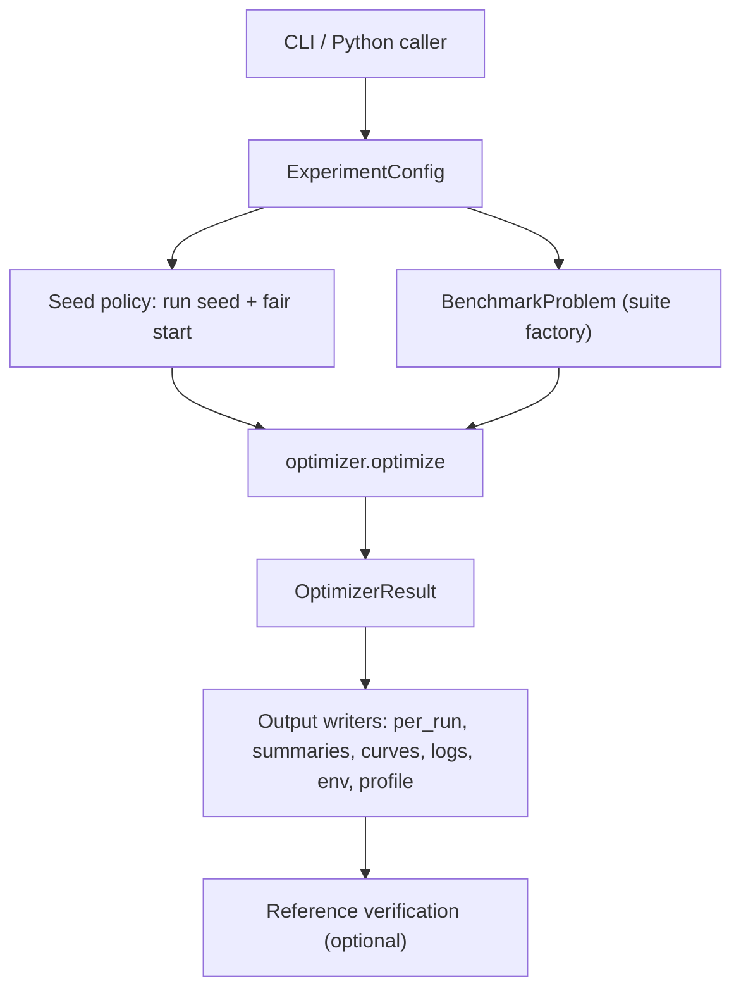
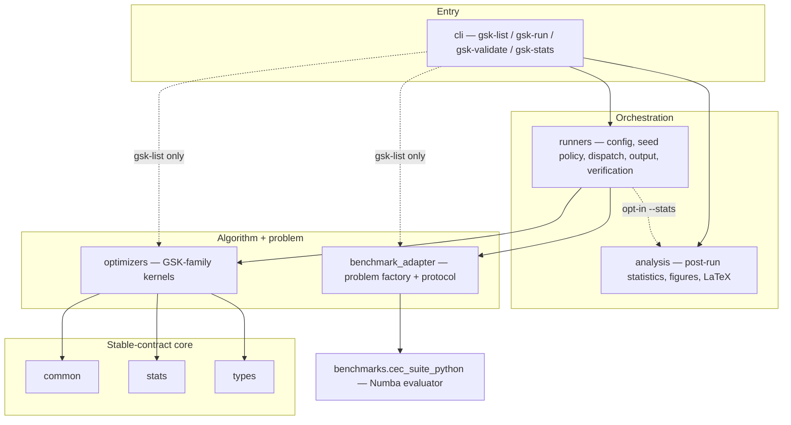

# Architecture

> The authoritative structural map is the root
> [ARCHITECTURE.md](../../ARCHITECTURE.md); this page is the reference-folder
> summary of it. Where they disagree, the root document governs.


> **What this page is.** The runtime layout — the stable contracts the code is
> organized around, and the ownership boundaries between layers.
> **Who it is for.** Developers who want the big picture before reading code.
> **Prerequisites.** None; see [Module Dependencies](module_dependencies.md) for
> the dependency direction and [Diagrams](diagrams.md) for the visual version.

The Python implementation is organized around a small set of stable contracts rather
than the original reference script layout.

## Runtime Flow

```text
CLI or Python caller
  -> ExperimentConfig
  -> run_experiment
  -> BenchmarkProblem
  -> optimizer.optimize
  -> result output writers
  -> optional reference verification
```

As a diagram:



The command-line tools are thin wrappers:

- `gsk-list` reports registered optimizers, benchmark suites, and reference
  table availability.
- `gsk-run` normalizes a YAML or direct command request and calls
  `gsk_family.runners.run_experiment.run_experiment`.
- `gsk-validate` inspects reference assets or compares a generated result tree
  with imported reference tables.
- `gsk-stats` runs the post-hoc GSK-family statistical comparison
  (`gsk_family.analysis.family_report.generate_family_report`) over finished
  summaries; see the [Post-Run Analysis](#post-run-analysis-and-paper-pipeline)
  section below.

The everyday launcher in a source checkout is `python run.py`, which adds `src/`
to `sys.path` and forwards to the same `gsk-run` entry point.

## Package Map

```text
src/gsk_family/
  analysis/            post-run result analysis and plotting helpers
  benchmark_adapter/   suite metadata, problem factory, evaluation contract
  cli/                 console entry points
  common/              shared reference-compatible helpers and RNG utilities
  optimizers/          GSK-family optimizer modules
  runners/             config parsing, execution, output, verification
  stats.py             error and summary-statistic helpers
  types.py             public optimizer option/result dataclasses
```

The same packages as an import-layering view (each layer imports only downward;
see [Module Dependencies](module_dependencies.md) for the full rule set):



`benchmarks/cec_suite_python/` contains the Python/Numba benchmark runtime and
is called through `BenchmarkProblem.evaluate`, so optimizers do not import suite
modules directly.

## Optimizer Boundary

An optimizer receives:

- a `BenchmarkProblem` with validated bounds, dimension, suite/function ids,
  known optimum metadata, and a vectorized `evaluate(population)` callable;
- `OptimizerOptions`, including the deterministic seed, requested RNG label,
  optional fair-start population, optional restored RNG state, and optimizer-
  specific values.

It returns an `OptimizerResult` containing the best solution, final objective,
error, evaluation count, convergence trace, timing, and parameter metadata.

All seven panel optimizers have Python kernels: baseline `gsk`, adaptive
`agsk`, adaptive-parameters `apgsk`, memory-based local-search `atmals-gsk`,
Fitness-Distance Balance `fdb-agsk`, the enhanced `egsk` (`optimizers/egsk.py`,
a faithful MATLAB port whose only deviation is using
`scipy.optimize.minimize(method="SLSQP")` for the interior-point refinement in
place of MATLAB `fmincon`), and the project's proposed dimension-tiered method
`dt-gsk` (`optimizers/dt_gsk.py`, with
`_dt_profiles.py`, `_dt_rng.py`, `_dt_core.py`, and the `_dt_subsystems/`
package vendored byte-for-byte). `egsk` also remains a reference comparator: the
analysis panel reports its cells from the committed `scipy`-SLSQP **port**
statistics under `benchmarks/cec_reference_results/` (the comparator of record),
not a MATLAB `fmincon` reference.

DT-GSK is a deliberate boundary exception. It is listed in
`seed_policy.UNIFIED_ONLY_OPTIMIZERS`, so under every seed policy it uses the
shared unified seed (`get_cec_seed`) and the `threefry` generator like the rest
of the family. Unlike the other kernels it self-initializes its own
`np_init_mult*D` (`5*D`) population from that same `threefry(seed)` stream and
intentionally ignores the runner-supplied fair-start population — a documented
fair-start exception intrinsic to the algorithm. The exact seeding contract is
in [seed_policy.md](seed_policy.md).

## Data Ownership

Generated result files are owned by Python runs and are written below
`results/_run_all/<optimizer>/<suite>/` by default. Imported reference files under
`benchmarks/cec_reference_results/` are read-only source evidence: they are both
the validation baseline and the paper's single source of truth for statistics —
the analysis loader (`analysis.result_loader.load_algorithm`) reads them first
and uses locally reproduced runs only as a fallback.

The runner refuses to write generated output into the reference tree, which
keeps reproduced evidence separate from source evidence.

## Parallel Execution

Parallel mode is the default. Independent experiment cells are dispatched to a
process pool (`ProcessPoolExecutor` with a spawn context). The automatic worker
count is deliberately conservative: 2 workers when at least two logical cores
are available, otherwise 1. User-facing campaign commands spell this out as
`--parallel --workers 2`; `--workers N` is the explicit override for larger or
smaller runs. Automatic CEC2017 composition cells (`F21`-`F30`) retain an upper
cap of 8 workers to reduce spawned-worker Numba/LLVM memory pressure if the
automatic default is ever raised. Each cell receives its own deterministic seed
and fair-start payload, built serially before dispatch, so output is independent
of completion order. If a worker process dies the runner rebuilds the pool and,
after repeated failures, falls back to serial execution; it never uses a thread
pool, which can deadlock the Numba kernels. The optional profile file records
worker count, task counts, warmup records, skipped cells, and per-run optimizer
timing.

## Post-Run Analysis And Paper Pipeline

Running optimizers and analysing them are separate layers. The `analysis`
package (`src/gsk_family/analysis/`) sits downstream of the runners: it reads
finished summary tables and produces the cross-optimizer statistical
comparison. It never imports the runner or CLI layers and never runs an
optimizer — it is a self-contained leaf on numpy/scipy/matplotlib. The one
cross-layer edge runs the other way: `runners.run_experiment` imports
`analysis.statistical_tests` for the opt-in `--stats` live panel.

Two entry points drive it:

- `gsk-stats` (`cli/stats.py`) builds the full post-hoc report for a suite: a
  7-algorithm GSK-family Friedman panel (the six reference comparators plus
  `dt-gsk`), pairwise Wilcoxon signed-rank tests with Holm correction,
  Vargha-Delaney A12 effect sizes, win/tie/loss tallies, BCa bootstrap intervals,
  Nemenyi critical-difference and rank-chart PNGs, and LaTeX table fragments.
  All seven panel columns are loaded reference-first from
  `benchmarks/cec_reference_results/`; artifacts are written under
  `results/_run_all/_analysis/<suite>/`.
- `gsk-run --stats` streams a lighter live version of the Wilcoxon + Friedman
  panel during a campaign (opt-in; it skips only vanilla `gsk`. The
  native-dimension `cec2011` suite is supported and emits a single per-suite
  rollup panel — see `_statistical_analysis_enabled` in `runners/run_experiment.py`).

The publication assets live outside the package under `papers/`. The matplotlib
review pack, `python papers/scripts/generate_review_pack.py`, renders
`papers/DT-GSK-CEC2017-review.pdf` directly with `PdfPages` (no LaTeX needed):
7-algorithm convergence grids built from
`CheckpointErrors_<alg>_F<func>_D<dim>.csv` files, with any missing curves logged
to `papers/DT-GSK-CEC2017-review_missing.log` rather than fabricated. The full
LaTeX paper (`papers/main.tex`) is a separate, MiKTeX-built artifact. See
[research/statistical_analysis.md](../research/statistical_analysis.md).
