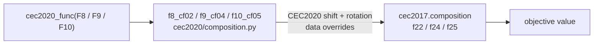

# CEC2020 C++ to Python Equivalence Review

## Scope

This review audits the bundled Python CEC2020 evaluator against the staged
C++ CEC2020 reference implementation and its committed fixed-vector oracle.
The audit covers:

- public function mapping `F1..F10`;
- runner-facing dimensions `{5, 10, 15, 20}`;
- data-driven unavailable cells;
- shift, rotation, shuffle, and composition data layout;
- fixed-vector objective values from `cec_tools/tests/data/cec2020_expected.csv`;
- adapter behavior exposed through `make_problem("cec2020", ...)`.

## Suite Protocol Context

The benchmark adapter registers CEC2020 in
`src/gsk_family/benchmark_adapter/protocol.py`:

- 10 functions (`function_ids = 1..10`), runner dimensions `D ∈ {5, 10, 15,
  20}`, error-vs-optimum statistics (CEC2020 is a member of
  `ERROR_VS_OPTIMUM_SUITES = {cec2013, cec2017, cec2020}`), and `target_error =
  1e-8`. The optima are the per-function biases
  `BIASES = (100, 1100, 700, 1900, 1700, 1600, 2100, 2200, 2400, 2500)` in
  `functions.py` (`cec2020_fopt`); e.g. F2 at D5 has optimum `1100.0`, asserted
  by `test_known_optimum_suites_use_error_statistics` in
  `tests/unit/test_benchmark_adapter.py`.
- **No committed reference-results tree.** CEC2020 is in code (`CEC_SUITES`) and
  constructible through `make_problem`, but `benchmarks/cec_reference_results/`
  contains only `cec2011`, `cec2013`, and `cec2017` — there is no
  `cec_reference_results/cec2020/`. The suite is wired and evaluator-audited but
  is not part of the committed optimizer reference evidence.
- The in-repo guards are
  `test_cec2020_composition_zero_vector_matches_cpp_oracle` (F8–F10 at
  D5/D10/D15/D20 where constructible, `rel=1e-12`) and the unavailable-cell
  rejections in
  `test_validation_rejects_bad_suite_function_dimension_and_budget`. The
  180-probe oracle sweep in *Evidence* below was a review-time script against
  the external staged C++/MEX archive, which is not committed here.

## Reference Protocol

The C++ implementation maps public CEC2020 ids to internal data-file ids:

| Public id | Internal id | Role |
|---:|---:|---|
| F1 | 1 | Bent Cigar |
| F2 | 2 | Schwefel |
| F3 | 3 | Lunacek Bi-Rastrigin |
| F4 | 7 | Griewank-Rosenbrock, unshifted/unrotated |
| F5 | 4 | Hybrid 1 |
| F6 | 16 | Hybrid 6 |
| F7 | 6 | Hybrid 5 |
| F8 | 22 | Composition 2 |
| F9 | 24 | Composition 4 |
| F10 | 25 | Composition 5 |

The *Internal id* column is the staged C++/MEX data-file id. For the composition
trio it is confirmed directly in the current Python source: `composition.py`
documents "Public CEC2020 F8 is staged-MEX internal id 22 ... matches the
CEC2017 F22 composition kernel" (and likewise ids 24/25 for F9/F10). The *Role*
column matches `_FUNCTION_NAMES` in `functions.py` (F5 = "Hybrid 1",
F6 = "Hybrid 6", F7 = "Hybrid 5", F8 = "Composition 2", F9 = "Composition 4",
F10 = "Composition 5"); F4 is evaluated unshifted and unrotated
(`s_flag=0, r_flag=0`, per the `functions.py` docstring).

The composition trio is the load-bearing part of this mapping — it is delegated
wholesale to the already-validated CEC2017 kernels:



The reference dimensions are `{5, 10, 15, 20}`. Public F1 and F8 are refused at
D5 and D15 because **no C++ oracle output was ever generated for those cells** —
the dispatcher's own message says "the staged C++/MEX protocol has no ground
truth for this cell". An earlier revision of this paragraph attributed it to
missing shuffle marker files; that was incorrect (F1 is unimodal, F8 is a
composition — neither uses shuffle data, which exists only for the hybrids
F5–F7). The required shift and rotation inputs ARE present and finite at every
dimension, so this is a validation gap, not a data gap. The dispatcher encodes
it as
`_UNAVAILABLE_REFERENCE_CELLS = {(1, 5), (1, 15), (8, 5), (8, 15)}` in
`functions.py`.

## Findings

### Fixed

1. **Composition functions F8-F10 followed the wrong Python path.**

   The initial Python CEC2020 composition implementation used a local raw
   CEC2020 leaf-kernel path. The C++ oracle showed that public F8-F10 match
   the already-validated CEC2017 composition kernels when those kernels are
   fed the CEC2020 internal-id data for ids 22, 24, and 25.

   Resolution: Python F8/F9/F10 now delegate to the CEC2017 F22/F24/F25
   composition kernels with explicit CEC2020 shift and rotation data
   overrides. In source, `composition.py` imports `f22 as _cec2017_cf02`,
   `f24 as _cec2017_cf04`, `f25 as _cec2017_cf05` from `cec2017.composition`,
   and `f8_cf02` / `f9_cf04` / `f10_cf05` return those kernels directly
   (e.g. `return _cec2017_cf02(x, shift=Os_cf, rotation=Mr_cf)`).

   Worked verification (from the committed tests, no external archive needed):
   the delegation is observable as an equality between two independently
   committed test tables at the D10 zero vector.

   | Function | CEC2020 guard value | CEC2017 guard value |
   |---|---|---|
   | F8 ↔ F22  | `5302.4980403395475` | `5302.4980403395475` |
   | F9 ↔ F24  | `3392.2088309135484` | `3392.2088309135484` |
   | F10 ↔ F25 | `4820.812334105729`  | `4820.812334105729`  |

   The CEC2020 column is from
   `test_cec2020_composition_zero_vector_matches_cpp_oracle`; the CEC2017 column
   is from `test_cec2017_d10_zero_vector_matches_cpp_oracle_all_functions`.
   Because the two constant sets were committed independently, their bit-for-bit
   agreement is direct in-repo evidence that F8/F9/F10 evaluate exactly the
   CEC2017 F22/F24/F25 kernels.

2. **Hybrid F7 at D5 missed the zero-width `escaffer6` guard-slot term.**

   In the reference, F7 at D5 gives the first partition zero width. The C++
   scratch-buffer behavior still contributes the wrap-around term from the
   guard slot and the previous transformed first coordinate. Python previously
   returned zero for that empty partition.

   Resolution: F7 now reproduces the documented guard-slot contribution when
   the first `escaffer6` partition is empty. In `hybrid.py`, `f7_hf05` uses the
   `oddball_first=True` partition scheme and, when `parts[0].shape[-1] == 0`,
   substitutes `_escaffer6_empty_guard(z)` for the normal
   `escaffer6` partition term.

3. **Unavailable reference cells were constructible in Python.**

   Python previously allowed CEC2020 F1/F8 at D5/D15 even though the C++
   reference constructor rejects them.

   Resolution: both the dispatcher and benchmark adapter reject
   `(F1,D5)`, `(F1,D15)`, `(F8,D5)`, and `(F8,D15)` with a clear
   unavailable-reference-data error. This is guarded by
   `test_validation_rejects_bad_suite_function_dimension_and_budget`, which
   asserts both `make_problem("cec2020", 1, 5)` and
   `cec2020_func(8, zeros(15))` raise a `ValueError` matching `unavailable`.

## Evidence

### Data Parity

Python `data.pkl` was compared against the C++ input text files:

- simple shift rows for public F1-F7: maximum absolute error `0.0`;
- composition row-wise shifts for internal ids 22, 24, 25 at D5/D10/D15/D20:
  maximum absolute error `0.0`;
- composition rotation blocks for internal ids 22, 24, 25 at D5/D10/D15/D20:
  maximum absolute error `0.0`.

### Oracle Before Fix

The fixed-vector oracle initially reported:

- `checked=180`;
- `failures=53`;
- maximum relative error `1.873e+00`;
- failures concentrated in public F8-F10, plus the F7/D5 guard-slot edge.

### Oracle After Fix

After the fixes:

```text
CEC2020 checked 180 failures 0 max_rel 6.262e-16
```

## Regression Coverage

Added unit coverage in `tests/unit/test_benchmark_adapter.py`:

- `test_cec2020_composition_zero_vector_matches_cpp_oracle` — representative
  CEC2020 F8–F10 zero-vector oracle values across D5/D10/D15/D20 where
  constructible (`rel=1e-12`); this is the 10-cell table that also cross-checks
  the CEC2017 delegation (see *Findings → Fixed → 1*);
- `test_validation_rejects_bad_suite_function_dimension_and_budget` —
  unavailable-cell rejection through both `make_problem` and direct
  `cec2020_func`;
- existing adapter metadata tests now use constructible CEC2020 F2/D5 instead
  of unavailable F1/D5.

## Residual Risk

CEC2020 is now clean against the committed C++ fixed-vector oracle. Remaining
risk is limited to cells that the C++ reference itself does not construct; the
Python project now rejects those cells rather than inventing unsupported values.

## Addendum (2026-07-26): the four withheld cells are closed

**RESTORED 2026-07-26.** The four cells were validated against the in-repo C++
oracle and the guard lifted. Method: the loader's missing files are pure
per-dimension availability MARKERS (the loader opens one for every function;
only hybrids consume the content), so the oracle was built with dummy markers
and its output proven bit-identical under two different marker contents.
Against it, F1/F8 at D5/D15 agreed with the Python suite to worst relative
error 1.258e-15 -- three orders inside the committed rel=1e-12 criterion --
with the already-trusted D10/D20 cells reproducing the same profile as
controls. The AGSK paper's own 5D tables always did include F1 and F8, so the
competition itself ran these cells. Pinned by
`tests/regression/test_cec2020_restored_cells.py`; the schedule now covers all
four dimensions, dropping only F6/F7 at D=5 (protocol-undefined).
