# Flowcharts And Diagrams

> **What this page is.** A visual map of the project — the same flows described
> in [Architecture](architecture.md) and [Workflows](workflows.md), drawn as
> flowcharts.
> **Who it is for.** Anyone who wants the shape of the system at a glance.
> **Prerequisites.** None; terms are defined in [the glossary](glossary.md).

The diagrams render in the HTML site. Each node uses an `id["label"]`
declaration so the flowcharts parse cleanly under Mermaid.

## Full Project Architecture

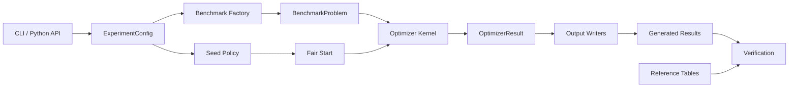

## Algorithm Execution Flow

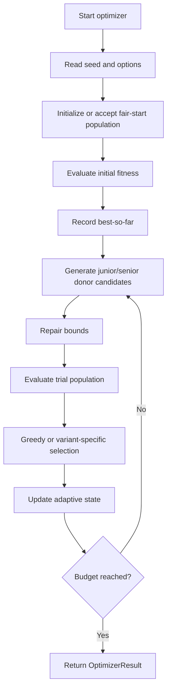

## Benchmark Evaluation Pipeline

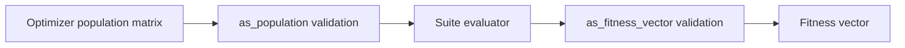

## Experiment Lifecycle

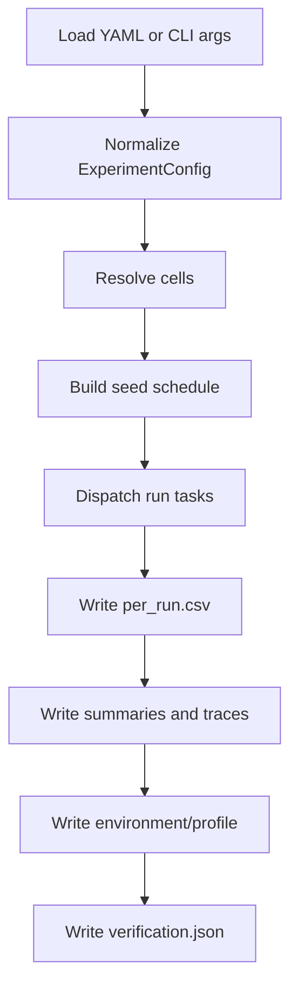

## Configuration Loading

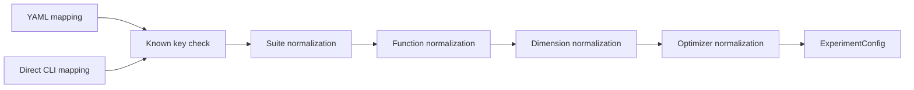

## Seed Generation And RNG Flow

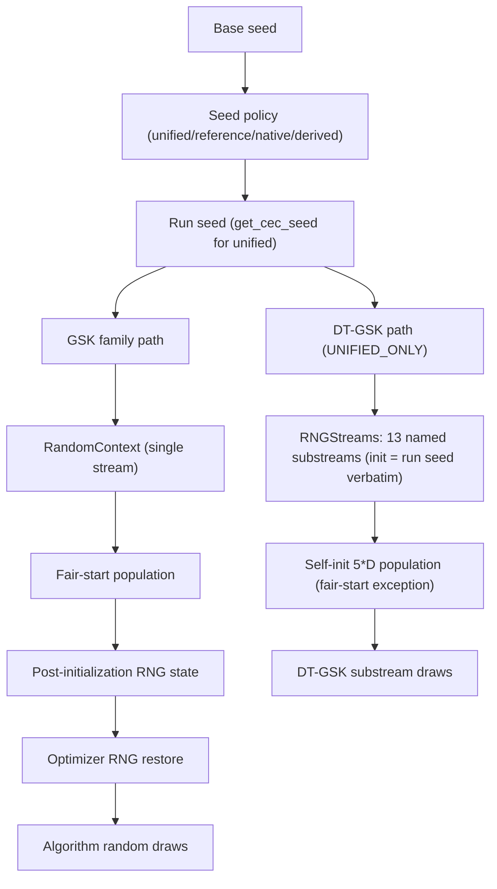

## Parallel Execution Flow

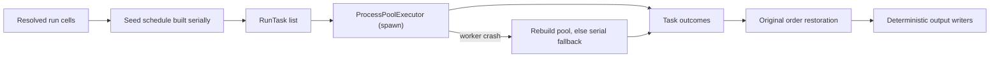

## Logging And Reporting Pipeline

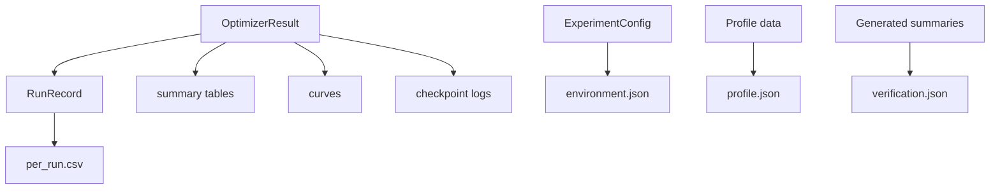

## Optimizer Update Cycle

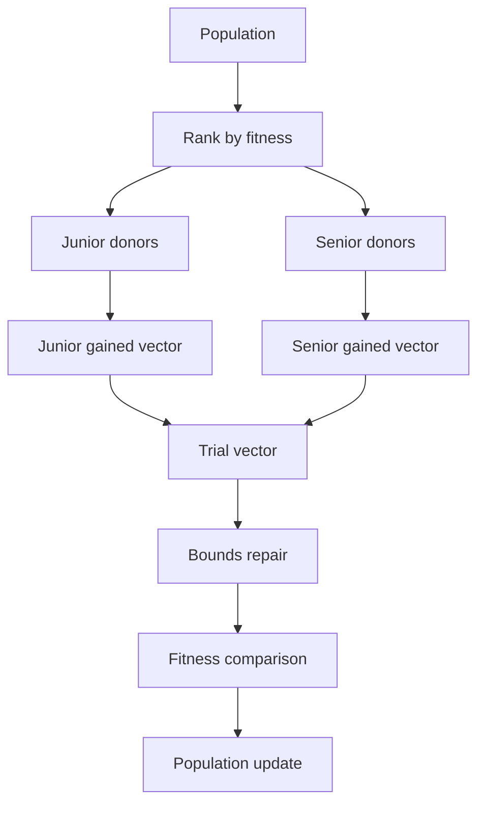

## Validation Workflow

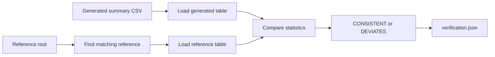

## Statistical Analysis Flow

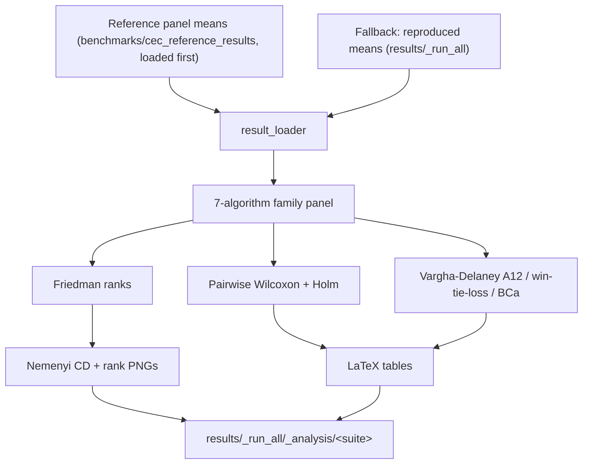

## Paper Review-Pack Flow

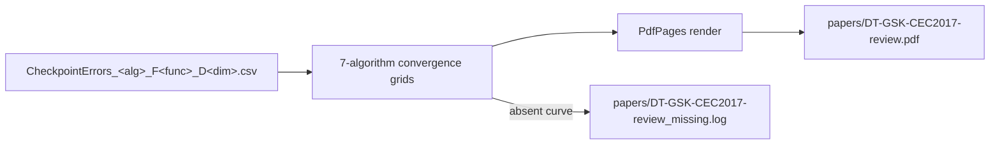

## Testing Workflow

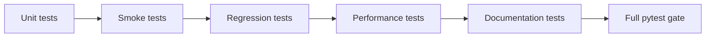

## Performance Optimization Workflow

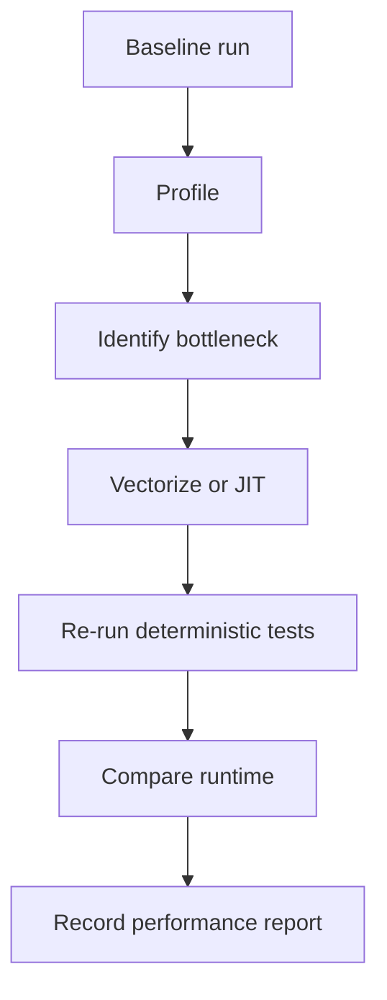
