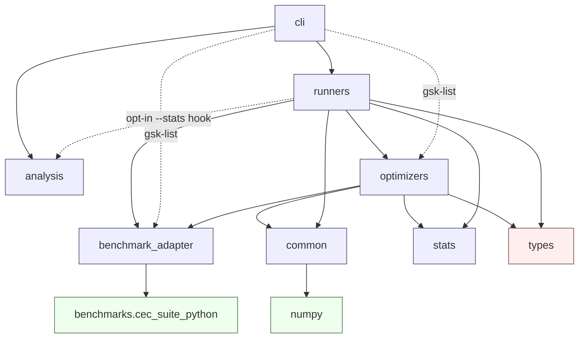

# Module Dependencies

> The authoritative statement of layering and dependency direction is the root
> [ARCHITECTURE.md](../../ARCHITECTURE.md) §3; this page is the reference-format
> rendering of the same rules and must not drift from it.


> **What this is.** The allowed import directions between the package's layers,
> and why they are arranged this way. **Who it is for.** Contributors deciding
> where new code belongs, and reviewers checking that a change does not create a
> backward dependency. **Prerequisites.** A rough sense of the package layout
> (see [project_structure.md](project_structure.md)). **After reading** you will
> know what each layer may import and what it must never import. For the broader
> design rationale see [architecture.md](architecture.md).

The Python project keeps dependencies pointed inward toward stable contracts.
"Inward" means the volatile, replaceable layers (CLI, output formats, reference
tables) depend on the stable core (`types`, `common`, `optimizers`), never the
other way around. In particular, optimizers are deliberately kept away from CLI,
output, and reference-table code.

## Dependency Direction

The arrows below read "depends on": the layer on the left imports from the
layers indented under it. No arrow ever points back up.

```text
cli
  -> runners                          (gsk-run -> run_experiment; gsk-validate -> runners.verification)
      -> benchmark_adapter
      -> optimizers
      -> common
      -> stats
      -> types
  -> benchmark_adapter, optimizers    (gsk-list reads protocol.CEC_SUITES + optimizers.OPTIMIZER_IDS directly)
  -> analysis                         (gsk-stats; cli/stats.py -> analysis.family_report)

analysis
  -> numpy / matplotlib               (tests, figures, LaTeX fragments)

optimizers
  -> benchmark_adapter.problem
  -> common
  -> stats
  -> types

benchmark_adapter
  -> benchmarks.cec_suite_python      (bundled Python/Numba benchmark evaluator)
  -> never imports optimizer modules

common
  -> numpy
```

The same picture as a graph (arrows point from a layer to what it depends on):



Note that `optimizers` import `benchmark_adapter.problem` only (the
`BenchmarkProblem` contract), not the factory or suite data — they receive an
already-built problem from the runner.

The `cli` layer normally reaches the system through `runners` (`gsk-run`) or
`analysis` (`gsk-stats`, `gsk-validate` going through `runners.verification`).
The lightweight `gsk-list` command is the one exception: it imports the suite
registry (`benchmark_adapter.protocol.CEC_SUITES`) and `optimizers.OPTIMIZER_IDS`
directly and touches neither `runners` nor `analysis`. Both paths still point
strictly downward, so the inward-dependency rule holds.

The `analysis` package is a self-contained leaf: its statistical core
(`statistics`, `statistical_tests`), data loaders (`result_loader` — which
loads the committed reference panel under `benchmarks/cec_reference_results/`
first and falls back to locally reproduced `results/_run_all/` trees — and
`project_policy`), figure renderer (`figures`), and LaTeX emitter
(`latex_tables`) depend only on `numpy`/`matplotlib` and each other. This keeps
the heavy plotting and statistics dependencies out of the optimizer hot path: a
bare optimizer run never imports `matplotlib`. The `gsk-stats` CLI is the only
first-party caller of `analysis.family_report`.

## Layer Responsibilities

Each layer owns one job and is forbidden from owning another layer's job. That
boundary is what keeps the import directions above clean.

| Layer | Owns | Must Not Own |
|---|---|---|
| `cli` | Argument parsing and process exit codes. | Algorithm behavior. |
| `runners` | Campaign expansion, seed schedule, artifacts, validation. | Optimizer internals. |
| `benchmark_adapter` | Suite metadata, bounds, evaluator shape. | Experiment output. |
| `optimizers` | Candidate generation and the optimizer result. | File I/O and reference comparison. |
| `common` | Reference-compatible helper semantics (repair, donors, RNG, rounding). | Suite policy. |
| `stats` | Summary statistics and error formatting. | File formats. |
| `analysis` | Post-run statistical comparison, effect sizes, figures, LaTeX. | Running optimizers. |

## Why This Matters

This separation makes it possible to:

- test optimizers with the `sphere` smoke problem, with no CEC data loaded;
- run the same optimizer from the Python API or the CLI, unchanged;
- change output formats without touching algorithm code;
- compare generated summaries with references after execution;
- add benchmarks without rewriting optimizer modules.

When adding code, place it in the layer whose job it does and import only
downward. Adding an optimizer or a suite is walked through in the
[extension guide](../development/extension_guide.md).
