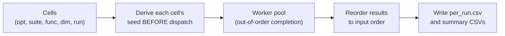

# Performance

> **What this page is.** How to run the project efficiently — parallel backends,
> warmup, Numba kernels, profiling — and an honest statement of what has and has
> not been measured yet.
>
> **Who it is for.** Researchers running large campaigns who care about wall
> time, and anyone interpreting the timing artifacts.
>
> **What you will get.** How the default process pool works, how to cap workers,
> how to warm up before timing, where the Numba kernels are, what `profile.json`
> records, and which comparison tables are still pending.
>
> **Prerequisites.** Basic running is in the
> [User Guide](../getting-started/user_guide.md); determinism guarantees are in
> [Reproducibility](reproducibility.md). Terms are defined in
> [the glossary](../reference/glossary.md).
>
> **Key point.** Timing here is **diagnostic**. It is not intended to reproduce
> reference wall-clock times — the Python port uses different libraries, process
> startup, and local-search implementations. Performance work must never change
> the numbers; determinism is the invariant, speed is the optimization.

## Parallel execution

Independent runs are spread across a reused, JIT-warmed worker pool — this is on
by default, so normal runs need no extra flags. Each cell
(`optimizer, suite, function, dimension, run`) is one independent task, which is
why parallelizing across cells is safe and order-independent.

The example below adds `--profile` only to capture timing for this section:

```powershell
gsk-run --config configs/smoke.yml --root . --profile
```

Two backends are selectable with `parallel_backend` (or `--parallel-backend`):

- `process` (default): a reused `ProcessPoolExecutor` (spawn) — true multi-core
  parallelism with no GIL contention; the correct choice for real campaigns. If
  a worker dies (an intermittent Numba/spawn crash, or out of memory) the run
  rebuilds the pool and retries, and finishes a cell serially only if it keeps
  failing, so the run always completes. Tiny runs (task count not greater than
  the worker count) run in-process to avoid spawn overhead.
- `thread`: a `ThreadPoolExecutor`. The optimizer loop is Python/NumPy and holds
  the GIL, so threads do not scale for CPU-bound runs; worse, calling
  `parallel=True` Numba kernels from many threads can **deadlock**. Avoid it —
  use the process backend, or `--serial` for a single-process run.

`--serial` forces a single in-process run with no pool at all — the simplest way
to get a clean stack trace when debugging, and the reference point for the
byte-identity check below.

Serial and process results are byte-identical: run seeds are derived before
dispatch and results are returned in input order. (See
[Numerical Examples — Parallel determinism](numerical_examples.md#parallel-determinism)
for why out-of-order completion still yields in-order, identical output.)



Because each cell's seed is a pure function of its coordinates and is fixed
before any task is dispatched, neither the backend nor the worker count can touch
the numbers; the reorder step before writing is what turns non-deterministic
*completion* order back into deterministic *output* order.

The automatic worker count is intentionally small so a copied command does not
consume a shared workstation. It uses two workers when at least two logical
cores are available, otherwise one:

| Logical cores | Automatic worker count |
|---:|---:|
| 22 | 2 |
| 20 | 2 |
| 10 | 2 |
| 2 | 2 |
| 1 | 1 |

For CEC2017 composition cells (`F21`-`F30`) on the default `process` backend,
automatic runs retain an upper memory-safety cap of 8 effective workers. The
normal two-worker default is already below this cap; the cap remains as a guard
if the automatic policy is raised in the future. Passing `--workers N` is an
explicit override and is recorded as the user's chosen speed/memory tradeoff.

With the process backend each worker caps its own Numba threads to about
`logical_cores // workers`, so total threads (workers x Numba) stay within the
core budget. Start campaign commands with `--parallel --workers 2`, then raise
the worker count only when the machine has enough spare CPU and RAM:

```powershell
gsk-run --config configs/smoke.yml --root . --parallel --workers 2 --profile
```

## Warmup

Warm up the JIT before you measure, so first-call compilation does not inflate
the timing.

```powershell
gsk-run --config configs/smoke.yml --root . --warmup --profile
```

Warmup preloads benchmark cells and records warmup metadata in the profile
artifact. Scope it with `--warmup-scope`:

| `--warmup-scope` | Warms |
|---|---|
| `selected` | only the cells the campaign will actually run |
| `suite` | every default cell in the suite |

Warm only what you measure: warming the whole suite when the campaign runs a few
cells inflates setup time without improving the timed numbers. The per-cell
warmup records and `benchmark_warmup_seconds_total` land in `profile.json`.

## Numba kernels

Several CEC suites ship Numba-oriented kernels so the expensive benchmark math
runs as compiled code.

```text
benchmarks/cec_suite_python/cec2011/_numba.py
benchmarks/cec_suite_python/cec2013/_numba.py
benchmarks/cec_suite_python/cec2013lsgo/_numba.py
benchmarks/cec_suite_python/cec2017/_numba.py
benchmarks/cec_suite_python/cec2020/_numba.py
```

Optimization policy — speed must never change the numbers:

- Use Numba for benchmark kernels where it preserves numerical behavior.
- Keep optimizer RNG and control flow deterministic.
- Prefer vectorized NumPy operations for population updates.
- Measure before replacing readable Python with JIT-heavy code.

CEC evaluator policy:

- The `--benchmark-backend` flag accepts `auto` (default) and `python`; both
  route to the Python/Numba evaluator. The kernels above are compiled
  transparently on first use, which is what warmup pre-pays.
- The benchmark FP mode is recorded as `benchmark_fp_mode` in `profile.json` so
  the evaluator configuration is part of the run's provenance.

## Profiling artifacts

When profiling is enabled (`--profile`), the runner writes
`results/_run_all/<optimizer>/<suite>/summary/profile.json` capturing worker
count, task counts, skipped cells, warmup records, per-run optimizer timing, and
environment and configuration metadata. The recorded fields include:

| Field | Meaning |
|---|---|
| `parallel`, `parallel_backend` | Whether parallel ran, and which backend. |
| `workers`, `workers_auto`, `workers_requested`, `workers_effective` | Resolved worker count and how it was chosen. |
| `worker_cap_applied`, `worker_cap_functions`, `worker_cap_workers` | Whether the CEC2017 composition memory cap fired and on which functions. |
| `tasks_dispatched`, `tasks_completed`, `tasks_skipped_or_failed` | Task accounting for the optimizer's cells. |
| `optimizer_wall_seconds` | Wall time for the whole optimizer pass. |
| `benchmark_warmup_seconds_total`, `benchmark_warmup`, `warmup_scope` | Warmup timing and per-cell warmup records. |
| `numba_runtime` | Numba runtime metadata. |
| `benchmark_backend`, `benchmark_backend_requested`, `benchmark_fp_mode` | Evaluator backend actually used vs requested, and the FP mode. |
| `generation_logs_enabled`, `convergence_graphs_enabled` | Whether `gen_logs` curves and PNGs were produced. |
| `run_runtime_seconds` | Per-run timing keyed by `function`, `dimension`, `run`, `seed`. |

Timing is diagnostic. It is not intended to reproduce reference wall-clock times,
because Python uses different libraries, process startup, and local-search
implementations. Use `profile.json` to compare configurations on the *same*
machine, not to make cross-toolchain wall-clock claims.

When a performance change is meant to leave the *numbers* untouched (the
invariant above), the FP-regime guard is what proves it. Comparing two campaigns
at run level is only valid when both were run sequentially on the same
machine+build and record matching FP sentinels **and** zero guard-cell
differences; otherwise a wall-clock or worker-count change may have silently
altered the floating-point regime and the delta is not bit-comparable. See
[Floating-Point Regime Verification](../reference/fp_regime.md) and
[Reproducibility](reproducibility.md#environment) for the sentinel and the
guard-cell validity check.

## Implemented performance features

These optimizations are already in the code:

- Vectorized NumPy population operations in optimizers.
- Numba-oriented benchmark helper modules in the bundled CEC suites.
- Reused process/thread parallel execution for independent run tasks.
- Conservative automatic worker count of 2 (or 1 on a one-core machine), with
  an effective cap of 8 for automatic CEC2017 composition cells.
- Optional benchmark warmup before timed runs.
- Optional `profile.json` output.
- Optional convergence graph PNG rendering. Use `--convergence-graphs` or
  `convergence_graphs: true` only when rendered PNG plots are needed; curve CSVs
  are retained either way.

## Remaining measurement work

These comparison tables still require full campaigns before final delivery. They
are listed here so the evidence gap is explicit:

| Report | Status |
|---|---|
| reference vs Python runtime | Pending full reference replay evidence. |
| Python baseline vs optimized Python | Pending optimizer-kernel microbenchmark harness. |
| Single-threaded vs parallel execution | Partially covered by performance tests; full campaign pending. |
| Numba on vs Numba off | Pending benchmark-kernel toggle campaign. |
| Vectorized vs non-vectorized paths | Pending historical baseline or microbenchmark harness. |

## Scaling notes

Practical advice for keeping large campaigns affordable:

- CEC2013LSGO and native-dimension CEC2011 functions can be expensive.
- Use reduced budgets before launching full campaigns.
- Omit `--convergence-graphs` for CSV-only runs when PNG rendering time or file
  count is not needed.
- Keep `results/` separate from reference tables to avoid accidental evidence
  mixing.
